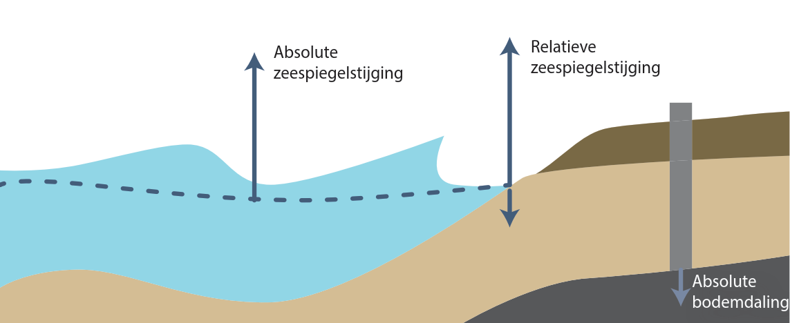

# Inleiding {#inleiding}

!!!(OUDE VERSIE: AANPASSEN) 

```{r, include=FALSE}

knitr::opts_chunk$set(
	echo = FALSE,
	message = FALSE,
	warning = FALSE
)
require(tidyverse)
require(readxl)
```

In dit rapport wordt de actuele stand en stijging van de zeespiegel langs de Nederlandse kust beschreven. Deze huidige zeespiegel is belangrijk voor het Nederlandse kustbeleid. De Nederlandse kust is fundamenteel voor onze veiligheid, drinkwatervoorziening, ecologie en recreatie.

Het handhaven van de kustlijn en het handhaven van het kustfundament zijn twee belangrijke pijlers van het landelijke kustbeleid. Het kustfundament is het deel van de kust dat van belang is als drager vanfuncties in het kustgebied. Het landelijke kustbeleid is geformuleerd in de 3e Kustnota [@rws2000], Nota Ruimte[@rws2004], het Nationaal Waterplan [@rws2008], de Nationale Visie Kust en Beslissing Zand [@IenM2013; @IenM2014]. Er wordtgehandhaafd door morfologische interventies in de vorm van zandsuppleties.

Het benodigde zandvolume wordt in essentie bepaald door het oppervlak van een deel van het kustfundament maal de zeespiegelstijging. Voor elke millimeter per jaar zeespiegelstijging wordt 7 miljoen \si{\m^3} gesuppleerd [@Ronde2008]. Er wordt naar gestreefd het gehele kustfundament, inclusief de landzijde mee te laten groeien [@rws2008].

In de laatste jaren is de hoeveelheid tijdelijk teruggebracht. Er is meer zand blijven liggen dan verwacht na de aanleg van de kustversterkingen. Daardoor is er voor het handhaven van de \ac{BKL}, tijdelijk minder zand nodig. De \ac{BKL} is de kustlijn zoals die op 1 januari 1990 lag en is sindsdien een aantal keer herzien. De kustlijn wordt dynamisch gehandhaafd.

De directe koppeling tussen kustfundament, zeespiegelstijging en suppletievolume maken het doelmatig suppleren en de precieze bepaling van de zeespiegelstijging en het kustfundament tot relevante onderzoeksthema's. In het programma `Kustgenese 2' wordt toegewerkt naar een verdere uitwerking van deze aanpak. De grenzen van het kustfundament worden opnieuw bepaald. De uitwisseling tussen het kustfundament en de bekkens (Waddenzee, Westerschelde) wordt geschat en er wordt gekeken naar uitwisselingen van sediment over de landsgrenzen.  Daarnaast, en belangrijk voor dit onderzoek, wordt ook de relatieve zeespiegelstijging verder uitgesplitst in een schatting van absolute bodemdaling en absolute zeespiegelstijging. Relatieve zeespiegelstijging is de stijging van de zeespiegel ten opzichte van het land, de som van de absolute zeespiegelstijging en de daling van het landgebonden referentievlak, zie \@ref(fig:relatievezeespiegel) en de nadere uitwerking in [@Dillingh2010].

```{r relatievezeespiegel, fig.cap="Relatieve versus absolute zeespiegelstijging."}

```

In de context van kustbeheer wordt onder de `zeespiegel' verstaan de over langere tijd gemiddelde hoogte van het zeeoppervlak, waaruit de korte termijn fluctuaties (windgolven, getij, windopzet etc.) nagenoeg zijn verdwenen. Wat overblijft is de geleidelijke verandering van de hoogte van het zeeoppervlak. Dit wordt nader uitgewerkt in \ref{#methode}.

De `huidige zeespiegel' is een kenmerkende waarde die wordt gebruikt voor de bepaling van de benodigde omvang van de zandsuppleties. Een kenmerkende waarde is een afgeleide statistiek, ook wel kengetal of indicator genoemd, die gekoppeld is aan een strategisch doel @[Koningsveld2005]. De methode van het bepalen van deze waarde wordt in dit rapport beschreven. De jaarlijks bepaalde waarde wordt elk jaar geactualiseerd in de online zeespiegelmonitor \notebook{dutch-sea-level-monitor}.

De zeespiegelstijging wordt niet alleen voor de kust gebruikt wordt maar ook voor de beperking van gaswinning onder de Wadden, het ontwerp van dijken en om te bepalen waar je wel en niet mag bouwen in de buurt van de kust. In dit rapport geven we een overzicht van welke zeespiegelindicatoren in gebruik zijn voor de verschillende toepassingen. Voor een deel van deze indicatoren wordt gebruik gemaakt van zeespiegelprojecties. Deze worden met actuele metingen vergeleken.

## Aansluiting bij eerder onderzoek {#Aansluiting-bij-eerder-onderzoek}

Nederland kent een lange geschiedenis in het systematisch meten van de zeespiegel (uurlijks sinds 1700) en de zeebodem en kusttopografie (jaarlijks sinds 1964). Deze metingen hebben bijgedragen aan doelmatig [@Koningsveld2004] en 'evidence based' [@Begum2007; @Portman2012] kustbeheer. In die lijn passen ook de onderzoeken, waar dit een vervolg op is, van @Dillingh2010, @Ronde2014 en @Baart2015. De term 'evidence based' is overgewaaid uit het Verenigd Koninkrijk en de volksgezondheid [@Nutley2000; @Sanderson2002]. 

In @Dillingh2010 werd een eerste definitie gegeven van de zeespiegelstijging in de context van het suppletie beleid. Er werd bepaald dat rekening gehouden moet worden met geodetische datum verandering (NAP-correctie) en met fysische processen (nodaal getij, zie \ref{#getij}, luchtdruk, zie \ref{#luchtdruk}). Er werd gevonden dat er geen statistisch aantoonbare versnelling in de zeespiegelstijging plaats vond over de periode 1890-2008. Een indicatie voor een versnelling werd wel gevonden met een meer exploratieve aanpak. Het al dan niet optreden van een versnelling is relevant omdat daardoor de te suppleren hoeveelheid zand toeneemt. Daarnaast werd een eerste koppeling gemaakt tussen de zeespiegel observaties (het statistische model) en de zeespiegel projecties van het \ac{KNMI}. Tenslotte hebben @Dillingh2010 de satelliet metingen van de absolute zeespiegel vergeleken met de metingen van de getijstations.

In @Dillingh2013 werden de huidige zeespiegelstand en de huidige zeespiegelstijging, zoals gebruikt voor het kustonderhoud, overgenomen als een 'kenmerkende waarde'. Het werd opgenomen in het overzicht met indicatoren als het gemiddeld hoog- en laagwater (slotgemiddelden), gemiddelde getijkrommen, \ac{LAT}, overschrijdingsfrequenties van hoogwater- en laagwater en de afvoerkarakteristieken zoals in gebruik voor rivierbeheer.

@Ronde2014 hadden als doel om de schatting betrouwbaarder te maken. Dit gebeurde door naar de statistische relatie met andere fysische processen (wind, rivierafvoer) te kijken. Ze concludeerden dat het voor de Nederlandse kust noodzakelijk is om rekening te houden met de wind. Zodoende kan veel variantie verklaard worden, waardoor een betrouwbaardere zeespiegel en zeespiegeltrend bepaald kunnen worden. Omdat de wind een negatieve trend liet zien voor het enkele station dat onderzocht werd, ontstond de vraag of misschien de onderliggende zeespiegelstijging eigenlijk te laag is ingeschat. De exploratieve methode om naar versnellingen te kijken werd veranderd (van Whittaker [@Eilers2003] naar \ac{LOESS} [@Cleveland1979]). De satellietmetingen werden in meer detail bekeken. @Ronde2014 gaven aan dat in de statistische methode een hoger gewicht aan recente waarnemingen moet worden toegekend dan aan oudere waarnemingen. Daarnaast werd een aanbeveling gedaan om een schatting voor de nabije toekomst te maken op basis van zowel klimaatscenario's als metingen.

@Baart2014 hebben de combinatie van statistische en fysische modellen verder uitgewerkt. Daarop bouwen we in dit onderzoek weer verder. Er werden voor het eerst heranalyses in de berekeningen meegenomen. Het gebruik van tijdsafhankelijke trends werd geïntroduceerd om sneller inzicht te krijgen in mogelijke versnelling. 

## Raakvlakken

### Nationaal

**Programma's**

```{r}
programmas <- read_excel("../../data/deltares/intern/raakvlakken.xlsx", sheet = "listProjects")

programmas %>% 
  mutate(
    programma = paste0("[", programma, "]", "(", URL, ")")
    ) %>% replace(is.na(.), "") %>%
  select(programma, relatie, indicator) %>%
knitr::kable()
```


<!-- Naam programma | Relatie indicatoren -->
<!-- --------------------- | -------------------- -->
<!-- [Onderzoeksprogramma Kustgenese](https://www.helpdeskwater.nl/onderwerpen/waterveiligheid/kust/kustgenese-2-0/) | huidige zeespiegel, zeespiegelstijging -->
<!-- [Onderzoeksprogramma BenO Kust](https://publicwiki.deltares.nl/pages/viewpage.action?pageId=131138795) | huidige zeespiegel; zeespiegelstijging -->
<!-- [Kennisagenda Waterveiligheid 2018](https://www.helpdeskwater.nl/onderwerpen/waterveiligheid/primaire/kennisagenda/) | extremen voor waterhoogte -->
<!-- [Kennisprogramma Zeespiegelstijging (KP ZSS)](https://www.deltaprogramma.nl/deltaprogramma/kennisontwikkeling-en-signalering/zeespiegelstijging)<br> - Spoor I - Zeespiegelstijging en Antarctica<br> - Spoor II - [Systeemverkenningen](https://www.rijkswaterstaat.nl/water/waterbeheer/bescherming-tegen-het-water/maatregelen-om-overstromingen-te-voorkomen/kennisprogramma-zeespiegelstijging/index.aspx) <br> - Spoor III - Signaleringsmethodiek<br> - Spoor IV - [Langetermijnopties](https://www.deltaprogramma.nl/deltaprogramma/kennisontwikkeling-en-signalering/zeespiegelstijging/spoor-4)<br> - Spoor V - Implementatiestrategie | o.a. zeespiegel -->
<!-- [Hoogwaterbeschermingsprogramma (HWBP)](https://www.hwbp.nl/projecten), onderdeel van het [Deltaprogramma](https://www.deltaprogramma.nl/deltaprogramma) | Zeespiegel (extremen?) -->
<!-- [Klimaatscenarios](https://www.knmi.nl/kennis-en-datacentrum/uitleg/knmi-klimaatscenario-s) | toekomstige zeespiegel -->
<!-- [Onderzoek bodemdaling](https://www.tno.nl/nl/aandachtsgebieden/energietransitie/expertisegroepen/geomodelling/bodemdaling-in-nederland/) | bodemdaling -->
<!-- [Programma Beoordelings- en Ontwerpinstrumentarium (BOI 2023)](https://www.helpdeskwater.nl/onderwerpen/waterveiligheid/primaire/beoordelen/nieuwsbrieven/nieuwsbrief-landelijke-beoordeling/nieuwsbrief-boi-oktober-2019/programma-boi-2023/) | extremen waterhoogte en golven -->


**Instituten**

*   [NIOZ](https://www.nioz.nl/en)
*   [Universiteit Utrecht](https://www.uu.nl/onderzoek)
*   [TU Delft](https://www.tudelft.nl/onderzoek)
*   [KNMI](https://www.knmi.nl/)
*   [Deltares](https://www.deltares.nl/nl/)
*   [TNO](https://www.tno.nl/nl/)
*   [PBL](https://www.pbl.nl/)

**Dashboards**

-   Compendium voor de leefomgeving - Klimaatverandering dashboard - [Zeespiegelstijging langs de Nederlandse kust en mondiaal, 1890-2018](https://www.clo.nl/indicatoren/nl0229-zeespiegelstand-nederland-en-mondiaal)
-   Zeespiegelmonitor dashboard - [Gemeten en geprojecteerde zeespiegel langs de Nederlandse kust](https://deltares.shinyapps.io/sealevelFlexDashboard/)
-   KNMI - [Klimaatverandering dashboard - Zeespiegel](https://www.knmi.nl/klimaatdashboard) 
-   Deltaprogramma [signaaldashboard - zeespiegel](https://www.deltaprogramma.nl/deltaprogramma/kennisontwikkeling-en-signalering/signaalgroep/signaaldashboard/zeespiegel)
-   European Environmental Agency (EEA) dashboard of [Global and European sea level rise](https://www.eea.europa.eu/ims/global-and-european-sea-level-rise)


```{r, eval=F}
DiagrammeR::grViz("digraph {

  graph [overlap = true, fontsize = 10, layout = dot, rankdir = LR]
  
  node [shape = rectangle,
      style = filled,
      color = DarkSeaGreen2,
      label = '']
      
  Huidig [label = 'huidige ZSS']
  Zeespiegel [label = 'Zeespiegel']
  Projectie [label = 'Projecties ~ 100 j']
  Hoogwater [label = 'Hoogwaters']

  node [shape = rectangle,
      style = filled,
      color = LightSteelBlue2,
      label = '']
  
  ZSM [label =  'Zeespiegelmonitor']
  Klimadash [label = 'Klimaatdashboard']
  BOI [label = 'Programma BOI']
  KennisZSSI [label = 'Kennisprogramma ZSS spoor I']
  KennisZSSII [label = 'Kennisprogramma ZSS spoor II']
  KennisZSSIII [label = 'Kennisprogramma ZSS spoor III']
  KennisZSSIV [label = 'Kennisprogramma ZSS spoor IV']
  

  
  # edge definitions with the node IDs
  
  ZSM->Huidig 
  Huidig->Zeespiegel
  Klimadash->Projectie
  BOI->Hoogwater
  KennisZSSI->
  KennisZSSII->
  KennisZSSIII->
  KennisZSSIV->
  
  }",
  width = 800)
```

### Internationaal

ICCP

PSMSL


## Onderzoeksvragen {#onderzoeksvragen}

Dit rapport heeft als doel de volgende centrale vraagstellingen te
beantwoorden. Daarnaast zijn er andere onderzoeksvragen beantwoord in diverse memo's, in bijlage \@ref(bijlagerapporten).


**Missiegedreven beleid**  

*  breidt de zeespiegelmonitor uit tot een globaal dekkend, lokaal toepasbare zeespiegelmonitor.
*  Kwaliteitsindicatoren, aansluiting bij internationale activiteiten. Modules voor signalen, kennis, indicatoren. 

**De boel onder controle?**

*  Voor welke zeespiegelstijging zijn de huidige Deltawerken ontworpen? Welke resterende zeespiegel is er over ten opzichte van het oorspronkelijke ontwerp, rekening houdend met bijgestelde normen? In hoeverre zijn de Deltawerken adaptief?

**Archivering**

*  Stel een archiveringsplan op om historische gegevens en documenten omtrent de zeespiegelmetingen beter te borgen. Voer archivering uit en beschrijf de resultaten van de archivering (blog post, nieuwsbericht). 

**Doelmatigheid**

*  welke doelmatigheidsverliezen treden op bij het kustonderhoud als we overgaan op een categorische indeling van de zeespiegelstijging?
*  vergelijk de mitigatie en adaptatiekosten vanuit het perspectief van het Nederlands kustbeleid. Welke zeespiegelstijgingseffect verwachten we voor 2100 van de Nederlandse en toegezegde internationale mitigatieinspanningen. Wat zijn de kosten van adapatie van dezelfde zeespiegelstijging voor Nederland? 

**Alternatieve feiten**

*  maak een factsheet met makkelijk overneembare quotes samen met de voorlichting van een van de ministers en verspreid deze onder de voorlichters. 
*  Onderhoud FAQ.

**Jaarlijkse zeespiegelmonitor**

*  Wat is de huidige stijging van de zeespiegel? Wat zijn de laatste ontwikkelingen op het gebied van de toestand van de globale en lokale zeespiegel?

**Gezamenlijkheid**

*  probeer afstemming of aansluiting te bereiken tussen de verschillende zeespiegelindicatoren voor bepaling van huidige zeespiegelstijging en versnellingsdetectie tussen Deltaprogramma, TNO, PBL en Deltares.

**Uitsplitsing oorzaken voor zeespiegelstijging**

*  probeer afstemming te bereiken tussen de verschillende methoden van het gezamenlijk presenteren van projecties en zeespiegelmetingen
*  voeg het effect van temperatuur en dichtheidsstromingen toe op basis van het HYCOM model.
*  stap over op het GTSM model als basis voor wind en stormopzet effecten.
*  Er zijn een aantal mogelijke bronnen van afsmelten op Antarctica. Wat is hun individuele bijdrage aan de stijging van de zeespiegel aan de Nederlandse kust. Welke moeten we “in de gaten houden”? Is er een effect van de geometrie veranderingen bij Antarctica op het getij bij Nederland?

**Verbetering meetmethoden**

*  hoe kunnen we het Landelijk Meetnet Water op het gebied van relatieve zeespiegelstijging optimaliseren

## Leeswijzer {#Leeswijzer}

Merk op dat de paginanummers van bovenstaande vragen in de digitale versie van dit document voorzien zijn van een hyperlink. Hiermee kunt u klikken naar de juiste pagina. Dit geldt ook voor verwijzingen naar acroniemen waarmee u bij het overzicht van afkortingen kunt komen, te vinden in \ref{#acroniemen}. Op enkele plekken in het rapport is het \notebook{} symbool opgenomen. Dat is een verwijzing naar de interactieve rekendocumenten, waarmee u zelf berekeningen uit dit rapport kunt reproduceren. Citaten in de vorm an [@Author1954} verwijzen naar een onbekende auteur (Unknown Author), bijvoorbeeld bij krantenberichten en verwijzingen naar kamerstukken. In dit document wordt de internationale getalsnotatie met een punt ($.$) als decimaalscheidingsteken gebruikt. Figuren overgenomen uit internationale publicaties of bedoeld voor internationale publicaties hebben Engelse assenlabels.

## Review {#Review}

<!-- Dit rapport is geschreven in opdracht van Rijkswaterstaat als -->
<!-- onderdeel van het \ac{KPP} programma kustbeleid, gefinancierd -->
<!-- door \ac{IenW}. voorgelegd aan een aantal externe experts. Wij -->
<!-- bedanken hen voor het constructieve commentaar, met name Cornelis -->
<!-- Slobbe (TU Delft), Jaap Breunese (TNO), Dewi le Bars (KNMI), Gerrit -->
<!-- Burgers (Rijkswaterstaat), Herman Peters (Rijkswaterstaat), Rena -->
<!-- Hoogland (Rijkswaterstaat), Quirijn Lodder (Rijkswaterstaat) en Robert -->
<!-- Vos (Rijkswaterstaat). -->
