# Oorzaken zeespiegelverandering {#oorzaken}

De zeespiegel wordt beïnvloed door verschillende processen die variëren in tijd en ruimte [zie bijvoorbeeld @Pickard2016 and @woodworth2019, @cazenave2022]. Een deel van de zeespiegelveranderingen aan de Nederlandse kust vindt zijn oorsprong in de globale processen. Een ander deel vindt zijn oorsprong in regionale (in de Noordzee) en lokale processen (langs de Nederlandse kust). Dit is weergegeven in figuur \@ref(fig:oorzaken). Dit overzicht sluit aan bij de indeling die het [IPCC]{acronym-label="IPCC" acronym-form="singular+short"} gebruikt [@IPCC2021]. Zie @Gregory2019 voor een overzicht van de terminologie. In dit rapport maken we, waar mogelijk, gebruik van actuele gemeten gegevens, bij voorkeur op basis van publiek beschikbare gegevensbronnen.

```{r oorzaken, fig.cap= "Overzicht van oorzaken van de lokale relatieve zeespiegelstijging. De groene onderdelen komen in dit hoofdstuk aan bod. Tijdschalen in de orde van jaren tot decaden. Links de globale oorzaken doorvertaald naar rechts, de lokale oorzaken."}

# 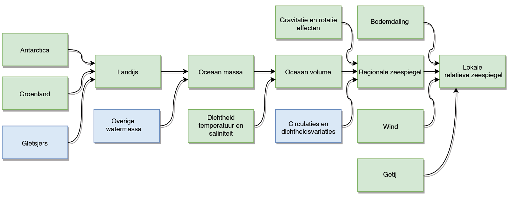

# https://rich-iannone.github.io/DiagrammeR/graphviz_and_mermaid.html

DiagrammeR::grViz("digraph {

  graph [overlap = true, fontsize = 10, layout = dot, rankdir = LR]
  
  node [fontname = Helvetica, 
        fontsize = 10,
        shape = rectangle,
        style = filled,
        color = DarkSeaGreen2,
        label = '']
      
  Ant [label = 'Antarctica']
  Groen [label = 'Groenland']
  Landijs [label = 'Landijs']
  OceaanMas [label = 'Oceaan \n massa']
  Dichtheid [label = 'Dichtheid \n temperatuur \n saliniteit', url = '#temperatuur']
  OceaanVol [label = 'Oceaan \n volume']
  GravRot [label = 'Gravitatatie en \nrotatie effecten']
  BodDal [label = ' Bodemdaling']
  RegZS [label = 'Regionale \n zeespiegel']
  Wind [label = 'Wind']
  Getij [label = 'Getij']
  LokRelZS [label = 'Lokale \n relatieve \n zeespiegel']
  
  node [shape = rectangle,
      style = filled,
      color = LightSteelBlue2,
      label = '']
  
  Glet [label =  'Gletsjers']
  OvWater [label = 'Overig \n watermassa']
  CircDichtheid [label = 'Circulaties en \ndichtheidsvariaties']

  
  # edge definitions with the node IDs
  
  Ant->Landijs  Groen->Landijs  Glet->Landijs
  Landijs->OceaanMas OvWater->OceaanMas
  OceaanMas->OceaanVol
  Dichtheid->OceaanVol
  GravRot->RegZS  OceaanVol->RegZS  CircDichtheid->RegZS
  RegZS->LokRelZS  BodDal->LokRelZS  Wind->LokRelZS  Getij->LokRelZS
  
  }",
  width = 650)

```

Naast de fysische oorzaken zijn er diverse methodologische keuzes die verschillen in de hoogte van de zeespiegel kunnen veroorzaken. Er zijn onnauwkeurigheden in de diverse meetmethoden. Daarnaast kan de beperkte historische dekking van de metingen voor vertekening zorgen. De invloed van regionale en lokale aspecten van de zeespiegel varieert per gebied. De Noordzee is onderdeel van het continentaal plat van Europa en is daardoor relatief ondiep. Hierdoor zijn op de tijdschaal van jaren tot decaden, het getij en windopzet de belangrijkste processen die bijdragen aan variaties in de regionale zeespiegel langs de Nederlandse kust.

Wereldwijd wordt doorgaans gekeken naar de absolute zeespiegelstijging. De term absolute zeespiegel wordt gebruikt voor de hoogte ten opzichte van de geoïde, het vlak dat het water zou volgen als er geen wind, getij en stroming zouden zijn in de oceaan. Lokaal is de relatieve zeespiegelstijging, de combinatie van bodembeweging en absolute zeespiegelstijging, vaak meer relevant.

## Definitie zeespiegelstand

Voor we de stijging van de zeespiegel kunnen definiëren moeten we eerst de zeespiegelstand definiëren. Om de zeespiegelstand te definiëren maken we doorgaans gebruik van een "gemiddelde zeespiegel". Omdat de zeespiegel van minuut tot minuut en van uur tot uur varieert middelen we de zeespiegel vaak eerst uit over een bepaalde periode (maand of jaar). De zeespiegelstand van uur tot uur noemen we de waterstand of waterhoogte. Als we alleen zeespiegelstand of zeespiegel noemen bedoelen we doorgaans de gemiddelde zeespiegelstand. Er zijn twee definities voor de gemiddelde zeespiegel in gebruik. Dit komt omdat er twee locaties zijn waar we de zeespiegel meten, aan de kust en op de oceanen en zeeën.

Aan de kust wordt de zeespiegel gemeten ten opzichte van een vast kenmerk. In Nederland is dat ten opzichte van het\acr{NAP} vlak. Omdat de zeespiegel kan veranderen door aanpassing van het land (bodembeweging) of aanpassing van het volume van het water noemen we dit ook wel relatieve zeespiegelstand. De Intergovernmental Oceanografysiche Commissie heeft procedures beschreven om van metingen van een getijdestations tot een zeespiegelstand te komen.

De tweede manier om de zeespiegelstand te bepalen is ten opzichte van de geoïde en te meten met satellieten. Door de hoogte van het zeespiegeloppervlak te meten over alle oceanen kan de globaal gemiddelde zeespiegel worden bepaald. Het is niet makkelijk om de zeespiegel netjes te refereren aan de geoïde. Daarom worden ook wel zeespiegelanomaliteiten gebruikt. Zeespiegelanomaliteiten zijn zeespiegelstanden uitgedrukt ten opzichte van gemiddelde zeespiegelstanden over een eerdere periode [@Author2022b].

Gebaseerd op de zeespiegelstanden kan een zeespiegelstijging worden bepaald. Een trend wordt altijd vastgesteld over een periode. De methoden voor het bepalen van de zeespiegelstijging worden verder besproken in hoofdstuk \@ref(methoden).

## Methoden {#methoden-zeespiegel}

Er zijn verschillende methoden om aspecten van de zeespiegelstijging te kwantificeren.

Boekhouden

:   In deze methode probeert men op grote schaal een balans op te stellen van verschillende componenten die bijdragen aan een fenomeen. Ook voor zeespiegelstijging worden er budgetten opgesteld. Het resultaat n deze aanpak is antwoorden op vragen als, waar komt de meeste zeespiegelstijging vandaan, van Antarctica of van Groenland? Met een gegeven lijstje oorzaken, kan er gekeken worden welke bijdragen elke grootte hebben. Men maakt gebruik van beschrijvende statistiek en bij voorkeur van gemeten data.

Data science

:   De methode op basis van data science richt zich meer op het detecteren en inschatten van veranderingen en het vergelijken van verschillende theorieën. Is er een versnelling zichtbaar in het afkalven en smelten van ijs op Antarctica? Welk deel van de trend is lange en welk deel is korte termijn? Men maakt gebruik van exploratieve, lerende en generatieve modellen. Dit gebeurt op basis van gemeten data en gesimuleerde data.

Simuleren

:   Als processen goed begrepen worden kunnen ze ook in een numeriek model gevat worden. Hiermee kunnen processen gesimuleerd worden. Dit wordt gebruikt voor het creëren van heranalyses (bijgestuurd door metingen) en bij het doorrekenen van scenario's naar projecties.

De uitdaging in het kwantificeren van de zeespiegel is om spaarzaam een verzameling van processen te kiezen waar rekening mee gehouden wordt. Alle processen tegelijk beschouwen is niet behapbaar, conceptueel, qua data beschikbaarheid en rekentechnisch.

Dit rapport maakt gebruikt van alle drie de methoden. In de beschrijving van de globale zeespiegel ligt de nadruk wat meer op de boekhoud aanpak. Voor de bepaling van de huidige zeespiegel wordt gebruik gemaakt van data science en geassimileerde heranalyses.

## Mondiale zeespiegelstijging {#boekhouding}

Absolute zeespiegelstijging wordt grotendeels veroorzaakt door twee componenten [Zie bijvoorbeeld @Chambers2017]: de totale hoeveelheid water in de oceaan (toename van massa) of in de dichtheid van het water (toename van volume). De globale zeespiegelveranderingen (gemiddeld over alle oceanen) Beide componenten zorgen ervoor dat het oceaanvolume toeneemt.

Dichtheid

:   Het oceaanwater wordt warmer doordat de oppervlaktetemperatuur stijgt. Hierdoor neemt de dichtheid van het oceaanwater af en is er een toename in oceaanvolume. Massa

:   De massa van de oceaanwater neemt toe door een toename van de totale hoeveelheid water in de oceaan. De massa kan toenemen door bijvoorbeeld het smelten van gletsjers en ijskappen (landijs) en veranderingen in opslag van land-water.

Een overzicht van de uitsplitsing van de globale zeespiegelstijging, over de periode 1990-2017 is te vinden in \@ref(fig:global-budget). Deze uitsplitsing wordt gebruikt om te kijken of de verschillende metingen met elkaar in overeenstemming zijn. In dit geval zijn de zeespiegelmetingen op basis van de verschillende altimetrie satellieten (TOPEX/Poseidon, \acr{JASON} 1,2,3) vergeleken [@Zlotnicki2016] met de oceaan massa op basis van de [GRACE]{acronym-label="GRACE" acronym-form="singular+short"}-missie [@Watkins2015] en de sterische informatie op basis van de [Argo]{acronym-label="Argo" acronym-form="singular+short"} dataset [@Llovel2014]. Sterisch slaat op de verandering in dichtheid door temperatuursverandering (thermosterisch) of veranderingen in het zoutgehalte in water (halosterische effect). Om de grafieken op elkaar aan te laten sluiten worden diverse correcties en filters toegepast. In [2](#fig:global-budget){reference-type="ref" reference="fig:global-budget"} zijn bijvoorbeeld de seizoenseffecten verwijderd, de data is gefilterd met een lopend gemiddelde, zodat deze er wat minder grillig uitzien. Er is een correctie doorgevoerd voor de [GIA]{acronym-label="GIA" acronym-form="singular+short"}. De oceaanbodem zakt waardoor het oceaanvolume toeneemt. Bij een constant zeeniveau stijgt na het toepassen van deze correctie de globale zeespiegel met 0.3mm/. Er zijn goede metingen van ijsmassaveranderingen beschikbaar sinds de start van de [GRACE]{acronym-label="GRACE" acronym-form="singular+short"} missie in 2002. De globale dekking van sterische effecten, op basis van het [Argo]{acronym-label="Argo" acronym-form="singular+short"} programma begint in 2004.

In het bovenste paneel van figuur \@ref(fig:global-budget) is te zien dat de sterische component (tot 2000m diep) en de toename van de oceaan massa samen gelijk zijn aan de geobserveerde zeespiegelstijging. Vanaf 2004 komt ongeveer een derde van de zeespiegelstijging door veranderingen in dichtheid (sterisch component) en twee derde de toename van massa van de oceaan. Het onderste paneel van figuur \@ref(fig:global-budget) laat zien dat de toename van massa met name komt door het afsmelten en afkalven van het ijs op Groenland. Een nadere beschouwing van deze balans is uitgewerkt door een groep wetenschappers [@Cazenave2018] die zich daar als onderdeel van het \acr{WCRP} mee bezig hebben gehouden. Ze komen tot de conclusie dat de gemeten zeespiegeltrend 0.37 mm hoger is dan verwacht op basis van de boekhouding over de periode 1993 - 2017. Over deze periode schatten ze de bijdrage van toename van massa op 1.4mm en de toename door temperatuurstoename op 1.3mm. Volgens @Horwath2022 zijn veranderingen in dichtheid en massa verantwoordelijk voor, respectievelijk, 38% en 57% van de mondiale zeespiegelstijging van 3 millimeter per jaar. Een nadere beschouwing van deze balans is uitgewerkt door een groep wetenschappers [@Cazenave2018] die zich daar als onderdeel van het \acr{WCRP} mee bezig hebben gehouden. Ze komen tot de conclusie dat de gemeten zeespiegeltrend 0.37 mm hoger is dan verwacht op basis van de boekhouding over de periode 1993 - 2017. Over deze periode schatten ze de bijdrage van toename van massa op 1.4mm en de toename door temperatuurstoename op 1.3mm.

(ref:global-budget-label) Bovenste paneel: uitsplitsing van globale zeespiegelstijging \acr{GMSL} naar verschillende componenten ( *ocean*: oceaan massa, *steric* sterische bijdrage). Onderste paneel uitsplitsing van oceaan massa in oorsprong van Groenland en Antarctica. De seizoensvariatie is in beide figuren verwijderd.

```{r global-budget, fig.cap= '(ref:global-budget-label)'}

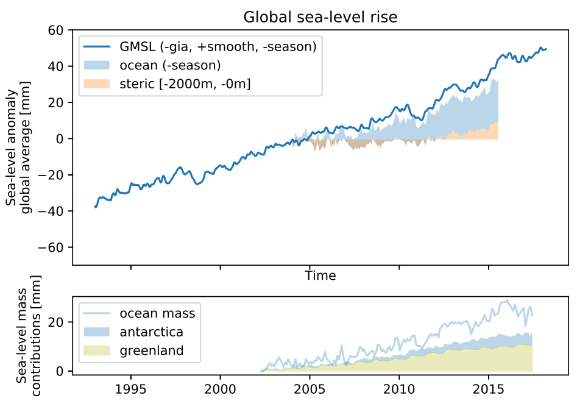
```

### Sinds de laatste ijstijd

De laatste keer dat de wereldwijd gemiddelde zeespiegel zo hoog stond als tegenwoordig was aan het einde van laatste interglaciale periode [@McKay2011], ongeveer 120 duizend jaar terug. Tijdens deze periode stond de zeespiegel 6 tot 9m hoger dan nu [@Kopp2009; @Dutton2015]. Tijdens de laatste ijstijd, het Weichselglaciaal, daalde de zeespiegel. Zo'n 21 duizend jaar terug werd het laatste dal bereikt op 125 m onder huidig zeeniveau. Sindsdien is de zeespiegel aan het stijgen, met een snelheid in de orde van tientallen mm tot enkele mm (figuur \@ref(fig:postglacial)). De grootste stijging, 20m in 500 jaar vond plaats tijdens de periode van 14.5 duizend jaar voor heden tot 14 duizend jaar voor heden. Deze periode wordt \acr{MWP}-1A genoemd. Er is discussie in de literatuur of de bron Noord-Amerika of Antarctica is [@Deschamps2012]. Voor Nederland hebben we een goed beeld van de zeeespielgstijging in de laatste 9000 jaar [@Hijm2019]. In die periode steeg de relatieve zeespiegel ongeveer 22 m, met een maximale stijging van 4 m in 200 jaar als gevolg van het leeglopen van grote ijsmeren in Noord-Amerika.

Gek genoeg is de zeespiegelstijging over de laatste eeuwen lastiger te bepalen dan over de laatste duizenden jaren. In Nederland meten we al sinds 1700, maar door het gebrek aan een hoogtemodel en de lokale verzakkingen zijn de gegevens als ongeschikt voor het bepalen van de zeespiegelstijging aangemerkt [@Veen1945]. Daarom kijken we normaal gesproken pas naar de gegevens vanaf 1890. Goede historische bronnen zijn schaars. Een mooi voorbeeld is de analyse van schilderijen van Venetië waaruit bleek dat de relatieve zeespiegel daar sinds 1700 constant stijgt [@Camuffo2017]. Andere veelgebruikte bronnen zijn gegevens uit zoutmoerassen, zie bijvoorbeeld [@Kemp2011]. De zeespiegelstijging over een periode in de orde van duizenden jaren kan bepaald worden op basis van koolstofdatering [@Libby1946] van geologische lagen [@Shepard1956]. Het is duidelijk dat de zeespiegel in de 20e eeuw sneller steeg dan enkele honderden jaren terug, tijdens de zogenaamde 'kleine ijstijd' [zie bijvoorbeeld @Buisman2006a] die duurde van de 15e tot en met de 19e eeuw . Over het antwoord op de vraag wanneer de zeespiegel precies is gaan versnellen (het 'inflexion' punt) is minder consensus. geven een overzicht van inflexiepunten varïerend van tweehonderd jaren terug tot hun eigen conclusie dat de versnelling begonnen is in 1925. Voor de bepaling van de huidige zeespiegel is deze discussie niet relevant. Deze discussie wordt vooral gevoerd in de context van het toeschrijven van de huidige zeespiegelstijging aan menselijk handelen.

(ref:postglacial-label) Relatieve zeespiegelstijging sinds de laatste ijstijd, gebaseerd op figuur van Robert A. Rohde (gebruikt in verschillende publicaties, oorspronkelijke bron wikipedia). Zie @Lambeck2014 voor een wetenschappelijke beschouwing.

```{r postglacial, fig.cap= "(ref:postglacial-label)", out.width='85%', fig.align='center'}
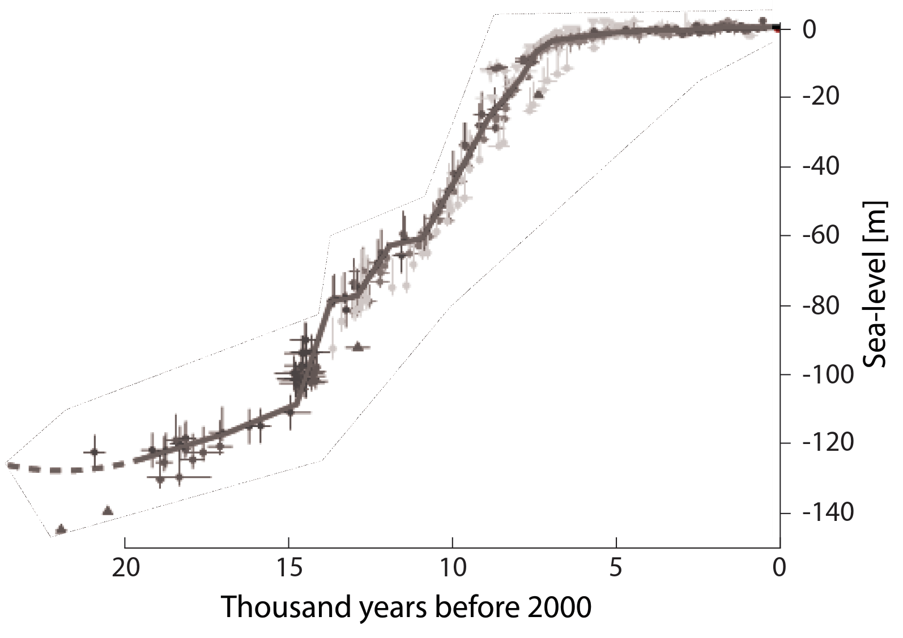
```

### Veranderingen in dichtheid {#temperatuur}

Een belangrijke factor in de trend van de zeespiegel is de temperatuur van de oceanen. Als de temperatuur stijgt, stijgt de zeespiegel doordat warmer water een lagere dichtheid heeft en dus meer massa. Zoet water heeft de hoogste dichtheid bij 4°C, maar hoe zouter het water hoe lager de temperatuur met de hoogste dichtheid [@Caldwell1978]. Van de temperatuur van het oppervlakte van de oceaan zijn lange meetreeksen en heranalyses beschikbaar [@Huang2017]. Uit deze reeks blijkt dat de temperatuur van oceaan, nadat deze in de kleine ijstijd flink was gezakt [@Voosen2017], weer aan het stijgen is figuur \@ref(fig:sst). Langs de Nederlandse kust is de temperatuur niet gestegen tot 1990. Dit is te zien in de heranalyses van de oppervlaktetemperatuur uit \acr{ERSST}, versie 5. De Noordzee is begin jaren 1990 met ongeveer een graad gestegen (blauwe lijn in onderste subfiguur in figuur \@ref(fig:sst)), [voor discussie zie @Emeis2015]. De metingen van het \acr{LMW} starten na deze veranderingen. Voor de zeespiegelstijging aan de Nederlandse kust is het belangrijk om naar de globale zeewatertemperatuur te kijken. Als de temperatuur van alle oceanen in de wereld stijgt zorgt dat ook voor zeespiegelstijging in Nederland. Doordat de Noordzee ondiep is, is het effect van de uitzetting beperkt.

(ref:sea-surface-temperature-label) Zeespiegeloppervlakte temperatuur, globaal \acr{ERSST} v5) en in de Noordzee \acr{ERSST} v5 en \acr{RWS} stations) .

```{r sea-surface-temperature, fig.cap= '(ref:sea-surface-temperature-label)', out.width='70%', fig.align='center'}
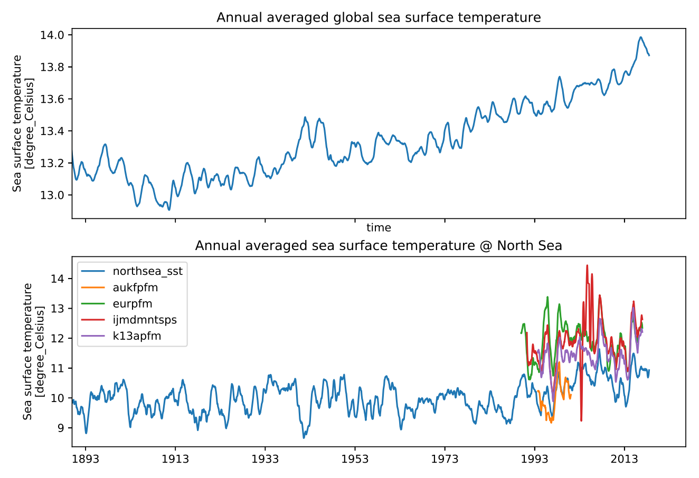
```

Voor het berekenen van de toename van de volume is niet de temperatuur van het oceaanoppervlak van belang, maar de temperatuur over de hele diepte van de oceaan. Om de temperauur in de diepe oceanen beter in kaart te brengen is begin van de eeuw het \acr{Argo} programma opgezet, een mondiaal netwerk van 3900 boeien. Deze boeien kunnen naar beneden duiken en zo de zoutgradiënt, druk en temperatuur meten over de bovenste 2000m van de oceaan. Er wordt gewerkt aan de uitbreiding tot 6000m diep [@Jayne2017], zie ook @Talley2016 voor een overzicht van metingen van schepen. Op basis van deze data wordt een schatting gemaakt van de veranderingen in dichtheid [@Roemmich2009] en deze wordt beschikbaar gesteld in een dataset. Op basis van de combinatie van zeespiegelmetingen, zwaartekrachtmetingen en dichtheid is de conclusie getrokken dat de diepe oceaan, dieper dan 2000 meter, niet opwarmt [@Llovel2014]. schatten de bijdrage van de diepe oceaan aan de zeespiegelstijging op ongeveer 0.1mm. De schatting van de zeespiegelbijdrage van de bovenste 2000m bedraagt 1.1mm op basis van data van [@Llovel2014; @Roemmich2009], zoals weergegeven in \@ref(boekhouding).

### (SM) Massaveranderingen, gletsjers, landijs en zeeijs

!!!(ontbrekende tekst) liet zien dat ongeveer 1.8 mm van de globale zeespiegelstijging kan worden toegeschreven aan veranderingen in massa. Voorbeelden van processen die bijdragen aan veranderingen in oceaanmassa zijn:

-   Afvoer van land (rivieren, ijsmassa's, gletsjers, grondwateronttrekkingen)
-   Veranderingen in opslag van water op land - Smelten van gletsjers en landijs
-   Verdamping

Voor de schatting van de bijdrage van zeespiegelstijging wordt vaak hoofdzakelijk gekeken naar veranderingen in massa van landijs en van gletsjers. Als gletsjers smelten dan kan dat water uiteindelijk in zee stromen. Daarnaast kunnen het water en ijs verdampen en als neerslag in zee terecht komen. Er zijn verschillende methode beschikbaar, zowel *in-situ* als op basis van satellieten. Directe metingen van veranderingen in lokale massa zijn mogelijk door de lancering van de \acr{GRACE} missie in 2002 en de opvolger \acr{GRACE-FO} in 2018, een tandem van twee satellieten. Op basis van deze metingen kan de hoeveelheid massa van het ijs op gletsjers en de ijskappen geschat worden [@Tapley2019]. Bijna al het landijs ligt opgeslagen op de ijskappen op Antarctica en Groenland. Desondanks domineerde de bijdrage van de gletsjers de landijs contributie aan zeespiegelstijging over de 20^ste^ eeuw [@Vaughan2013]. Dit doordat op korte tijschalen, gletsjer sneller reageren op klimatologische veranderingen dan de grote ijskappen. Over de periode 2003 - 2009 was het massaverlies van de gletsjers gelijk aan 259 gigaton per jaar, gelijk aan de bijdrage van beide ijskappen en gelijk aan een bijdrage van 29% van de geobserveerde zeespiegelstijging [@Gardner2013]. De laatste schattingen van de massabalans van gletsjers laten een duidelijk afname zien met een versnelling over de laatste twee decennia ==ref==.De bijdrage van smeltende gletsjers aan zeespiegelstijging is in de orde van 0.7 mm/jaar [@hugonnet2021,@ciraci2020].

Sinds 1995 is de bijdrage van Groenland aan het versnellen [@Rignot2011] en wordt de bijdrage van de ijskappen belangrijker. Op Antarctica ligt de grootste massa van ijs, 27Mkm^3^ of een equivalent van 58m zeespiegelstijging [@Fretwell2013]. Op Groenland ligt xxxm een equivalen van xx m zeespiegelstijging. Over de periode 2003 tot 2018 is er 3000Gt aan ijsmassa verdwenen van Groenland. Dat komt overeen met een globale zeespiegelstijging van 8 mm over 15 jaar en dus 5.3 cm/eeuw. Als 360 Gt ijs smelt dan komt dat overeen met 1 mm zeespiegelstijging op basis van de dichtheid en het oppervlak van de oceanen. De massa verandering op Antarctica was de helft van Groenland, 1500Gt. Dat komt overeen met 4 mm of 2.7 cm. Zie ook een analyse van een langere reeks aan gegevens door @Team2018.

**Animatie massaverlies Antarctica**

Voor de Zeespiegelmonitor is een animatie gemaakt die het massaverlies op Antarctica laat zien op twee verschillende plaatsen: De Thwaites Gletsjer (links) en de Pine Island Gletsjer (rechts). De animatie laat de verandering van ijsmassa zien als bewerkte radarbeelden en als grafiek (linksonder). Duidelijk zijn de verschillende processen te zien (gletsjerbeweging, afbreken, verlies van zeeijs). Een overzicht van het hele gebied is te zien rechtsonder.

<iframe width="100%" height="550" src="https://www.youtube-nocookie.com/embed/UmEEDsMqHIA?start=1" title="YouTube video player" frameborder="0" allow="accelerometer; autoplay; clipboard-write; encrypted-media; gyroscope; picture-in-picture" allowfullscreen>

</iframe>

<iframe width="100%" height="550" src="https://www.youtube-nocookie.com/embed/UmEEDsMqHIA?start=1" title="YouTube video player" frameborder="0" allow="accelerometer; autoplay; clipboard-write; encrypted-media; gyroscope; picture-in-picture" allowfullscreen> </iframe>

</br>

Verandering van opslag van water op land kunnen veroorzaakt worden door zowel klimaatvariabiliteit (veranderingen in neerslag, verdamping en rivierafvoer) en door menselijke interventies (zoals afdammen van rivieren en grondwaterontrekkingen). Deze component is deels onzeker door grote interjaarlijkse variabiliteit in combinatie met kleine veranderingen. Vaak worden opslag op en onttrekkingen uit het land tegen elkaar weggestreept [@Stocker2013]. Er wordt gewerkt om het effect van onttrekkingen van grondwater [@Wada2010; @Wada2017] en de extra opslag in kaart te brengen [@Donchyts2016] en om de totale watermassa op land te meten [zie bijvoorbeeld @Chen2016]. De laatste wetenschappelijke schatting is dat de verandering van de opslag van water op land een positieve bijdrage levert aan de zeespiegelstijging, namelijk van 0.41±0.11 mm/yr over 2003 - 2016 [@caceres2020]. De trends van het zeeijsoppervlak zijn weergegeven in \@ref(fig:ice-trend), op basis van @Fetterer2017. Het oppervlak van het zeeijs van de Noordpool is sinds 1989 aan het dalen. Het oppervlak van het zeeijs van de Zuidpool steeg gestaag tot 2015, toen is het oppervlak abrupt gekrompen. Het afsmelten van zeeijs heeft geen invloed op de hoogte zeespiegel. Het drijvende ijs ligt al in het water en verplaatst net zoveel water als de eigen massa (wet van Archimedes). Er zijn wel indirecte invloeden. Het zeeijs zorgt voor een meer reflectief oppervlak. Het smelten van ijs is een drijvende kracht achter de thermohaliene circulatie, ook wel bekend als de Noord-Atlantische Diepwaterpomp, zoals beschreven in paragraaf \@ref(circulaties). Op Antarctica en Groenland werkt het zeeijs als tegenkracht tegen het afbrokkelen van het landijs.

De trends van het oppervlakte van het zeeijs zijn weergegeven in figuur \@ref(fig:ice-trend), op basis van @Fetterer2017. Het oppervlak van het zeeijs van de Noordpool is sinds 1989 aan het dalen. Het oppervlak van het zeeijs van de Zuidpool steeg gestaag tot 2015, toen is het oppervlak abrupt gekrompen.

(ref:ice-trend-label) Zeeijsoppervlak veranderingen. Bovenste paneel Antarctische en Arctische zeeijsoppervlak, per maand en jaar weergegeven. Onderste paneel Antarctische zeeijsoppervlak (blauw) en Arctische (oranje), gecorrigeerd voor seizoenseffecten . Data: [@Fetterer2017].

```{r ice-trend, fig.cap= "(ref:ice-trend-label)"}

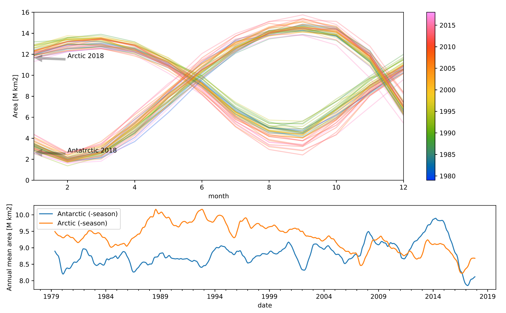
```

## Regionale and lokale processen

De voorgaande secties bespraken verschillende oorzaken die ervoor zorgen dat de globale zeespiegel stijgt. De zeespiegel stijgt echter niet overal op aarde even snel. Integendeel, er zijn plekken op de wereld waar de relatieve zeespiegel daalt, bijvoorbeeld in Scandinavïe, en er zijn plekken op de wereld waar de zeespiegel veel sneller stijgt dan het wereldwijde gemiddelde, bijvoorbeeld ten oosten van de Filipijnen \@ref(fig:regional-trends). De processen die de zeespiegel regionaal (de Noordzee versus andere zeeën) beïnvloeden zijn gravitatie effecten, oceaancirculatie en luchtdrukverschillen [zie bijvoorbeeld @Stammer2013]. Processen die de zeespiegel lokaal (langs de Nederlandse kust) beïnvloeden zijn wind opzet en het getij. Daarnaast kunnen lokale bodembewegingen voor verschillen ten opzichte van het wereldwijde gemiddelde zorgen. Ook voor het land achter de kust is de absolute bodemdaling van belang om te bepalen hoe de overstromingsgevoeligheid toe neemt.

```{r sea-level-trends, fig.cap= "Overzicht van zeespiegel trends op basis van satellietmetingen (1993-2014).", fig.show='hold' }
require(png)
knitr::include_graphics("figures/sea-level-trends.png")
knitr::include_graphics("figures/sea-level-trends-legend.png", dpi = 450)
```

### (SM) Gravitatie {#gravitatie}

Als gevolg van het zelfgravitatie effect wordt de massa van smeltende ijskappen verdeelt niet gelijkmatig over de oceaanverdeeld, Het water in de oceaan wordt door de zwaartekracht naar een op het land liggende ijsmassa toe getrokken, waardoor het zeeniveau nabij een ijskap relatief hoog is. Wanneer het landijs (deels) smelt zorgt dit voor een lokale afname in zwaartekracht waardoor de aantrekkende werking op het water is de oceaan afneemt en zal dalen. Het water verder weg van de ijskap zal wel stijgen maar minder dan het wereldwijde gemiddelde, terwijl ver weg van de ijskap de stijging groter is dan het wereldwijde gemiddelde vanwege het behoud van massa.

Figure \@ref(fig:self-gravitation). laat het geobserveerde effect van de herverdeling van het huidig smeltende ijs zien [@Hsu2017].Hierin is te zien dat Nederland gunstig ligt ten opzichte van het huidig smeltende ijs van Groenland, en van ijskappen en gletsjers. Dat zorgt ervoor dat het smeltende ijs nu voor een zeespiegelstijging van ongeveer 0.9 mm/jaar zorgt aan de Nederlandse kust terwijl het globaal gemiddeld 1.8mm/jaar is. Het meest ongunstig liggen Ivoorkust, Indonesië en Papoea-Nieuw-Guinea en de Noordkust van Australië

Deze onderverdeling komt grotendeels overeen met de verwachte vingerafdrukken [zie bijvoorbeeld voor de Wadden @Vermeersen2018]. Voor Nederland betekent dit dat we nagenoeg geen zeespiegelstijging verwachten als het gevolg van het afsmelten van Groenland. Dat we slechts ongeveer 60% van de zeespiegelstijging van smeltende gletsjers aan de Nederlandse kust verwachten en 95%, net iets minder dan een evenredig deel, van het afsmelten van Antarctica. Nederland ligt daarmee, na de Scandinavische landen die ook nog bodemstijging ondervinden van de laatste ijstijd, op een van de de meest gunstige plekken ter wereld.

Het inzicht dat smelwater zich niet uniform verdeelt over de wereld ontstond in de jaren 70 van de vorige eeuw [@Clark1977]. Het concept van zelfgravitatie is in de astronomie al langer in gebruik [zie bijvoorbeeld @Chamberlin1909]. In de eerste zeespiegelprojecties werd dit fenomeen al meegenomen [@Mercer1978]. Daarna is het in de vergetelheid geraakt. In de laatste klimaatscenario's is het, in de ontwikkeling naar beter regionaal toepasbare scenario's, weer meegenomen [@Slangen2012; @Hurk2014]. Tegenwoordig staat dit fenomeen te boek als een onderdeel van de 'sea-level fingerprints' [@Clark2002], zeespiegelvingerafdrukken. Het idee hierachter is dat de herverdeling van massa volgens een per ijsmassa vast te stellen vingerafdruk plaats vindt.

(ref:self-gravitation-label) Trends (over de periode april 2002 tot oktober 2014), berekend vanuit \acr{SLF} uit (a) Groenland, (b) Antarctica, (c) ijskappen en gletsjers en (d) de som van a-c (inclusief correcties). De blauwe lijn geeft aan waar de stijging evenredig is met de smelting, licht rode en blauwe vakken liggen gunstig, donker rode vlakken hebben te maken met meer zeespiegelstijging. Uit @Hsu2017.

```{r self-gravitation, fig.cap= '(ref:self-gravitation-label)'}

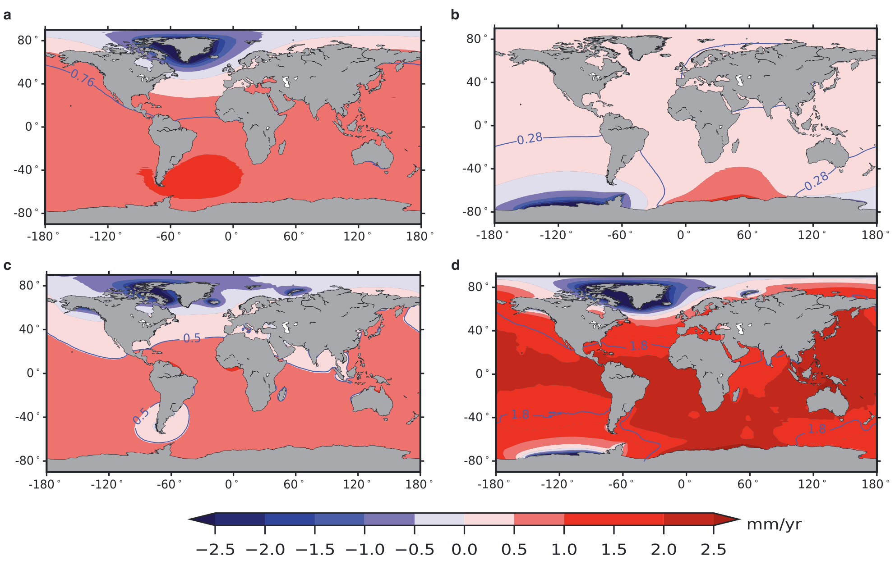
```

### (SM) Circulaties {#sec:circulaties}

Regionale verschillen in zeespiegel onstaan ook door redistributie of ocean water massa door oceaancirculaties. Oceaancirculatie,weegegeven in figuur \@ref(fig:ocean-current), wordt gedreven door verschillen in temperatuur, saliniteit, het corioliseffect en de kracht van de wind op het oppervlak van de oceaan.

(ref:ocean-current-label) De golfstroom voert warm water van de Golf van Mexico naar West Europa, op basis van het \acr{ECCO} 2 model, visualisatie NASA/Goddard Space Flight Center Scientific Visualization Studio.

```{r ocean-current, fig.cap= '(ref:ocean-current-label)'}
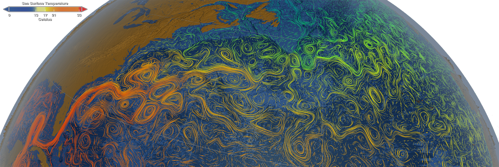
```

Een van de variaties in de circulatie wordt aangemerkt als de \acr{AMO} [@Schlesinger1994]. Deze oscillatie is gedefinieerd als de multidecadale variatie in de temperatuur van de Noord Atlantische Oceaan. Op dit moment is de \acr{AMO} index hoger dan gemiddeld \@ref(fig:amo). De temperatuur van de Noord Atlantische Oceaan is dus nu hoger dan gemiddeld [@McCarthy2015]. Deze circulaties zorgen niet rechtstreeks voor een hogere zeespiegel. Ze kunnen wel zorgen voor meer of minder stormen en een ander golfklimaat. Er zijn aanwijzingen dat we overgaan naar een negatieve \acr{AMO} [@Smeed2014]. Een lokale variant van een circulatie is de \acr{ROFI} [@Boer2009], de zoetwaterpluim uit de Rijn die de stroming rond het zuidelijk deel van de Hollandse kust beïnvloedt.

(ref:amo-label) Atlantische Multidecadale Oscilllatie, een hoge waarde hangt samen met een warme Noord Atlantische Oceaan, data: \acr{NOAA}.

```{r amo, fig.cap='(ref:amo-label)'}

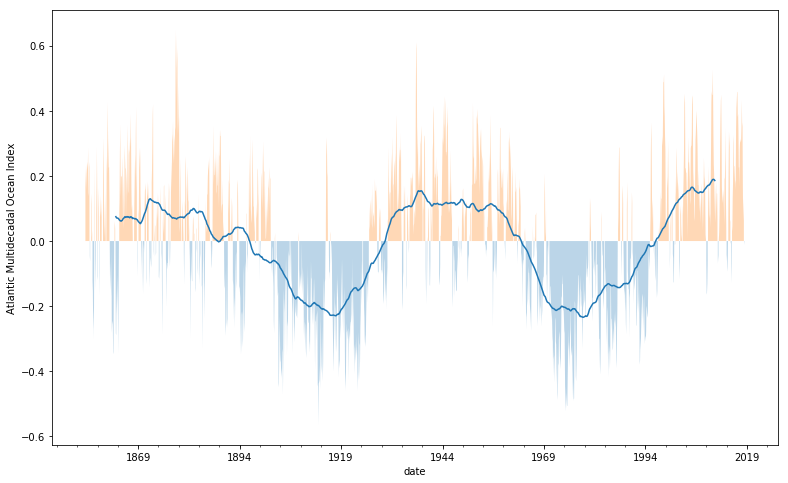

```

### (SM) Luchtdruk {#luchtdruk}

De zeespiegel verandert ook in reactie op een verandering in luchtdruk. Als er ruimtelijk luchtdruk verschillen ontstaan, dan stijgt de zeespiegel op de plek met de laagste luchtdruk terwijl in een gebied met hoge luchtdruk het zeeoppervlak naar beneden wordt gedrukt [@Dickman1988]. Dit heet het inverse barometer effect waarbij de zeespiegel stijgt met 1 cm bij een daling van 1 millibar [@Wunsch,1997]. Er is conservatie of massa, dus ruimtelijke gemiddeld is er geen verandering in zeespiegel. Het effect is relatief klein, maar niet verwaarloosbaar in gebieden met een lage breedtegraad als Nederland.Dit effect vindt ook plaats tijdens een storm waar een gebied met lage luchtdruk voor extra stormopzet zorgt. Er kunnen ook variaties over langere termijn optreden. Een bekend fenomeen is de \acr{NAO}. Bij een hoge \acr{NAO}, wat overeenkomt met een lage atmosferische druk, staat de zeespiegel op de Noord Atlantische Oceaan wat hoger.

### (SM) Getij {#getij}

Het zeeoppervlak varieert door veranderingen van de aantrekkingskracht veroorzaakt door verandering van de posities van de aarde, de maan en de zon. Dit resulteert in zes verschillende frequenties tabel \@ref(tab:getij-frequenties) die samengesteld tot een variabele waterstand leiden, het getij. Deze frequenties beïnvloeden de waterstand in verschillende boventonen (dubbeldaags getij) en modulaties (spring-doodtij cyclus). In de context van klimaatcycli kent men nog drie langere periodes, bekend als de Milankovich termen [@Munk2002].

```{r}
getijFreq <- tibble(
  `Frequentie (/h)` = c(14.49205211,
                        0.54901653,
                        0.04106864,
                        0.00464184,
                        0.00220641,
                        0.00000196),
  periode = c(      "1 dag",
                    "1 maand",
                    "1 jaar",
                    "8.85 jaar",
                    "18.613 jaar",
                    "20940 jaar"),
  Bron = c(
    "aarde draait rond",
    "maan draait om de aarde",
    "scheve aarde draait om zon",
    "afstand van aarde tot maan varieert",
    "baan maan om aarde kantelt ten opzichte van baan aarde om zon",
    "afstand van aarde tot zon varieert"
  )
)

knitr::kable(getijFreq, align = "rcl", caption = "Frequenties van het getij [@Doodson1921]")
```

<!-- Ik stel voor om onderstaand te vervangen door bovenstaande code  -->

<!-- !!!!!!! check numbers and units !!!!!!!!!!!!!!!!!!!!! -->

<!-- ::: {#tab:getij-frequenties} -->

<!--     Frequentie (/h)       Periode Bron -->

<!-- ------------------------------------------------------------------------ -->

<!--         14.49205211         1 dag aarde draait rond -->

<!--          0.54901653       1 maand maan draait om de aarde -->

<!--          0.04106864        1 jaar scheve aarde draait om zon -->

<!--          0.00464184     8.85 jaar afstand van aarde tot maan varieert -->

<!--          0.00220641   18.613 jaar baan maan om aarde kantelt ten opzichte van baan aarde om zon -->

<!--          0.00000196    20940 jaar afstand van aarde tot zon varieert -->

<!-- : Frequenties van het getij [@Doodson1921]. -->

<!-- ::: -->

De getijamplitude varieert langs de kust \@ref(fig:m2). De amplitude kan veranderen door geometrische veranderingen aan de kust, zoals bij de aanleg van de Maasvlakte 2 en bij de aanleg van de Afsluitdijk. Het getij in Nederland kan ook veranderen door zeespiegelstijging [@Pickering2017] of geometrische veranderingen elders op de wereld.

(ref:m2-label) Amplitude van \acr{M2} voor de verschillende getijstations. Het station van IJmuiden is verplaatst van Noordersluis (donar code: IJMDNDSS) naar Buitenhaven (IJMDBTHVN), deze curves sluiten op elkaar aan (bruin en paars).

```{r m2, fig.cap = '(\ref:m2-label)' }
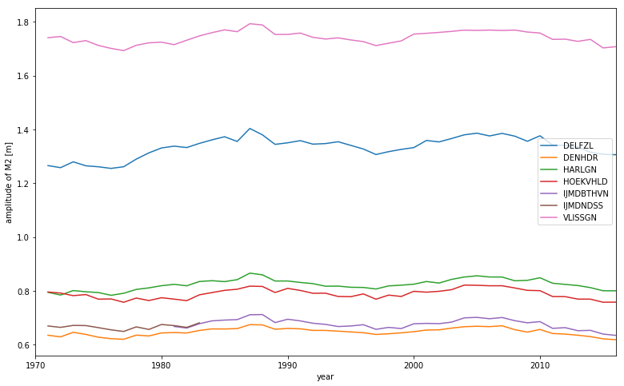
```

De belangrijkste getijcomponenten, bijvoorbeeld bij Hoek van Holland: \acr{M2}, \acr{M4}, \acr{S2}, \acr{O1}, \acr{N2}, \acr{MS4}, \acr{MU2}, \acr{L2}, \acr{MN4}, \acr{K1}, hebben frequenties in de orde van dagen en maanden, welke in de jaargemiddelde zeestanden zijn uitgemiddeld. Van de langjarige getijcomponenten heeft vooral de nodale cyclus van 18.613 jaar een effect op de gemiddelde zeespiegel. Er is discussie over hoe het nodaal getij de zeespiegel precies beïnvloedt [bijvoorbeeld @Hansen2016] omdat de manifestatie van het getij in metingen niet altijd overeenkomt met de theorie.

### Bodemdaling {#sec:bodemdaling}

Al sinds we begonnen zijn met waterstandsmetingen is de vraag welk deel van de veranderingen wordt veroorzaakt door bodemdaling en welk deel door absolute zeespiegelstijging. Om die vraag te beantwoorden moeten we weten welke daling heeft plaatsgevonden in de verschillende lagen van de bodem en ten opzichte van welke bodemlaag we de zeespiegel meten. De eerste vraag wordt in deze paragraaf beantwoord. De tweede vraag in paragraaf \@ref(verticale-referentie).

Tegenwoordig maken we onderscheid tussen de termen 'absolute zeespiegelstijging' en de term 'relatieve zeespiegelstijging'. Met absolute zeespiegelstijging bedoelen we de zeespiegelstijging ten opzichte van de geoïde. Met relatieve zeespiegel bedoelen we de combinatie van absolute zeespiegelstijging en absolute bodemdaling. Het is net zo logisch, en vroeger ook gebruikelijk [@Veen1945 zie bijvoorbeeld], om dit relatieve bodemdaling te noemen. Zowel de zakking van de bodem als de stijging van de zeespiegel hebben hetzelfde effect, dat het land ten opzichte van de zeespiegel daalt. In slechts 12% van de delta's is absolute zeespiegelstijging het grootste probleem. Het afknijpen van de sedimenttoevoer is in de meeste delta's een groter probleem [@Ericson2006], omdat de bodemdaling in de delta's niet meer gecompensserd wordt door sedimentatie. In verstedelijkte delta's zijn het winnen van gas en water onder de eigen bodem en compactie veel voorkomende oorzaken van de relatieve zeespiegelstijging [zie bijvoorbeeld @Abidin2011].

In deze paragraaf, uitgewerkt op basis van [@Hijma2017; @Hijma2018], onderscheiden we verschillende processen die voor bodemdaling kunnen zorgen, zoals weergegeven in tabel \@ref(tab:bodemdaling) . Deze zijn visueel weergegeven in \@ref(fig:bodemdaling).

```{r isometric-beach, fig.cap="Lagen van de bodem en oorzaken van bodemdaling aan de Nederlandse kust. Blauwe oorzaken zitten in de relatieve zeespiegelstijgingsmetingen. De paarse oorzaken niet."}

knitr::include_graphics("figures/isometric-beach2.png")
```

```{r bodemdaling}
knitr::kable(
  tibble::tibble(
    Oorzaak = c("Geologisch", "", "", "Antropogeen", "", "", "", ""),
    Component = c("Tektoniek", "Isostasie", "Autocompactie", "Olie-/gaswinning", "Zoutwinning", "Winning van grondwater", "Peilbeheer", "Zetting"),
    Mechanisme = c(
      "Spanningen in de ca. 100 km dikke Euraziatische aardplaat waar Nederland deel van uitmaakt. de Afrikaanse en Euraziatische aardplaat bewegen naar elkaar toe. Europa en Noord Amerika drijven van elkaar.",
      "Het terugbuigen van de noord-west Europese plaat door het afsmelten van de grote ijskappen die in de laatste glaciale periode op Groot- Brittannië en Scandinavië rusten.",
      "Samendrukking van afzettingen tussen het maaiveld en honderden meters diepte. Deze compactie vindt plaats onder het eigen gewicht en door toename van dat gewicht in het recente geologische verleden door jonge afzettingen.",
      "De drukverlaging in olie- of gasvelden zorgt voor samendrukking van de betreffende lagen.",
      "Lage druk in de cavernes die ontstaan door het winnen van zout. De cavernes worden langzaam dichtgedrukt en zorgen voor inzakking van bovenliggende lagen." ,
      "Waterdrukverlaging in de bodemlagen in de omgeving van de winning. De laag waaruit wordt gewonnen, maar ook boven en/of onderliggende lagen, worden samengedrukt." ,
      "Periodische verlaging van het waterpeil in veengebieden. Hierdoor kan zuurstof het veen dat boven de grondwaterspiegel ligt oxideren (verbranden). Peilverlaging zorgt ook voor een waterdrukverlaging in klei- en veenlagen onder de grondwaterspiegel die daardoor iets worden samengedrukt.",
      "Extra gewicht dat op het maaiveld (of waterbodem) wordt aangebracht drukt de lagen in de ondergrond worden samen."
    )
  ),
  caption = "Oorzaken van bodemdaling, naar [@Hijma2017]."
  
)
```

De invloed van autocompactie en tektoniek, langs de Nederlandse kust, worden door @Hijma2017 geschat op minder dan 0.1mm/jaar. De bijdrage van isostasie is groter in Noord Nederland (0.3 mm/jaar--0.7 mm/jaar) dan in Zuid Nederland (0.2 mm/jaar--0.5 mm/jaar), zoals te zien in figuur \@ref(fig:bodemdaling-isostasie). De gevolgen van zout en gaswinning staan weergegeven in figuur \@ref(fig:bodemdaling-winningen). Tot nu toe zijn het vooral de gaswinningen die voor een aanzienlijke bodemdaling hebben gezorgd.

```{r bodemdaling-isostasie, fig.cap="Bodemdaling door tektoniek en isostasie, uit [@Hijma2018]."}
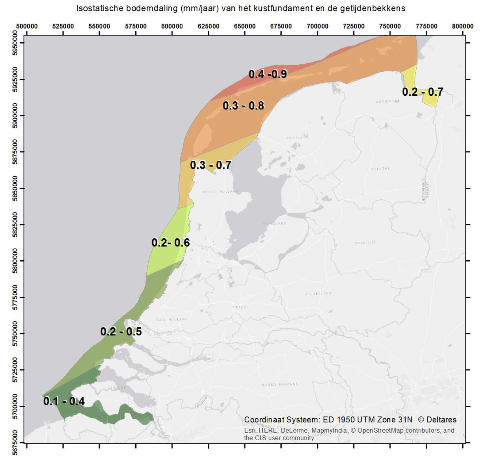
```

```{r bodemdaling-winningen, fig.cap="Bodemdaling door winningen (verleden, verwacht), uit [@Hijma2018]", fig.show='hold', out.width='50%'}
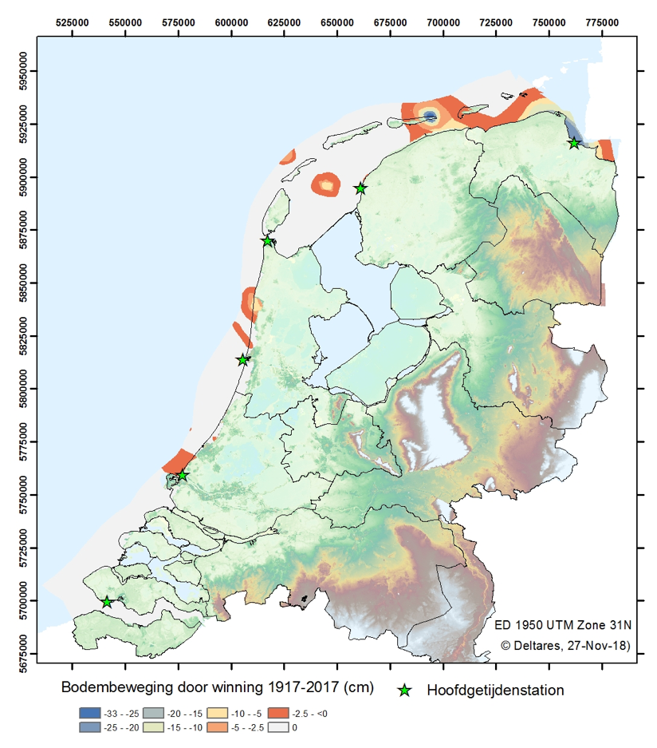
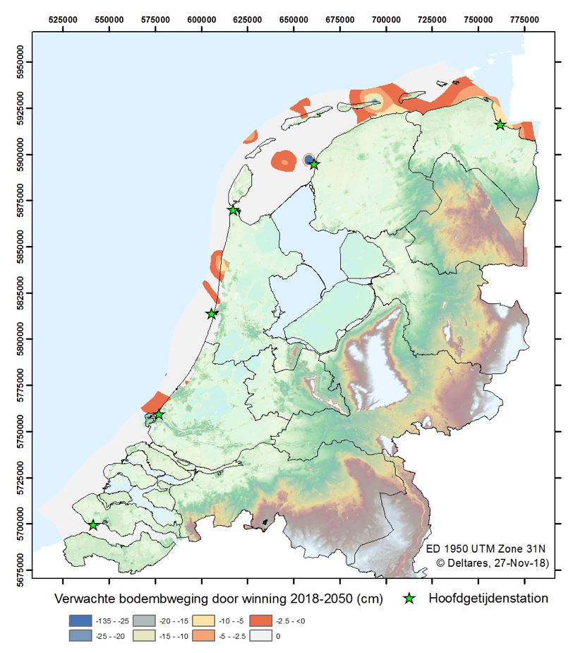
```

Een andere manier om de bodemdaling te bepalen is om de zeespiegel zowel relatief als absoluut te bepalen. Dit wordt gedaan door de getijstations met \acr{GNSS} apparatuur uit te rusten. Hiermee kan de verandering ten opzichte van de peilbout bepaald worden, maar ook ten opzichte van de geoïde. Een aantal hoofdgetijdenstations heeft al heel lang een GNSS-ontvanger. In Vlissingen wordt bijvoorbeeld sinds eind 2006 gemeten en in IJmuiden sinds eind 2004. Bij andere hoofdstations stonden soms wel GNSS-ontvangers in de buurt, maar niet op het station zelf. Recent zijn meerdere ontvangers geplaatst, op initiatief van de Bodemdalingsmonitor, bij Hoek van Holland (2021), Den Helder (2022) Harlingen (2022) en Delfzijl (2022). Het zal meerdere jaren duren voordat de bodemdalingstrend bij de stations zichtbaar zal worden in de GNSS-data, maar op termijn zal voor elk station de meerjarige bodemdalingstrend bekend zijn. De gegevens zijn ook opgenomen in internationale datasets. Naast het vaststellen van de bodemdaling voor de verschillende lagen in de bodem is het ook nodig om te bepalen ten opzichte waarvan we meten. Dit wordt uitgebreid beschreven in paragraaf \@ref(nulpaal). Sinds 1958 meten we de zeespiegelstijging ten opzichte van de diepte van de nulpalen. Hoe diep de nulpalen zijn gefundeerd staat beschreven in het overzicht van de hoofdstations in paragraaf \@ref(station-overzicht). Simpel samengevat zeggen we doorgaans dat ze gefundeerd zijn op het Pleistoceen. Voor 1958 zullen de merken minder diep zijn gefundeerd en deels in het Holoceen (van de ijstijd tot nu) gefundeerd zijn. In de periode 1890-1958 zal dus ook nog een deel van bodemdaling van de Holocene afzettingen zitten. Een overzicht van de bodemdalingscomponenten per station staan in tabel \@ref(tab:bodemdaling-per-station). Nu we bepaald hebben welke bodemdalingprocessen plaatsvinden in de verschillende lagen en ten opzichte van welke diepte we hebben gemeten kunnen we vaststellen welke bodemdalingscomponent in de relatieve zeespiegelstijging zit. We gaan er van uit dat de tektonische bodembeweging, de isostatische bodembeweging en, met uitzondering van Delfzijl, de bodembeweging door winningen onderdeel uitmaken van de relatieve zeespiegelstijging zoals deze langs de Nederlandse kust wordt gemeten.
