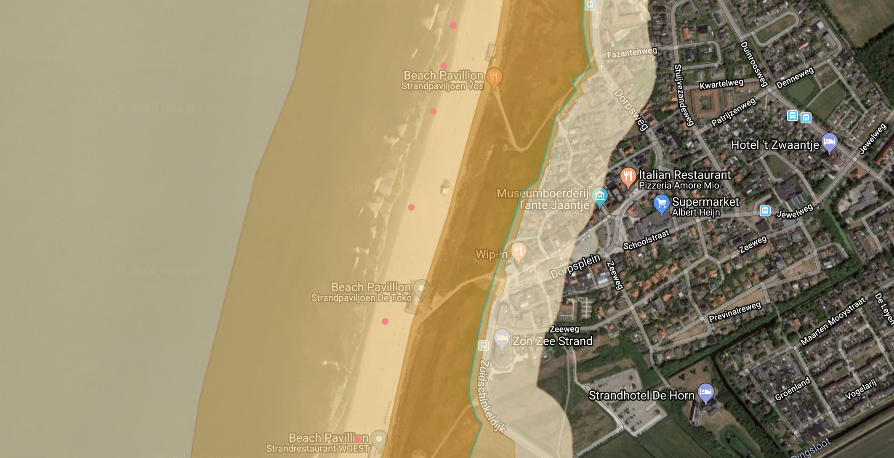
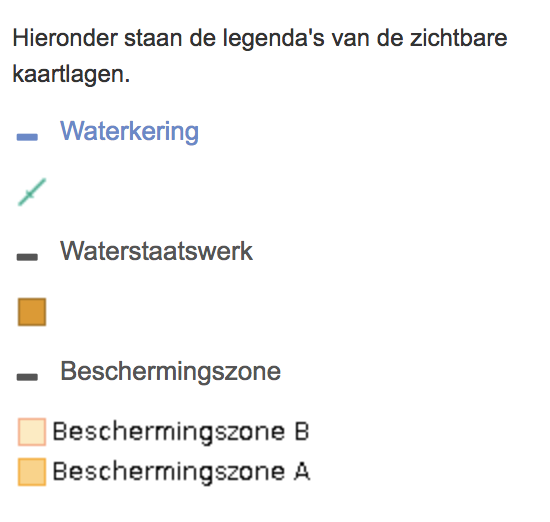

# Toepassingen {#toepassingen}

Dit hoofdstuk is een update en ingekorte versie van het rapport in de
bijlage.

Traditioneel worden de waterstandsmetingen vooral toegepast in de
scheepvaart. Met name de tijdstippen van het getij zijn belangrijk om te
bepalen of er genoeg ruimte onder de kiel (laagwater) en onder een brug
(hoogwater) is. Sinds het begin van de 20e eeuw ontstond het idee dat de
zeespiegel al lange tijd aan het stijgen is. Daardoor werd het steeds
belangrijker om ook naar de gemiddelde zeespiegel te kijken [@Veen1945;
@Veen1954].

In dit hoofdstuk bespreken we een aantal toepassingen waar de stand van
de zeespiegel, nu ten opzichte van vroeger, of in de toekomst ten
opzichte van nu, gebruikt worden. In November 2016 is een expert sessie
belegd voor gebruikers van zeespiegelindicatoren. Hierbij is gekeken
naar het gebruik van zeespiegelindicatoren voor diverse toepassingen. Op
basis van dat overzicht is onderstaand overzicht gemaakt van enkele
toepassingen waarbij indicatoren van de zeespiegel gebruikt worden. Per
toepassing wordt een overzicht gegeven van de volgende aspecten.

Definitie

:   de wijze waarop het is opgeschreven en de interpretatie

Grootheid

:   hoogwater, laagwater, gemiddelde waterstand

Categorie

:   beheer en onderhoud, beoordeling van veiligheid, ontwerp of
    planvorming (ruimtelijke ordening)

Toepassing

:   waar wordt de indicator voor gebruikt

Oorsprong

:   waar komt de indicator voor het eerst voor, in beleidsstukken,
    uitgangsdocumenten en wetten

Producent

:   organisatie die verantwoordelijk is voor het vaststellen van de
    indicator

Gebruiker

:   organisatie die het beleid uitvoert waarop het getal is gebaseerd

Verantwoording

:   hoe het getal tot stand is gekomen, referentie naar het document
    waarin dit is beschreven.

## Kustbeheer

Zoals in de besproken heeft de overheid zich als taak gesteld om de
kustlijn en het kustfundament dynamisch te handhaven. In het kader van
de vergelijking werken we hier de verschillende aspecten verder uit.

Het handhaven gebeurt in de vorm van zandsuppleties. Het
beleidsuitgangspunt is dat geen structurele erosie van de kustlijn
plaatsvindt en dat het kustfundament meegroeit met de zeespiegel. Beide
doelen zijn sinds de 3e Kustnota (RWS, 2000) herhaald in diverse stukken
(Nota Ruimte, 2004; Integraal Beheerplan Noordzee, 2007; Nationaal
Waterplan 2009-2015 en 2016-2021; Nationaal Kader Kust, 2011; Nationale
Visie Kust, 2013; Beslissing Zand, 2014; Suppletieprogramma
Kustlijnzorg; 2015). Het benodigde zandvolume om mee te groeien wordt
voor een belangrijk deel bepaald als het product van 'het oppervlak van
het kustfundament' en 'de actuele zeespiegelstijging'. De trend in de
actuele zeespiegelstijging is dus de indicator die voor het beheer en
onderhoud van de kust wordt gebruikt.

Sinds 2001 wordt jaarlijks gemiddeld 12 Mm^3^ zand gesuppleerd langs de
Nederlandse kust. Dit is de richtwaarde uit de 3e Kustnota die in de
uitvoering van het beleid in het programma Kustlijnzorg is overgenomen.
\acr{DG} Water en Bodem neemt op basis van het beleidsadvies in 2020 en
op basis van inzichten uit het programma Kustgenese 2.0 een beslissing
over het benodigde suppletievolume voor de jaren daarna. Kustfundament,
zeespiegelstijging en suppletievolume zijn direct gekoppeld aan elkaar.
De basis voor het huidige suppletievolume is een rapport uit het jaar
2000. Mulder (2000) stelt dat de totale suppletiebehoefte bij
gelijkblijvende trend in de zeespiegelstijging van 20 cm/eeuw wordt
geschat op gemiddeld 12 Mm^3^ per jaar (met een maximum van 16 miljoen
Mm^3^ per jaar). In het geschatte volume is niet alleen rekening
gehouden met zandverlies van het kustfundament, maar ook dat van de
Waddenzee en de Westerschelde. Basisuitgangspunt bij de bepaling van het
suppletievolume is de aanname dat de sedimentvraag van de kust op lange
termijn bepaald wordt door het oppervlak van het zanddelende
kustsysteem.

Naam

:   Huidige zeespiegelstijging

Definitie

:   De langjarige trend in de jaargemiddelde zeespiegel voor de zes
    hoofdstations.

Grootheid

:   Waterstand ten opzichte van \acr{NAP}

Toepassing

:   Beheer en onderhoud Kust

Oorsprong

:   3e Kustnota (2000)

Producent

:   Deltares

Gebruiker

:   Rijkswaterstaat, programma Kustlijnzorg, programma Kustgenese

Literatuur

:   Mulder (2000), [@Dillingh2010], [@Ronde2014], [@Baart2015]

## Delfstoffenwinning

Het \acr{EZK} heeft in 2015 \acr{TNO} verzocht advies uit te brengen
over het voor de delfstoffenwinning onder de Waddenzee met ingang van
2016 te hanteren beleidsscenario voor de zeespiegelstijging. Het gaat
hier om gaswinningen die worden toegestaan voor een duur van enkele
tientallen jaren, waarbij tussentijds ingrijpen mogelijk is, als dit
nodig zou blijken te zijn. De ruimte voor winning wordt mede bepaald
door de snelheid van de zeespiegelstijging. Het betreffende
beleidsscenario wordt elke 5 jaar geactualiseerd op basis van recente
inzichten.

Het \acr{TNO} heeft dit uitgewerkt in een advies [@Kroon2016] om
rekening te houden met zowel een trend als een versnelling in de
relatieve zeespiegelstijging. \acr{EZK} hanteert bij haar besluitvorming
een gebruiksruimte (meegroeivermogen minus het deel hiervan dat dient
ter compensatie van de stijgende zeespiegel) van 5mm/.

Naam

:   Beleidsscenario zeespiegelstijging

Definitie

:   Geobserveerde zeespiegelstijging van de stations in het Nederlandse
    deel van de Wadden plus een versnelling op basis van de wereldwijde
    acceleratie.

Grootheid

:   Stijging van de zeespiegel

Toepassing

:   Hand aan de kraan

Oorsprong

:   Mijnbouwwet, Natura2000

Producent

:    \acr{TNO}

Gebruiker

:   Ministerie van Economische Zaken

Literatuur

:   @Kroon2016

## Ontwerp

Een voorbeeld van een ontwerp indicator zien we bij de aanleg van de
zeewering van Maasvlakte 2, begin deze eeuw. Het midden scenario uit de
3e Kustnota is gebruikt in combinatie met een levensduur van 50 jaar. In
het noordwesten van Maasvlakte 2, waar schepen via de vaargeul de haven
van Rotterdam binnenlopen en de ruimte voor een zeewering dus beperkt
is, beschermt een harde zeewering het nieuwe havengebied. De harde
zeewering van Maasvlakte 2 heeft een kruinhoogte van circa 14 m+NAP. De
zeewering is ontworpen op omstandigheden die statistisch gezien
gemiddeld eens in de 10,000 jaar voorkomen. Hierbij is rekening gehouden
met een stijging van de zeespiegel voor de komende vijftig jaar van
0.30m, wat overeenkomt met het midden scenario uit de 3e Kustnota. Voor
de opvolgende periode van 50 jaar is er ruimte gereserveerd om de kruin
van de zeewering nog eens met 0.50m te verhogen. Het is dus een adaptief
ontwerp. De Maasvlakte 2 ligt op 5 m boven \acr{NAP} achter de
zeewering.

Adaptief ontwerpen is niet nieuw. Ook bij bijvoorbeeld de
Oosterscheldekering is rekening gehouden dat de bovenkant vervangen moet
kunnen worden. Voor de basis is wel gekozen voor een verwachte
levensduur van 200 jaar. Dit sluit ook aan bij adviezen van de eerste
Delta Commissie (ontwerpen voor een fractie van een eeuw)
[@Deltacommissie1960a].

Naast harde en zachte keringen zijn er ook nog de niet-vervangbare
kunstwerken, die niet of nauwelijks aan te passen zijn, zoals
bijvoorbeeld de Maeslantkering. Voor dergelijke kunstwerken wordt met de
bovengrens van het Veerman-scenario gerekend [@Deltacommissie2008]. Bij
het ontwerp van de zeesluis IJmuiden, met als zichtjaar 2120, is hier
gebruik van gemaakt (RWS, 2014). Zo is uitgegaan van een
zeespiegelstijging van 1.20m in 2100 ten opzichte van 2000. Voor de
jaren na 2100 wordt lineair geëxtrapoleerd.

Naam

:   Ontwerphoogte Maasvlakte 2

Definitie

:   Hoogwaterstand (inclusief golven) met een overschrijdingsfrequentie
    van $10^{-4}$/ plus een scenario van zeespiegelstijging 50 jaar
    vooruit.

Grootheid

:   Hoogwaterstand

Categorie

:   Ontwerp

Toepassing

:   Ontwerphoogte/levensduur

Oorsprong

:   @Samenwerkingsverband-Maasvlakte-21998

Producent

:   Deltares (hoogwaterstand) + KNMI (scenario's)

Gebruiker

:   Haven van Rotterdam

Literatuur

:   @Samenwerkingsverband-Maasvlakte-21998

## Toetsing/beoordeling

In \acr{WBI} [@Infrastructuur-en-Milieu2016] zijn de toeslagen voor
getijhoogwaterstijging (omschreven als "zeespiegelrijzing en lokale
effecten") bepaald voor de periode 1985-2023 op basis van een
statistische analyse van tijdreeksen van hoogwaterstanden tot en met
2012 voor 23 stations. Aanname hierbij is dat de gemiddelde trend (in de
stijging) tussen 1985 en 2012 zich voortzet tot 2023. De gemiddelde
toeslagen langs de Nederlandse kust, Westerschelde en Waddenzee zijn
voor de periode 1985-2023 gelijk aan de toeslagen voor de periode
1985-2017 (met uitzondering van Hoek van Holland en Petten Zuid).

Naam

:   Toeslag getijhoogwaterstijging

Definitie

:   Regionaal variërende toeslag getijhoogwaterstijging in 2011 ten
    opzichte van 1985

Grootheid

:   Hoogwater

Categorie

:   Toetsing

Toepassing

:   Wettelijke beoordeling veiligheid primaire waterkeringen

Oorsprong

:   Hydraulische Randvoorwaarden (HR2006)

Producent

:   Deltares

Gebruiker

:   Rijkswaterstaat, Waterschappen

Verantwoording

:   Derde toetsronde: achtergrondrapportages HR2006, documenten Douwe
    Dillingh (teruggaand tot vaststelling basispeilen in 1985) WBI2017:
    Chbab (2015)

## Percentage onder zeeniveau {#sec:perc-below-sl}

In ruimtelijke-ordeningsvraagstukken speelt de vraag waar we kunnen
wonen, bouwen en verbouwen. Vaak wordt Nederland geprezen omdat we ons
in staat hebben gesteld om te kunnen wonen onder de zeespiegel (bijv.
OECD 2014). De bijbehorende indicator die in gebruik is, is het "% van
Nederland dat onder zeeniveau ligt", soms wordt gebruikt "het percentage
van de bevolking dat onder de zeespiegel woont". Meestal wordt gesteld
dat meer dan de helft van Nederland onder zeespiegel ligt (bijv. RWS
2016, Koenders 2015, OECD 2014). Dit percentage is al geruime tijd in
gebruik (bijvoorbeeld Prillevitz 1966). Dit percentage bleek niet
correct toen het in het IPCC (2007) rapport terecht kwam en dit rapport
grondig werd gecontroleerd (Vrij Nederland 2010). Het \acr{PBL}, die de
bijdrage had geleverd aan de \acr{IPCC}, schreef een correctie
[@PBL2010]. Hierin gaven ze aan dat het percentage van Nederland onder
zeespiegel niet 55% maar 26% had moeten zijn. Dit is eigenlijk ook niet
het percentage onder zeeniveau, maar onder \acr{NAP}.

Wat misschien wel de belangrijkste conclusie van deze indicator is is
dat afgezien van het gebruik in internationale profilering de indicator
niet tot daadwerkelijke actie leidt. De indicator heeft vooral een
symbolische en representatieve waarde. Zeker vanwege dat laatste is het
wel belangrijk dat het cijfer correct en goed gedefinieerd is, nemen we
deze indicator voortaan op in deze rapportage, in dit geval in paragraaf
\@ref(nl-below-sl).

Naam

:   Percentage Nederland onder zeeniveau

Definitie

:   Onbepaald

Grootheid

:   Topografie $>$ zeeniveau

Type

:   Planvorming

Toepassing

:   Toespraken en inleiding wetenschappelijke artikelen

Oorsprong

:   Onbekend

Context

:   Dit cijfer wordt in veel toespraken gebruikt, bijvoorbeeld
    [@Rutte2016].

Producent

:   Onbekend, correctie door \acr{PBL}

Gebruiker

:   Ministers, wetenschappers, Rijkswaterstaat

Verantwoording

:   Er is geen publicatie waar het getal wordt uitgerekend. Er is geen
    methode beschreven.

## Zeespiegel over 200 jaar {#sec:200jaar}

In de 3e Kustnota is gedefinieerd dat extra ruimte moet worden
gereserveerd voor uitbreiding van de kustbescherming. Het gaat hier om
het opnemen van een reservestrook (een planologische reservering) voor
200 jaar zeespiegelstijging in de leggers van waterschappen. Hierbij
wordt uitgegaan van een pessimistisch scenario: 85 cm/eeuw
zeespiegelstijging en 10% toename wind. De waterschappen houden op die
manier rekening met ruimte om de gevolgen van zeespiegelstijging op te
vangen. Dit kan bijvoorbeeld door de waterkering te verbreden. De 3e
Kustnota stelt verder strenge voorwaarden aan bebouwing langs de kust.
Zo moet rekening worden gehouden met de planologische reservering, zijn
harde elementen in de afslagzone en reserveringsstrook die het wezen van
de flexibele kust aantasten niet toegestaan en mag nieuwe bebouwing geen
belemmering vormen voor het proces van afslag. Dit is onlangs nog eens
bekrachtigd in het voorlopige Kustpact. De waterschappen hebben het
begrip reserveringszone (ook wel vrijwaringszone genoemd) hernoemd naar
"profiel van vrije ruimte" en gesteld dat het het deel van de zone is
dat "naar het oordeel van de beheerder nodig is voor toekomstige
verbeteringen". Hierbij is expliciet de definitie van de
zeespiegelstijging losgelaten (Unie van Waterschappen, 2013).
Waterschappen leggen in de Keur en in de Legger vast wat de specifieke
invulling is.

Voor een voorbeeld van de implementatie hiervan beschouwen we de
beschermingszones bij Callantsoog in \acr{HHNK}. Er zijn twee
beschermingszones A en B. Beschermingszone A ligt naast de primaire
kering (zie [2](#fig:reservering){reference-type="ref"
reference="fig:reservering"}).

```{r, fig.show='hold', out.width='50%', fig.cap="Beschermingszones Callantsoog"}


```

Naam

:   Zeespiegel over 200 jaar

Definitie

:   Zeespiegel uit scenario maal twee + 10% wind. Gecombineerd met
    \acr{MorphAn} berekening.

Toepassing

:   Bepaling keur en legger

Oorsprong

:   [@Author2012]

Type

:   Planvorming

Context

:   ECLI:NL:RBSGR:2006:AZ5796

Instituut

:   Unie van Waterschappen (Keur/Legger), Deltares (\acr{MorphAn}),
    \acr{KNMI} scenario's

Gebruiker

:   Waterschappen

verantwoording

:   [@Author2012]

## Signalering {#sec:signalering}

Het Deltaprogramma gebruikt adaptief deltamanagement in haar taak om
Nederland te beschermen tegen overstromingen, en te zorgen voor
voldoende zoet water. Om adaptief te kunnen reageren wordt de "Meten,
Weten, Handelen" methodiek gehanteerd. Bij nieuwe externe
ontwikkelingen, zoals een versnelde zeespiegel, kan er een signaal
afgegegeven worden. Elke zes jaar worden de indicatoren en de doelen
opnieuw vastgesteld. De methodiek voor de signalering van versnelde
zeespiegel moet nog ontwikkeld worden.

Naam

:   Signalering zeespiegelversnelling

Definitie

:   Onbepaald

Grootheid

:   Zeespiegelversnelling

Type

:   Planvorming

Toepassing

:   Adaptatief deltamanagement

Oorsprong

:   Deltaprogramma

Context

:   Deze indicator wordt beschreven in de
    [@Infrastructuur-en-Waterstaat2018].

Producent

:   Kennisprogramma zeespiegelstijging

Gebruiker

:   Deltacommisaris

Verantwoording

:   Er is nog geen vastgelegde methodiek.

## Trends in toepassingen van de zeespiegel {#sec:toepassing-trends}

Uit de workshop in november 2016 bleek dat er een aantal ontwikkellingen
zijn in het gebruik van indicatoren. Zo werd besproken dat er meer
adaptief wordt ontworpen en is degene die de waterkering / kunstwerk
aanlegt ook verantwoordelijk voor het onderhoud.

::: {#tab:indicatoren-trend}
| Voorheen                     | Nu                                     |
|:-----------------------------|:---------------------------------------|
| Statische ontwerpen          | Adaptieve en/of uitbreidbare ontwerpen |
| Langere ontwerpduur          | Kortere ontwerpduur                    |
| B & O gescheiden van ontwerp | Design Build Finance and Maintain      |
| Robuust ontwerp              | Kosteneffectief ontwerp                |

: Trends in zeespiegel indicatoren
:::

Op basis van de expertsessie en de uitwerking van de indicatoren blijkt
dat indicatoren voor de middellange termijn ontbreken. Tot op het heden
wordt binnen de onderzochte toepassingsgebieden met een korte zichtduur
gerekend (5-10 jaar vooruit) of met een langere zichtduur (50-200 jaar
vooruit). In het beheer en onderhoud gaat men momenteel toe naar
ontwerpen waarbij men een beeld wil hebben van de ontwikkelingen op
middellange termijn. Denk hierbij bijvoorbeeld aan de Zandmotor waarbij
men wil weten hoe die zich langs de Nederlandse kust gaat verplaatsen.
In het ontwerp is er een trend zichtbaar naar ontwerpen met zichtjaren
in de middellange termijn. Dit komt omdat de onzekerheden op lange
termijn zo groot zijn dat een ontwerp voor een periode van 50 jaar in
veel gevallen niet doelmatig is. Deze twee toepassingen groeien dus naar
elkaar toe en dus ontstaat de behoefte aan eenduidige indicatoren op de
middellange termijn. Het is wenselijk om korte, middellange en lange
termijn indicatoren te hebben die op elkaar aansluiten.
