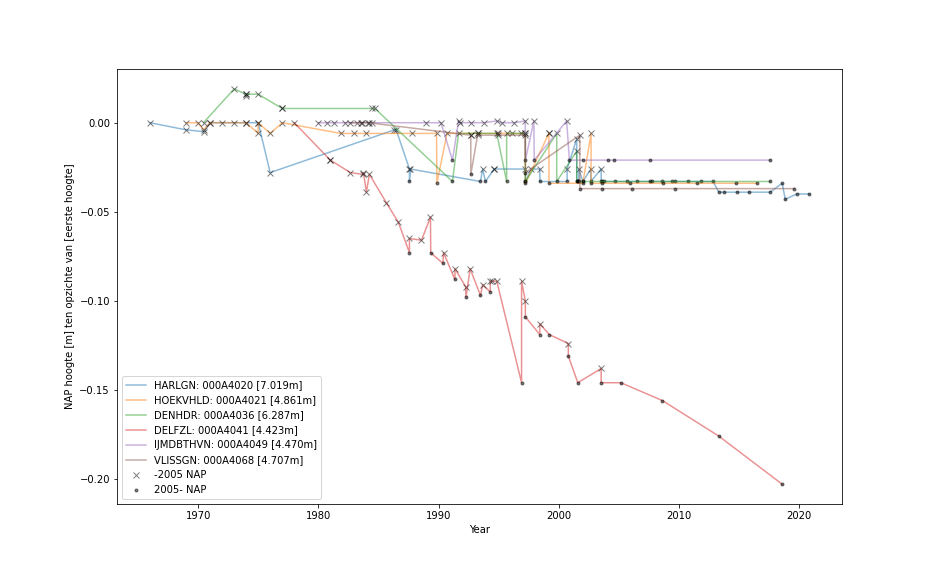

# Metingen {#metingen}


Er zijn twee manieren om de zeespiegel te meten. De relatieve zeespiegel aan de kust wordt gemeten met een vlotter of radar in een getijstation ten opzichte van een referentieniveau op het land en de absolute zeespiegel op de oceaan wordt gemeten met satellieten met een radar, ten opzichte van een spheroïde, geoïde of als anomaliteit. Dit hoofdstuk beschrijft deze twee meetbronnen.

## (FB) Getijdestations {#station-overzicht}

De eerste waterstandsmetingen aan de Nederlandse kust zijn gestart in het jaar 1700 in Amsterdam. Sinds de invoering van het \acr{NAP} zijn de gegevens ook geschikt om zeespiegeltrends mee te bepalen.

In Nederland zijn er 269 stations bekend die sinds 1890 de hoogte van de waterstand hebben gemeten. Van deze stations liggen er 69 aan de huidige kust en 16 in de Noordzee. Van deze stations zijn er verschillende stations in de loop der tijd verplaatst. Zo is het station van IJmuiden verplaatst van de Noordersluis, naar het havenhoofd en later naar de huidige locatie buiten de haven.

In figuur \@ref(fig:waterbase) is een overzicht van de beschikbare metingen van de kuststations. Niet alle gegevens zijn meer beschikbaar. Wel zijn nog oude jaar- en maandgemiddelden beschikbaar. Deze gegevens zijn gearchiveerd bij het internationale archief van de [PSMSL]{acronym-label="PSMSL" acronym-form="singular+short"}. Daar zijn de gevens beschikbaar van de volgende stations: Delfzijl, West-Terschelling, Harlingen, Den Helder, IJmuiden, Hoek van Holland, Maassluis, Roompot Buiten, Vlissingen. Van deze stations worden er zes aangemerkt als "Hoofdstations". Dit zijn zes stations, redelijk uniform verdeeld langs de Nederlandse kust, met een lange historie aan metingen. Dat zijn de stations (eerste jaargemiddelde) Delfzijl (1865), Harlingen (1865), Den Helder (1865), IJmuiden (1871), Hoek van Holland (1864), Vlissingen (1862). De jaargemiddelde gegevens gaan verder terug dan de beschikbare uur/minuten waarden in \@ref(fig:waterbase).

Deze stations maken deel uit van het [LMW]{acronym-label="LMW" acronym-form="singular+short"}. Dit systeem zorgt voor de inwinning, opslag en ontsluiting van de gegevens die de toestand van het water (standen, stroming, temperatuur, saliniteit) en het weer beschrijven.

<!-- ![Overzicht van de beschikbare waterstandsmetingen van de stations die waterstanden meten langs de kust. Rood/groen: actief/niet actief, Stippel/doorgetrokken lijn: meting t.o.v \acr{NAP} (kust)/meting t.o.v. [MSL]{acronym-label="MSL" acronym-form="singular+short"} (buitengaats)](waterbase){#fig:waterbase width="\\textwidth"} -->

(\ref:waterbase-label) Overzicht van de beschikbare waterstandsmetingen van de stations die waterstanden meten langs de kust. Rood/groen: actief/niet actief, Stippel/doorgetrokken lijn: meting t.o.v \acr{NAP} (kust)/meting t.o.v. \acr{MSL} (buitengaats).

```{r waterbase, fig.cap= "(\ref:waterbase-label)"}


```

Alle hoofdstations zijn uitgerust met twee vlotters. Er zijn ook enkele stations met andere sensoren, zoals radar. Soms kan een station een tijd niet beschikbaar zijn. Zo is het station van Den Helder wel eens uitgevallen door de groei van mosselen. De gegevens worden dan teruggeschat op basis van naburige stations (in dit geval Texel en IJmuiden). Dit wordt de opvulmethode genoemd. Daarnaast vinden er diverse validaties plaats. In de memo hierover [@Baart2016] wordt het meetproces uitgebreid beschreven (zie ook bijlage \@ref(bijlagerapporten)).

De bekende eigenschappen van de constructie van de stations worden in onderstaand overzicht weergegeven. Bij de stations van Hoek van Holland en Delfzijl heeft onder de stations gaswinning plaatsgevonden. De foto's zijn van Rijkswaterstaat.

### Vlissingen

```{r}

```

Dit station ligt aan de kade in Vlissingen (51.44210°N, 3.59610°O), nabij de buitenhaven. Het fundament is een stalen damwand met een diepte van -17.6m NAP, en een breedte van 2.2m. Binnen deze damwand liggen de meetinstrumenten. De onderwater kamer is een afgesloten betonnen plaat die zich bevindt op -4.0m \acr{NAP} tot -5.0m NAP. Het station heeft een \acr{GNSS}. Tijdens de storm van 1953 overstroomde de kade waarop het station staat. Hiervan zijn [filmbeelden](https://www.youtube.com/watch?v=bMhM449AarI) beschikbaar.

### Hoek van Holland

```{r}

```

Het station in Hoek van Holland ligt naast de Nieuwe Waterweg bij de monding van de rivier. De referentiepaal bevindt zich buiten het hoofdgebouw op het vaste land. Het hoofdgebouw is verbonden met het vaste land door een stalen brug. De basis van het hoofdgebouw ligt op stalen palen. Het gebouw is een betonconstructie met een diepte tot -3.0m NAP, hierin bevinden zich de meetinstrumenten. De peilkelder bevindt zich in het hoofdgebouw. De gehele betonconstructie heeft een fundering van meerdere damwanden. Dit zijn 8 betonnen platen (8-zijdig) met een lengte van 14.1 m. De nabijgelegen nulpaal van 28.35m is geplaatst op een diepte van 23.5m. Dit station is door gaswinning 2 centimeter verzakt [@Hijma2018] op basis van een schatting van de winningsschotel. Deze verzakking zit al in de metingen doordat het \acr{NAP} peilmerk hier niet voor is gecorrigeerd, zoals bij Delfzijl wel het geval is. In de buurt van het station is een \acr{GNSS} station geplaatst.

### IJmuiden

```{r}
knitr::include_graphics("figures/IJMDBTHVN.jpg")
```

IJmuiden ligt aan de noordkant van de jachthaven in IJmuiden, in de buurt van een golfbreker. Het hoofdgebouw bevindt zich in het water en is verbonden door een stalen trap en een brug met het vaste land. De basis van dit gebouw bestaat uit een ronde stalen damwand. De onderwaterkamer wordt afgesloten met een betonplaat tussen -3.75m \acr{NAP} en -4.5m NAP. De damwand wordt uitgebreid tot een diepte van -13m NAP. IJmuiden heeft \acr{GNSS}. De nulpaal staat op het vaste land. De metingen van IJmuiden omvatten ook de oudere metingen van locatie IJmuiden Noordersluis.

### Den Helder

```{r}

```

Dit station bevindt zich in de dijk van Den Helder. Het station heeft een pijp door de dijk naar de zee voor het meten van het waterniveau. De inlaat van deze pijp ligt op -3.25m NAP. Er is een aparte constructie voor de ventilatie van het hoofdgebouw. Het station is via een pijp door de dijk met zee verbonden en daar leggen mosselen eitjes in. Als die allemaal tegelijk groeien raakt de pijp verstopt en is het station buiten gebruik. De peilbout bevindt zich buiten het hoofdgebouw aan de overkant van de dijk. De hoofdconstructie heeft een basis van stalen damwanden die een rechthoek vormen rondom de meetinstrumenten. De nabijgelegen nulpaal van 17.5m staat op een diepte van 12.23m.

### Harlingen

```{r}

```

Het getijstation in Harlingen bevindt zich in de haven op de boulevard. Op een diepte van -2.56m \acr{NAP} loopt een pijp van het station naar zee. De inlaat van de buis wordt beschermd door een constructie, om de variaties door de golfinslag te verminderen. Het hoofdgebouw heeft een fundament van een stalen damwandconstructie met rechthoekige binnenafmetingen 2.53 x 2.27 m^2^ rondom de meetinstrumenten. De 28m lange nulpaal staat op een diepte van 22m. In de buurt van dit station start zoutwinning.

### Delfzijl

```{r}
knitr::include_graphics("figures/DELFZL.jpg")
```

Dit station bevindt zich in de haven van Delfzijl. Het station heeft een hoofdgebouw met een fundament op een stalen ronde paal (binnenbreedte = 2.3m, buitenbreedte 2.348m) en reikt tot een diepte van -20m NAP. Het gebouw is verbonden met het vaste land door middel van een stalen trap naar een kade. De peilbout bevindt zich in de constructie die aan de muur is bevestigd. De betonnen onderwaterkamer bevindt zich tussen -4 en -5 m. Dit station is door gaswinning 24cm gezakt [@Hijma2018] en zakt nog steeds. De peilbouten zijn 'losgekoppeld' van het \acr{NAP} [@Jong1973]. De hoogtes van buiten de gaswinningsschotel worden doorgetrokken naar Delfzijl. Om de relatieve zeespiegelstijging te berekenen moet daarom bij dit station de door gaswinning veroorzaakte bodemdaling opgeteld worden. In de buurt van het station Delfzijl is een \acr{GNSS} station geplaatst.

## (FB) Verticale referentieniveaus {#verticale-referentie}

Een meting van hoogte heeft een verticale referentie nodig. Hiervoor wordt een geodetisch datum gebruikt. Er zijn verschillende referentiesystemen in gebruik, in de context van zeespiegelonderzoek heeft men te maken met globale, continentale (tectonische platen), nationale en maritieme referentieniveaus.

```{r}

```

In Nederland wordt de hoogte nauwkeurig vastgesteld sinds de invoering van het \acr{NAP}. Oorspronkelijk lag het \acr{NAP} op het gemiddelde hoogwaterniveau in het IJ, van voor de afsluiting in 1872 [@Weele1971], 9 voet, 5 duim, Amsterdamse maat (2.68m) boven Stads Peyl. De Rijkscommissie Graadmeting voor Waterpassing (nu [NCG]{acronym-label="NCG" acronym-form="singular+short"}) voerde de eerste serieuze waterpassingen uit, waarmee het invoeren van het \acr{NAP} mogelijk werd. Rijkswaterstaat ([CIV]{acronym-label="CIV" acronym-form="singular+short"}) is verantwoordelijk voor het beheer van het \acr{NAP}, in samenwerking met het Kadaster.

Het \acr{NAP} wordt gebruikt om Nederlandse zeespiegelmetingen aan de kust uit te drukken. Het is gebaseerd op de ruim 30 duizend peilmerken. Het is geldig binnen het domein waar de peilmerken zich bevinden. Op zee en voor satellietmetingen op de oceaan is het niet bruikbaar.

Voor internationale uitwisseling van gegevens van getijstations wordt gebruik gemaakt van een [RLR]{acronym-label="RLR" acronym-form="singular+short"}. Voor Nederland wordt dit gebruikt om de \acr{NAP} correctie door te voeren, zoals beschreven in @Dillingh2010. Doordat een correctie van de hoogte van de peilmerken is doorgevoerd zijn metingen van voor 2005 niet gemeten ten opzichte van de huidige hoogte van het \acr{NAP}. Hier komen we zo weer op terug.

Naast het \acr{NAP} zijn ook andere hoogtesystemen in gebruik. De [IHO]{acronym-label="IHO" acronym-form="singular+short"} schrijft het gebruik van [LAT]{acronym-label="LAT" acronym-form="singular+short"} voor op de Noordzee. Dit niveau verschilt langs de kust en ligt op ongeveer 2,5m onder \acr{NAP} [@Slobbe2013]. In de Verenigde Staten wordt hiervoor [MLLW]{acronym-label="MLLW" acronym-form="singular+short"} gebruikt.

Daarnaast worden ook hoogtes ten opzichte van [ETRS89]{acronym-label="ETRS89" acronym-form="singular+short"}, het Europese coördinaatreferentiestelsel gebruikt. Dit stelsel beweegt mee met de verschuiving van Europa. Dit wordt onder andere gebruikt voor de inwinning van gegevens van [BGT]{acronym-label="BGT" acronym-form="singular+short"}, [BRK]{acronym-label="BRK" acronym-form="singular+short"} en [AHN]{acronym-label="AHN" acronym-form="singular+short"} en voor geodynamische studies in Europa.

Voor wereldwijde uitwisseling en metingen op basis van [GPS]{acronym-label="GPS" acronym-form="singular+short"} satellieten is het [WGS84]{acronym-label="WGS84" acronym-form="singular+short"} in gebruik. Het [AGRS]{acronym-label="AGRS" acronym-form="singular+short"} wordt gebruikt om de transformaties tussen [WGS84]{acronym-label="WGS84" acronym-form="singular+short"}, [ETRS89]{acronym-label="ETRS89" acronym-form="singular+short"} en \acr{NAP} mogelijk te maken.

Ten slotte wordt vaak gebruik gemaakt van een anomaliteit van de zeespiegel. De term anomaliteit wordt in de aardwetenschappen gebruikt als een verschil ten opzichte van het gemiddelde van een andere periode. Zo worden satellietmetingen gerapporteerd ten opzichte van het gemiddelde over het begin van de meetperiode. Ook klimaatscenario's en zeespiegelmetingen op zee worden vaak ten opzichte van een gemiddelde over een periode uitgerekend.

### Het \acr{NAP} en de nulpalen {#nulpaal}

Terug naar de zeespiegel langs de Nederlandse kust. Deze meten we ten opzichte van het \acr{NAP}. Voor de bepaling van de relativiteit van de stijging van de zeespiegel is het vooral van belang ten opzichte van welk punt de zeespiegel wordt gemeten. Dat werkt als volgt. In het peilhuis staat een [DNM]{acronym-label="DNM" acronym-form="singular+short"}, de moderne variant van een peilschrijver. Een ouderwetse peilschrijver is nog te zien in het peilhuisje in Herwijnen. Deze [DNM]{acronym-label="DNM" acronym-form="singular+short"} wordt periodiek gecalibreerd ten opzichte van de \acr{NAP} bout in het station. De hoogte van deze peilbout wordt gebaseerd op basis van een nabijgelegen vast punt.

Doordat het \acr{NAP} een lange historie heeft en niet alle gegevens openbaar beschikbaar zijn is het niet met zekerheid vast te stellen hoe het \acr{NAP} praktisch geïmplementeerd is. Op basis van de beschikbaar gestelde documenten en data komen we tot de volgende beschrijving.

Bij alle getijstations staan nulpalen (1e orde merken) die als vast worden verondersteld. Tot de invoering van de nulpalen [@Wemelsfelder1958] werden aan de kust bovengrondse peilmerken (2e orde merken, meestal geplaatst in openbare gebouwen) gebruikt [@Bruijne2005]. Een geografisch overzicht van de peilmerken is te vinden op [NAPinfo](https://maps.rijkswaterstaat.nl/geoweb55/index.html?viewer=NAPinfo.Webviewer#:~:text=Rijkswaterstaat%20NAPinfo%20viewer,-Het%20Normaal%20Amsterdams&text=NAP%20peilmerken%20zijn%20meetmerken%20in,van%20het%20NAP%20zijn%20vastgelegd.).

Het \acr{NAP} is dus geïmplementeerd als het vlak door de als vast veronderstelde ondergrondse merken. Per waterpassing is opnieuw bepaald welke merken als vast gehanteerd konden worden. Ter gelegegenheid van het 200 jarig bestaan van het (N)AP is een overzicht van de historie van het \acr{NAP} beschreven door @Dam2018 en eerder door @Weele1971. De historie is belangrijk omdat er niemand meer leeft die betrokken was bij de eerste waterpassing in 1888.

In de loop van de jaren 1990 ontstond het inzicht dat verschillende peilmerken toch niet zo vast waren. Daarom is een revisie doorgevoerd (ook wel bekend als de \acr{NAP} correctie) in de hoogte van de nulpalen [@Brand2004]. Anders gezegd, het \acr{NAP} referentiesysteem is opnieuw gerealiseerd wat heeft geleidt tot nieuwe hoogtes van de peilmerken (dat is, een nieuw referentiestelsel). Aangezien voor de analyses van zeespiegelgegevens consistentie in het gebruikte referentiestelsel wenselijk is, wordt de sprong in de zeespiegelmetingen als gevolg van de herziening van het \acr{NAP} verwijderd, zoals eerder beschreven in @Dillingh2010.

Dan nog een uitzondering voor het station van Delfzijl. In de vorige paragraaf beschreven we dat de nulpalen als constant werden verondersteld. Dit is niet het geval voor het station van Delfzijl. Toen geconstateerd werd dat de bodem onder Groningen snel daalde ontstond de vraag of ten opzichte van de lokale nulpaal of ten opzichte van de nulpaal voor de bodemdaling begon moet worden gemeten. Uiteindelijk is besloten de nulpaal van Delfzijl en andere nabijgelegen nulpalen van het \acr{NAP} los te koppelen [@Jong1973]. Het \acr{NAP} werd bepaald ten opzichte van peilmerken buiten de bodemdalingsschotel van Groningen. Hierdoor zit de bodemdaling van Groningen niet in de metingen van het station van Delfzijl en moeten we die er nog apart bij optellen om de relatieve zeespiegelstijging te bepalen.

### \acr{NAP} historie {#nap-historie}

Vanuit de historie van \acr{NAP} merken hebben we een overzicht gemaakt van de hoogtes van de merken. Deze overzichten zijn niet bedoeld om de bodemdaling absoluut vast te stellen maar te verifïeren dat Delfzijl wel en Hoek van Holland niet van het \acr{NAP} zijn losgekoppeld. In [2](#fig:nulpalen){reference-type="ref" reference="fig:nulpalen"} is een overzicht weergegeven van de Nulpalen in de buurt van de getijdestations. Hierin is te zien dat de nulpalen allemaal van hoogte zijn veranderd in de revisie, de \acr{NAP} correctie in 2005. Een deel van de hoogtes in het archief is reviseerd. Daarnaast is te zien dat de nulpaal van Delfzijl is losgekoppeld van het \acr{NAP}. De hoogte is niet constant. Ten slotte zien we dat de hoogte van Den Helder is aangepast tussen de vierde en vijfde waterpassing. Het is onduidelijk waarom.

In [3](#fig:nap-history){reference-type="ref" reference="fig:nap-history"} zien we dat de peilmerken in de buurt van de nulpaal van Hoek van Holland van hoogte veranderen. Dit laat zien dat niet alle peilmerken een vaste hoogte hebben gehad. We zien dat de punten dalen. Dit zou logischerwijs bodemdaling tussen de hoogte van de nulpaal en de hoogte van de peilmerken moeten zijn.

(ref:nulpalen-label) Overzicht van de historie van de \acr{NAP} merken in de buurt van de meetstations. Relatief ten opzichte van de eerste meting. (nulpalen)

```{r nulpalen, fig.cap="(ref:nulpalen-label)" }

```

## (SM) Satellietmeting van de zeehoogte

Deze sectie geeft een overzicht van satellietmetingen van de zeehoogte (altimetrie). De altimetrie satellieten zijn begonnen met meten in 1992, met de lancering van de TOPEX/Poseidon satelliet. Over de afgelopen decennia is met meerdere satellieten de zeehoogte vastgesteld. De satellieten beschikken over een radar altimeter waarmee de zeehoogte wordt vastgesteld.

De nadir (naar beneden kijkende) altimetriemetingen worden door verschillende instituten gegrid en gecombineerd in een werelddekkende dataset. Voor dit rapport maken we gebruik van de geïntegreerde dataset van @Zlotnicki2016. Deze dataset omvat de combinatie van Amerikaanse satellieten (Topex/Poseidon, Jason 1, 2, 3) en Europese satellieten (ERS-1, 2, Envisat, Altika, Cryosat-2 en Sentinel 3). De variabele die we hier gebruiken is de zeespiegel anomaliteit, dat is de zeespiegelhoogte ten opzichte van de gemiddelde zeespiegel aan het begin van de meetreeks. De gegevens hebben een horizontale resolutie van 0.167° en een temporele resolutie van 6 d.

Deze metingen worden vergeleken met de metingen van de getijstations ter validatie. Daarnaast worden ze gebruikt om de huidige globale zeespiegel en de huidige zeespiegelstijging in de Noordzee te bepalen. In eerdere rapporten werd gebruik gemaakt van de vergridde data van [AVISO]{acronym-label="AVISO" acronym-form="singular+short"}. De huidige data heeft een hogere frequentie (van maand naar 5 dagen) en de verwerkingsprocedure is wat beter beschreven.

De satellieten meten zowel met radar altimeter als met microgolf radiometer. De microgolf radiometer wordt gebruikt om een correctie toe te passen die nodig is omdat er een verstoring optreedt door de waterdamp in de atmosfeer [@Scharroo2004]. Daarnaast is de plaatsbepaling en een schatting van de drift van de satelliet belangrijk.

Door de covariantie tussen satellietparen wordt met kriging (een interpolatie techniek) een vlak gefit. Hiermee wordt in de ruimte geïnterpoleerd. In de tijd wordt lineair geïnterpoleerd. De gegevens worden ter validatie vergeleken met data die weggelaten is uit het verwerkingsproces en met getijstations. De nauwkeurigheid ligt in de orde van 4 cm ([RMS]{acronym-label="RMS" acronym-form="singular+short"}).

De satellietdata zijn niet gevalideerd bij kusten en het is bekend dat de radiometer en altimeter "vervuild" kunnen raken door de onzekerheden in de correctie voor getij en doordat de sensor deels land en deels water meet. De radius van de kriging methode zorgt ervoor dat data van nabij de kust en verderaf door elkaar geïnterpoleerd wordt. Daarom wordt aangeraden om voorzichtig te zijn met het interpreteren van data in de buurt van de kust. Recent zijn satellieten gelanceerd (bijv. Sentinel-3A en B) met een wat kleinere 'footprint' waardoor dichter bij de kust gemeten kan worden. Zie [@Vignudelli2011] voor een overzicht van diverse toepassingen.


