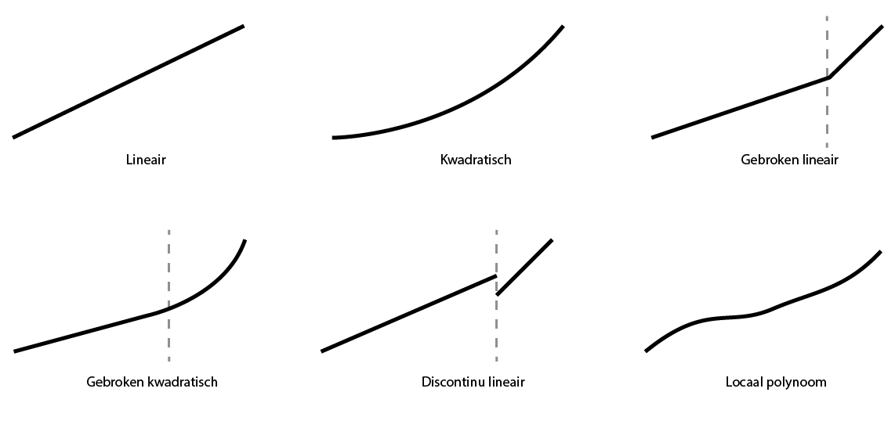
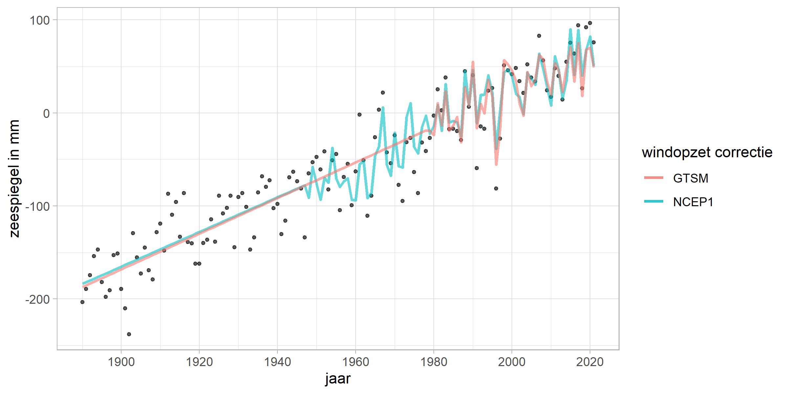

# Methoden {#methoden}

```{r setup-methoden}
require(tidyverse)
require(leaflet)
```

In hoofdstuk \@ref(inleiding) wordt uitgelegd dat er een 'huidige zeespiegel' nodig is, onder andere om de suppletiebehoefte te bepalen. Huidig is in de context van deze toepassing eigenlijk geen tijdspunt, maar een tijdsspanne. Het gaat niet om de zeespiegel vandaag, maar om de zeespiegel van enkele jaren terug tot nu.

## Afwegingen {#afwegingen}

Bij het selecteren van de methode worden er diverse afwegingen gemaakt, waarbij we gebruik maken van onderstaande criteria. Dit hoofdstuk geeft een overzicht van de belangrijkste modelkeuzes en de bijbehorende onderbouwing. Uitgangspunt voor de afwegingen is het bepalen van een goede maat voor de huidige zeespiegelstijging ten behoeve van het suppletieprogramma en de suppletiebehoefte.

**Stabiliteit** - de gebruikt methodiek moet niet van jaar tot jaar te veel variëren.

**Spaarzaamheid** - parcimonie: principe dat de eenvoudigste van twee ongeveer even plausibele verklaringen voor hetzelfde fenomeen de voorkeur heeft

**Robuustheid** - trend moet niet te veel afhangen van modelkeuzes

**Voorspelkracht** - toepassing van model in het verleden moet een goede hindcast opleveren voor een voorspelhorizon die vergelijkbaar is met de lengte van de gewenste periode (10-15 jaar)

**Behoudend** - methode moet temporeel aansluiten oftewel over de gehele periode met metingen toepasbaar zijn zonder onderbreking of verspringing.

**Generaliseerbaarheid** - methode moet ook werken bij andere stations dan in Nederland

**Power** - als er een verandering is moet de methode dat snel detecteren

**Fysisch verklaarbaar** - de gekozen formulering moet verklaarbaar zijn vanuit fysisch oogpunt

## Algemene methodiek

In dit onderzoek maken we gebruik van een \acr{GLM}, een gegeneralizeerde vorm van een lineair regressiemodel. Vooral omdat de variatie goed verklaard wordt [@Watson2016]. We gaan er vanuit dat de zeespiegel sneller aan het stijgen is of binnenkort sneller gaat stijgen dan in het verleden (ruwweg de twintigste eeuw)[^06-methoden-1]. Dit heeft implicaties voor de verwachte zeespiegel en zeespiegelstijging. Daarom maken we gebruik van schattingen van de versnelling, zie \@ref(versnelling-methods). Merk op dat een lineair model niet impliceert dat de zeespiegelstijging een rechte lijn moet volgen. Ook polynome, sinusoïde, exponentiële en loglineaire modellen vallen onder de \acr{GLM} familie.

[^06-methoden-1]: Zie ook laatste IPCC rapport: <https://www.ipcc.ch/report/ar6/wg1/chapter/chapter-9/>

## (Meet)gegevens {#bronnen}

In dit onderzoek maken we gebruik van gegevens voor de 6 zogenaamde hoofdstations Vlissingen, Hoek van Holland, IJmuiden, Den Helder, Harlingen en Delfzijl. Deze kuststations leveren sinds 1890, toen het \acr{NAP} overal was doorgevoerd, betrouwbare metingen. In De Ronde et al. (2013) is de methode Zeespiegelmonitor op de 6 hoofdstations toegepast. Gegevens worden betrokken uit de [\acr{PSMSL} database](https://psmsl.org/data/). Rijkswaterstaat draagt zorg voor de aanlevering van gegevens aan \acr{PSMSL}.

```{r, out.width="80%", fig.cap= "Locatie van de 6 hoofdstations."}
stations <- read_delim("https://raw.githubusercontent.com/openearth/sealevel/master/data/psmsl/NLstations.csv", delim = ";")

leaflet(stations) %>%
  addTiles() %>%
  addCircleMarkers(lat = ~Lat, lng = ~Lon, label = ~StationName, labelOptions = labelOptions(noHide = T))
```

De overige stations waarvan gegevens in PSMSL opvraagbaar zijn worden niet gebruikt. Het station van West-Terschelling (1921) wordt buiten beschouwing gelaten omdat het in de buurt ligt van Den Helder en Harlingen. Het station van Maassluis (1848) ligt kustinwaarts ten opzichte van Hoek van Holland en kan afgesloten worden door de Maeslantkering. Daardoor is de waterstand niet meer gelijk aan die van de open zee. Het station Roompot Buiten heeft een relatief korte historie (jaargemiddelden beschikbaar sinds 1982) en overlapt met Vlissingen. Roompot Buiten heeft wel een belangrijke functie in de operationele toepassing, waarin Roompot Buiten wel en IJmuiden niet als een hoofdstation wordt gezien. Roompot Buiten is in de Zeespiegelmonitor niet meegenomen als hoofdstation.

We maken geen onderscheid naar in welke mate de stations zijn beïnvloed door de diverse ingrepen aan de Nederlandse kust. Er hebben diverse kleinere en grotere ingrepen plaatsgevonden die invloed hebben op de metingen. Denk hierbij aan de aanleg van de Afsluitdijk, de aanleg van de Deltawerken, sinds de jaren 1990 het dynamisch kustbeheer en vooral de diverse lokale aanpassingen binnen de havens. Deze effecten onderscheiden we niet.

Op dit moment is van Station Delfzijl onzeker of de vertikale positie de laatste 10-15 jaar correct is doorgevoerd. [@Honingh2021]. Zij schrijven:

> Delfzijl is het enige hoofdgetijdenstation waarvan de nulpaal niet tot het primaire meetnet behoort. Dit komt doordat de olie, gas en zoutwinning hebben geresulteerd in onstabiele merken in het grootste deel van Friesland en Groningen, waardoor deze niet deel uitmaken van het primaire net. Dit betekent dat Delfzijl alleen met secundaire waterpassingen wordt ingemeten. Omdat Delfzijl tot een zakkingsgevoelig gebied behoort, worden eens per 5 jaar secundaire waterpassingen uitgevoerd in dit gebied. Tijdens deze waterpassingen worden zowel de nulpaal en de M-bout ingemeten. De laatste jaren zijn hoogtewijzingen bij Delfzijl echter niet goed doorgevoerd voor de waterstandsmetingen. De laatste hoogtewijziging van de nulpaal bij Delfzijl is doorgevoerd in 2013 (hoogte=4,247 m+NAP), terwijl de laatste regionale waterpassing in 2018 (hoogte=4,220 m+NAP) is uitgevoerd (Kremers, 2021 & Alberts, 2020). Ook zijn er in de periode 2015-2020 geen B0-correcties geweest, omdat de maximale geconstateerde afwijking 3 mm was. Echter worden de B0-metingen ten opzichte van de M-bout ingemeten, maar de M-bout wordt nu niet jaarlijks ingemeten ten opzichte van de nulpaal. Dit is wel noodzakelijk omdat de nulpaal en de M-bout onafhankelijk van elkaar bewegen.

Rijkswaterstaat heeft begin 2022 geconstateerd dat een inhaalslag nodig is voor de verticale correctie van de waterstandsmetingen bij Delfzijl. Deze correctie wordt begin 2023 verwacht. Vanwege deze onzekerheid berekenen we de zeespiegel en -stijging ook op basis van het gemiddelde van alleen de 5 andere hoofdstations. Het weglaten van gegevens van Delfzijl leidt tot informatieverlies, maar het meenemen van dit station zou kunnen leiden tot fouten. We kiezen hier voor het vermijden van fouten. Zogauw er gecorrigeerde waarden voor Delfzijl beschikbaar zijn, kan de analyse met alle zes hoofdstations herhaald worden. De verwachting is dat dit in de eerste helft van 2023 gebeurt (mondelinge communicatie, Rijkswaterstaat).

Een andere bron van gegevens zijn altimetriemetingen via satellieten. Voor de Noordzee zijn sinds 1993 gegevens beschikbaar gegrid tot een resolutie van een kwart lengte- en breedtegraad. Deze gegevens worden gebruikt ter verificatie van het absolute deel van de zeespiegelstijging en als bron voor de recente globale zeespiegelstijging. Meer informatie staat in paragraaf \@ref(satellietmetingen).

::: rmdnote
Voor de huidige zeespiegel wordt het gemiddelde van de hoofdstations Vlissingen, Hoek van Holland, IJmuiden, Den Helder en Harlingen gebruikt.
:::

## Tijdschaal {#tijdsschaal}

De gegevens van de getijstations zijn beschikbaar in verschillende temporele resoluties, variërend van jaarlijks tot gegevens per minuut. Voor het bepalen van de gemiddelde zeespiegel wordt de jaarlijks gemiddelde zeewaterstand per kuststation gebruikt. De belangrijkste cyclus in de waterstanden is de 18.613 jarige nodale cyclus. Seizoenseffecten worden veroorzaakt door seizoensgedrag in zowel wind, luchtdruk als temperatuur/dichtheid. PSMSL stelt ook reeksen van de maandgemiddelde zeewaterstanden beschikbaar. Deze reeksen vertonen meer variatie en leveren voor de statistische analyse van de trend in de actuele zeespiegelstijging geen additionele inzichten op. Zie ook de gedetailleerde uitsplitsing per station in het [rekendocument]().

## Welke termen?

De methode in dit onderzoek bouwt verder op de aanpak zoals beschreven in @Baart2015. De variatie in de zeespiegel wordt in een aantal componenten uitgesplitst. Het uitsplitsen van de variatie van jaargemiddelde zeespiegel wordt gedaan met behulp van een \acr{GLM}. Een lineair model wordt gebruikt als onderdelen tot elkaar optellen. In deze sectie beschrijven we welke termen in dit model meegenomen worden en waarom.

In eenvoudige vorm wordt de waterstand beschreven als de volgende vergelijking:

```{=tex}
\begin{equation} 
  h_t = constante + trend + versnelling? + getij + wind + residu
  (\#eq:trend)
\end{equation}
```
De versnelling is optioneel (zie sectie \@ref(versnelling-methods). In \@ref(eq:gedetailleerdevergelijking) is de gedetailleerde wiskundige vergelijking van het regressiemodel voor de zeewaterstand opgenomen.

### Versnelling? {#versnelling-methods}

We gaan er niet vanuit dat de zeespiegel altijd een lineaire trend zal blijven volgen. Daarom geven we het model de mogelijkheid om een versnelde of vertraagde zeespiegel uit te rekenen.

Om de versnelling van de zeespiegel te beschrijven zijn er in de literatuur verschillende varianten in omloop. Deze worden hieronder schematisch weergegeven en beschreven.

```{r accelerations, fig.cap="Schematische weergave van de verschillende modelvarianten om de zeespiegelstijging te schatten. " }

```

1.  Een *lineaire* aanpak gaat ervan uit dat de versnelling afwezig is. Deze methode wordt toegepast door NOAA voor [historische reeksen](https://tidesandcurrents.noaa.gov/sltrends/mslUSTrendsTable.html). Vanuit het spaarzaamheidsprincipe veronderstellen we dat dit model geldt (nulhypothese) tenzij het verworpen wordt.
2.  Een *kwadratische versnelling*. Dit is de gebruikelijke [@Jevrejeva2014; @Church2011] en formele manier om de versnelling mee te nemen. De methode bevat naast een parameter voor de lineaire trend in de zeespiegelstijging een extra parameter voor de versnelling in de zeespiegelstijging (zie \@ref(eq:trend)). Op de significantie van deze parameter wordt statistisch getoetst. Deze methode wordt weergegeven met vergelijking \@ref(eq:quadratictrend).
3.  De *gebroken lineaire* methode gaat ervan uit dat de zeespiegelstijging abrupt versneld is. Een abrupte versnelling kan optreden als een groot gebied tegelijk boven het 0 punt komt te liggen. In de praktijk wordt het ook gebruikt om een aparte trend uit te rekenen voor het satelliettijdperk. Sinds 1993 (na de lancering van de [TOPEX/Poseidon](https://eospso.nasa.gov/missions/topexposeidon) satelliet) meten we de zeespiegel ook met satellieten . De satellietmetingen laten een hogere zeespiegelstijging zien dan de gemeten waterstanden in het getijstationtijdperk ('tide gauge era'). Hierbij wordt 1993 vaakgenoemd als de start van de versnelde zeespiegel [bijvoorbeeld @Stocker2013]. Om goede vergelijkingen te maken is het daarom nodig om ook voor deze periode een trend te bepalen. In deze methode kan de trendparameter vanaf het jaar 1993 wijzigen. Op de significantie van de trendbreuk wordt statistisch getoetst. Dit gebroken trendmodel wordt weergegeven in vergelijking \@ref(eq:brokentrend).
4.  De *gebroken kwadratische* versnelling gaat er van uit dat de zeespiegel in de jaren 60 van de vorige eeuw is gaan versnellen als gevolg van de verhoogde uitstoot van broeikasgassen na de tweede wereldoorlog (Slangen et al. 2016, Dangendorf et al. 2019). Met een geavanceerd statische methode is dit ook gevonden door Keizer et al (submitted). Voor toepassing hier wordt vóór 1960 een lineaire toename aangenomen. De versnelling vanaf 1960 wordt berekend op de manier die hierboven is beschreven bij de kwadratische versnelling. Dit gebroken trendmodel wordt weergegeven in vergelijking \@ref(eq:brokenquadratic).

De keuze van het model heeft implicaties voor de huidige zeespiegel, immers het bepaalt deels hoeveel zeespiegel er wordt toegekend aan veranderingen in getij of windopzet. Het is dus belangrijk om het model te kiezen dat met de grootst mogelijke waarschijnlijkheid de huidige zeespiegelstijging beschrijft. Tegelijkertijd houden we vast aan de uitgangspunten in paragraaf \@ref(afwegingen). De uiteindelijke modelkeuze (welk model is beter dan het simpelste, dus lineaire, model) vindt plaats op twee criteria. Er moet sprake zijn van een significante acceleratie of deceleratie en er moet sprake zijn van een beter model. Dat laatste wordt vastgesteld met behulp van het \acr{AIC}, waarbij een afweging wordt gemaakt tussen de complexiteit en de toegevoegde waarde. Het \acr{AIC} criterium is een afweging op basis van de statische eigenschappen van de verschillende modellen. Het doet geen uitspraak over de juistheid van onderliggende fysische processen.

5.  Een andere methode is om een *discontinue lineaire* trend te berekenen. Door over aparte perioden trends uit te rekenen krijg je trends waarvan de intercepts niet aansluit op de vorige periode. Dit is de methode zoals gebruikt in het laatste [IPCC rapport](https://www.ipcc.ch/report/ar6/wg1/chapter/chapter-9/). Hierbij worden trends over verschillende perioden apart uitgerekend.
6.  *Lokaal polynoom* is een methode met meer vrijheidsgraden en wat exploratiever van aard. De parameters worden gebaseerd op "expert judgement" en "trial en error" [@Cleveland1994]. Het voordeel van deze methode is dat deze de mogelijkheid open laat van een meer variërende trend over tijd. Het nadeel is dat deze methode door het grotere aantal vrijheidsgraden ook wat meer kan "wapperen", vooral aan het uiteinde. Dat wil zeggen dat de trend aan het eind van de reeks, met nieuwe data, snel van richtingscoefficient kan veranderen.

De laatste twee methoden hebben we in deze rapportage niet gebruikt vanwege de genoemde nadelen.

## Getij {#methode-getij}

Het getij, met name de nodale cyclus, zoals beschreven in paragraaf \@ref(getij), wordt meegenomen als gelinearizeerde amplitude en fase, in de vorm van een $u$ en $v$ component (vergelijking \@ref(eq:gedetailleerdevergelijking)). Het is ook mogelijk om het equilibrium getij [@Baart2012e] op te leggen. Het equilibrium getij is het getij dat zou optreden zonder invloed van land of ondiepte op de propagatie van de getijgolf. In Nederland komt het nodaal getij in de buurt van het equilibrium, maar aan andere kusten komen metingen en het equilibrium getij vooralsnog niet overeen [@Cherniawsky2010; @Baart2012e]. Met het oog op de generieke toepasbaarheid en zolang er geen uitsluitsel is om het anders te doen gaan we voorlopig nog uit van het geobserveerde getij.

## Wind {#methoden-wind}

Omdat de Nederlandse kust aan een continentaal plat ligt, waar de wind voor een grote opslingering kan zorgen, willen we het effect van wind meenemen in de analyse. Dit is op twee verschillende manieren gedaan.

1.  Door gebruik te maken van windgegevens. De heranalyses (een combinatie van modellen en historische gegevens) van de \acr{NCEP} [@Kalnay1996], op basis van een punt op de Noordzee (lat: 52.38, lon: 3.75), worden gebruikt als basis voor de schatting van de windopzet. De maandgemiddelde Noord-Zuid en Oost-West component worden gebruikt. Ten opzichte van @Baart2015, waar deze methode in detail beschreven staat, worden de gegevens ongeroteerd gebruikt om de gegevens generiek toepasbaar te maken. De \acr{NCEP} windanalyse is beschikbaar vanaf 1949. De zeespiegelberekening is ook uitgevoerd met een alternatieve windcorrectie ([20CR heranalyse](https://psl.noaa.gov/data/20thC_Rean/)). Het voordeel van deze versie is dat er heranalyses beschikbaar zijn vanaf 1836 - 2015, een veel langere periode dan de \acr{NCEP}. Omdat de \acr{20CR} serie niet na 2015 beschikbaar is, is er ook een gecomineerde heranalyse gemaakt, met gegevens van \acr{20CR} (t/m 2015) aangevuld met \acr{NCEP1}.

2.  In (referentie ontbreekt, Frederikse?) is onderzocht of het gebruik van stormopzetten uit \acr{GTSM} [@Muis2020; @Muis2016] van toegevoegde waarde is voor het bepalen van de zeespiegelstijging. Het doorrekenen van wind naar de kust met een hydrodynamisch model heeft als voordeel dat getij-stromingsinteractie, het inverse barometer effect en stormopzet onderscheiden kunnen worden. Als test zijn de stormopzetten, berekend per station en over de stations gemiddeld, aan het model toegevoegd. Deze beogen dezelfde fysica te beschrijven als de wind op de Noordzee. Beide aanpakken laten goede resultaten zien over de periode (1979-2014) (figuur \@ref(fig:wind-versus-surge)). De windreeksen die als invoer in \acr{GTSM} worden gebruikt zijn beschikbaar vanaf het jaar 1949. De \acr{GTSM} aanpak is iets beter in het beschrijven van de extreemste jaren, en jaren met veel oostenwind zoals 1996 (figuur \@ref(fig:wind-versus-surge)). Een deel van de GTSM resultaten is te vinden via de [Copernicus site](https://cds.climate.copernicus.eu/cdsapp#!/dataset/10.24381/cds.a6d42d60?tab=overview). Voor de huidige zeespiegelmonitor is GTSM met ERA5 wind forcing aangevuld tot en met 2021 voor gebruik in de zeespiegelmonitor en bestrijkt nu de periode 1979 - 2021.

(ref:wind-versus-surge-caption) Huidige zeespiegelstijging volgens het lineaire model met verschillende correcties voor windopzet: \acr{GTSM} en met geobserveerde wind (\acr{NCEP1}) . De trend is gefit op de jaargemiddelde waarden voor de 5 stations.

```{r wind-versus-surge, fig.cap= "(ref:wind-versus-surge-caption)"}


```

::: rmdnote
Welke correctie voor windopzet gebruiken we?

In de huidige zeespiegelmonitor wordt de GTSM heranalyse gebruikt voor de opzetcorrectie. Het voordeel van deze correctie is dat de wind en stormopzet hierbij onafhankelijk van de trend wordt berekend. De resultaten met de beide andere windcorrecties (NCEP, CR20 en gecombineerd) worden hiernaast gepresenteerd in bijlage \@ref(varianten).
:::

## Residu

Als in een jaar de zeespiegel iets hoger staat dan verwacht (in relatie tot het regressiemodel, een positief residu), is het iets waarschijnlijker dat het residu het daaropvolgende jaar ook positief is. Dit noemt men autocorrelatie. In de literatuur is dit, in de context van zeespiegelmetingen, beschreven door bijvoorbeeld @Bos2014. Zij adviseren om voor jaargemiddelden een \acr{AR} term mee te nemen, net name een \acr{AR}1 term, rekening houdend met 1 jaar terug. Zie ook @Visser2015 voor een nadere discussie.

## Gedetailleerde vergelijking {#detail-vergelijking}

De volledige vergelijking van het regressiemodel (zonder versnelling of trendbreuk) is in wiskundige notatie als volgt:

```{=tex}
\begin{align} 
h_t &=& \beta_{constante} + \beta_{trend} t + versnelling?  \notag \\
&+& \beta_{nodal_u} \cos\left(\frac{2\pi t}{18,613}\right) + \beta_{nodal_v} \sin\left(\frac{2\pi t}{18,613}\right)  \notag \\
&+& \beta_{wind_{u}} u\left|u\right|(t) + \beta_{wind_{v}} v\left|v\right|(t) + \varphi h(t-1) + \epsilon_{t} (\#eq:gedetailleerdevergelijking)
\end{align}
```
Hierbij is $h_t$ de zeewaterstand in jaar $t$, $\beta_{constante}$ is het niveau van de basis zeespiegel in de epoch 1970. gedefinieerd. Parameter $\beta_{trend}$ beschrijft de lineare stijging, dat is het aantal eenheden (bijvoorbeeld millimeter) waarmee de zeespiegel ieder jaar stijgt. De amplitude en fase van het 18,613-jarige nodale getij volgen uit de schattingen van de modelparameters $\beta_{nodal_{u}}$ en $\beta_{nodal_{v}}$, [zie @Baart2012e voor details]. De parameters $\beta_{wind_{u}}$ en $\beta_{wind_{v}}$ representeren de invloed van de wind en de daarmee samenhangende luchtdruk. De term $\varphi$ is de autocorrelatie met de zeespiegelstand van het voorgaande jaar.

De vergelijking van het regressiemodel (zonder versnelling of trendbreuk) bij gebruik van de windopzet uit \acr{GTSM} wordt de vergelijking:

```{=tex}
\begin{align} 
h_t - surge &=& \beta_{constante} + \beta_{trend} t + versnelling?  \notag \\
&+& \beta_{nodal_u} \cos\left(\frac{2\pi t}{18,613}\right) + \beta_{nodal_v} \sin\left(\frac{2\pi t}{18,613}\right)  \notag \\
&+& \varphi h(t-1) + \epsilon_{t} (\#eq:gedetailleerdevergelijkingGTSM)
\end{align}
```
waarbij $h_t - surge$ de zeewaterstand minus de opzet uit GTSM is in jaar $t$.

Voor de term $versnelling?$ kan voor de kwadratische versnelling de volgende term ingevuld worden:

```{=tex}
\begin{equation} 
  \beta_{acceleration} t^2
  (\#eq:quadratictrend)
\end{equation}
```
Voor de term $versnelling?$ kan in vergelijking \@ref(eq:gedetailleerdevergelijking) de volgende term ingevuld worden in het geval van gebroken lineaire trend:

```{=tex}
\begin{equation} 
  \beta_{1993} (t-1993)(t>=1993)
  (\#eq:brokentrend)
\end{equation}
```
Voor de term $versnelling?$ kan in vergelijking \@ref(eq:gedetailleerdevergelijking) de volgende term ingevuld worden in het geval van gebroken kwadratische trend:

```{=tex}
\begin{equation} 
  \beta_{1960} (t-1960)(t^2>=1960)
  (\#eq:brokenquadratic)
\end{equation}
```
