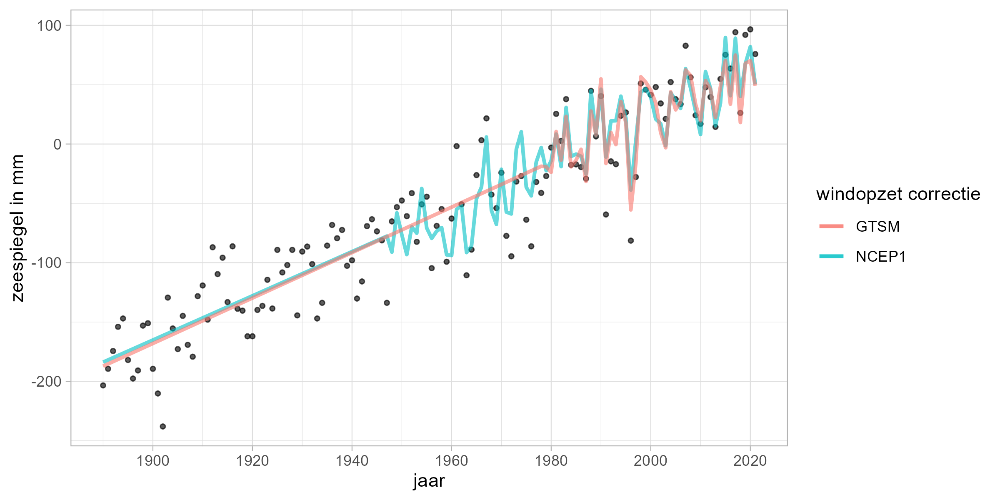

# Methoden {#methoden}

In hoofdstuk \ref(toepassingen) staat verder uitgelegd dat er een 'huidige zeespiegel' nodig is, onder andere om de suppletiebehoefte te bepalen. Huidig is in de context van deze toepassing eigenlijk geen tijdspunt, maar een tijdsspanne. Het gaat niet om de zeespiegel vandaag, maar om de zeespiegel van enkele jaren terug tot nu.

Met de 'huidige zeespiegel' wordt zowel de huidige stand als de trend die leidde tot de huidige stand bedoeld, dus de huidige zeespiegelstand en de huidige zeespiegelstijging.

Bij het selecteren van de methode worden er diverse afwegingen gemaakt, waarbij we gebruik maken van onderstaande criteria. Dit hoofdstuk geeft een overzicht van de belangrijkste modelkeuzes en de bijbehorende onderbouwing. Deze afwegingen voor het bepalen van een goede maat voor de huidige zeespiegelstijging ten behoeve van het suppletieprogramma en de suppletiebehoefte beantwoorden.

**Stabiliteit** - methode moet niet van jaar tot jaar te veel variëren.

**Spaarzaamheid** - parcimonie: principe dat de eenvoudigste van twee even plausibele verklaringen de voorkeur heeft

**Robuustheid** - trend moet niet te veel afhangen van modelkeuzes en periodes

**Voorspelkracht** - toepassing van model in het verleden een goede hindcast opleveren

**Behoudend** - methode moet temporeel aansluiten

**Generaliseerbaarheid** - methode moet ook werken bij andere stations dan in Nederland

**Power** - als er een versnelling is moet de methode dat snel detecteren

## Welk model? {#welkmodel}

Er is een rijke diversiteit aan modellen beschikbaar om een korte termijn trendschatting te maken. Een uitgebreid overzicht van toepassingen in de context van zeespiegeltrends wordt gegeven door [@Visser2015; @Watson2016]. Er is weinig consistentie in modelkeuze in de literatuur, zie bijvoorbeeld de recente toepassing van een \acr{LSTM} [@Braakmann-Folgmann2017], een state space model [@Frederikse2016] en een \acr{STL} [@Breaker2011] aanpak. Er is een aantal instituten die een actueel mondiaal zeespiegelcijfer rapporteren, met name \acr{AVISO}, \acr{CSIRO}, \acr{NASA} en de \acr{NOAA}. Zij rapporteren een zeespiegeltrend op basis van een lineaire trend. Ook in het Compendium voor de Leefomgeving [@CBS2018] wordt de zeespiegel als lineare trend gerapporteerd.

In dit onderzoek maken we gebruik van een \acr{GLM}, een gegeneralizeerde vorm van een lineair regressiemodel. Vooral omdat de variatie goed verklaard wordt [@Watson2016] en omdat er geen modellen zijn die zich, op basis van bovenstaande criteria, als betere hebben bewezen. Omdat we er vanuit gaan dat de zeespiegel sneller aan het stijgen is of binnenkort sneller gaat stijgen maken we ook gebruik van schattingen van de versnelling, zie \@ref(versnelling-methods). Er wordt ook gebruik gemaakt van een Bayesiaanse \acr{MCMC} variant. Dit sluit ook aan bij de aanbevelingen om naar een multimodel aanpak [@Baart2012f; @Visser2015] over te gaan. Merk op dat een lineair model niet impliceert dat de zeespiegelstijging een rechte lijn moet volgen. Ook polynome, sinusoïde, exponentiële en loglineaire modellen vallen onder de \acr{GLM} familie.

## Welke data? {#bronnen}

### Zeespiegel

In dit onderzoek maken we gebruik van gegevens voor de 6 zogenaamde hoofdstations Vlissingen, Hoek van Holland, IJmuiden, Den Helder, Harlingen en Delfzijl. Deze kuststations leveren sinds 1890, toen het \acr{NAP} overal was doorgevoerd, betrouwbare metingen. In De Ronde et al. (2013) is de methode Zeespiegelmonitor op de 6 hoofdstations toegepast. Er is overwogen om de stations uit te breiden met andere stations uit het overzicht in figuur \@ref(fig:databeschikbaarheidRWS)

```{r databeschikbaarheidRWS, eval=F}

# knitr::include_graphics("")

```

Het station van West-Terschelling (1921) wordt buiten beschouwing gelaten omdat het in de buurt ligt van Den Helder en Harlingen. Het station van Maassluis (1848) ligt kustinwaarts ten opzichte van Hoek van Holland en kan afgesloten worden door de Maeslantkering. Daardoor is de waterstand niet meer gelijk aan die van de open zee. Het station Roompot Buiten heeft een relatief korte historie (jaargemiddelden beschikbaar sinds 1982) en overlapt met Vlissingen. Roompot Buiten heeft wel een belangrijke functie in de operationele toepassing, waarin Roompot Buiten wel en IJmuiden niet als een hoofdstation wordt gezien.

We maken geen onderscheid naar in welke mate de stations zijn beïnvloed door de diverse ingrepen aan de Nederlandse kust. Er hebben diverse kleinere en grotere ingrepen plaatsgevonden die invloed hebben op de metingen. Denk hierbij aan de aanleg van de Afsluitdijk, de aanleg van de Deltawerken, sinds de jaren 1990 het dynamisch kustbeheer en vooral de diverse lokale aanpassingen binnen de havens. Deze effecten onderscheiden we niet. De metingen voor deze hoofdstations worden als maand- en jaargemiddelden beheerd door [\acr{PSMSL}](https://psmsl.org/)

Een andere bron van gegevens zijn altimetriemetingen via satellieten. Voor de Noordzee zijn sinds 1993 gegevens beschikbaar gegrid tot een resolutie van een kwart lengte- en breedtegraad. Deze gegevens worden gebruikt ter verificatie van het absolute deel van de zeespiegelstijging en als bron voor de recente globale zeespiegelstijging. Ook worden gegevens van andere getijstations langs de Noordzee gebruikt, verkregen via \acr{PSMSL}. Meer informatie staat in paragraag \@(satellietmetingen).

### Wind

Bij het berekenen van de huidige zeespiegel wordt gecorrigeerd voor wind en stormopzet (zie paragraaf \@ref(methoden-wind)). Hiervoor worden verschillende gegevensbronnen gebruikt. Voor correctie naar optredende wind worden twee verschillende heranalyses gebruikt, \acr{NCEP} en \acr{20CR}:

*   [NCEP](https://psl.noaa.gov/data/gridded/data.ncep.reanalysis.html) en 
*   [20CR](https://psl.noaa.gov/data/20thC_Rean/)

Ook wordt de wind en opzetcorrectie afgeleid uit het \acr{GTSM} model. Informatie over deze bronnen is hier te vinden:

*   [GTSM](https://publicwiki.deltares.nl/display/GTSM/Applications)

### Overig

De zeespiegelstijging kan voor een groot gedeelte worden toegeschreven aan het verlies van ijsmassa op land. De schatting hiervan wordt gebruikt om een budget op te stellen in paragraaf 

GIA

IJsverlies

## Welke tijdschaal? {#tijdsschaal}

Vanuit de literatuur is geen sterke consensus over welke periode gebruikt wordt om over te rapporteren als het gaat om de zeespiegel. In de metingen van getijstations wordt een meetperiode van 60 jaar als kort gezien [@Douglas2001]. In de metingen van satellieten worden veranderingen in de tijdsspanne van 5 jaar apart benoemd [@Cazenave2018].

De gegevens van de getijstations zijn beschikbaar in verschillende temporele resoluties, variërend van jaarlijks tot gegevens per minuut. Voor het bepalen van de gemiddelde zeespiegel wordt de jaarlijks gemiddelde zeewaterstand per kuststation gebruikt. De belangrijkste cyclus in de waterstanden is de 18.613 jarige nodale cyclus. Seizoenseffecten (behalve wind en surge, waarvoor gecorrigeerd wordt) met een kortere schaal hebben geen significant effect op het jaargemiddelde. PSMSL stelt ook reeksen van de maandgemiddelde zeewaterstanden beschikbaar. Deze reeksen vertonen meer variatie en leveren voor de statistische analyse van de trend in de actuele zeespiegelstijging geen additionele inzichten op. Zie ook de gedetailleerde uitsplitsing per station in het rekendocument .

## Welke termen?

De methode in dit onderzoek bouwt verder op de aanpak zoals beschreven in @Baart2015. De variatie jaargemiddelde zeespiegel wordt beschreven met behulp van een \acr{GLM}. In deze sectie beschreven we welke termen in dit model meegenomen worden en waarom.

In eenvoudige vorm wordt de waterstand beschreven als de volgende vergelijking:

```{=tex}
\begin{equation} 
  h_t = constante + trend + versnelling? + getij + wind + residu
  (\#eq:trend)
\end{equation}
```
De versnelling is optioneel (zie sectie \@ref(versnelling-methods). In \@ref(eq:gedetailleerdevergelijking) is de gedetailleerde wiskundige vergelijking van het regressiemodel voor de zeewaterstand opgenomen.

### Constante en trend

Meestal kijken we naar zeespiegeltrends en naar veranderingen in de trends. Maar eigenlijk net zo interessant is hoe hoog de zeespiegel precies staat. Het nulniveau van het \acr{NAP} begon ooit als hoogwater in Amsterdam, toen stond het gemiddeld zeeniveau dus onder \acr{NAP} [@Veen1945]. Begin jaren 1980 was de zeespiegel gelijk aan het \acr{NAP} en tegenwoordig ligt \acr{NAP} onder het gemiddeld zeeniveau.

### (DLB) Versnelling? {#versnelling-methods}

We gaan er niet vanuit dat de zeespiegel altijd een lineaire trend zal blijven volgen. Daarom geven we het model de mogelijkheid om een versnelde of vertraagde zeespiegel uit te rekenen met de optionele versnellingsparameter.

Aansluitend op de literatuur worden drie varianten vergeleken:

1.  Een kwadratische versnelling. Dit is de gebruikelijke [@Jevrejeva2014; @Church2011] en formele manier om de versnelling mee te nemen. De methode bevat naast een parameter voor de lineaire trend in de zeespiegelstijging een extra parameter voor de versnelling in de zeespiegelstijging (zie \@ref(eq:trend)). Op de significantie van deze parameter wordt statistisch getoetst. Deze methode wordt weergegeven met vergelijking \@ref(eq:quadratictrend).

2.  Een trendbreuk in 1993. Het jaar 1993 markeert het begin van het satelliettijdperk ('satellite era') met de start van deTOPEX/Poseidon metingen. Dit lijkt een wat arbitraire keuze. De motivatie is als volgt. De satellietmetingen laten een hogere zeespiegelstijging zien dan de gemeten waterstanden in het getijstationtijdperk ('tide gauge era'). Hierbij wordt 1993 vaakgenoemd als de start van de versnelde zeespiegel [bijvoorbeeld @Stocker2013]. Om goede vergelijkingen te maken is het daarom nodig om ook voor deze periode een trend te bepalen. In deze methode kan de trendparameter vanaf het jaar 1993 wijzigen. Op de significantie van de trendbreuk wordt statistisch getoetst. Dit gebroken trendmodel wordt weergegeven in vergelijking \@ref(eq:brokentrend).

3.  Een gebroken kwadratische versnelling.

\*\* DEWI PLEASE ADD TEXT \*\*

De uiteindelijke modelkeuze (welk model is beter?) vindt plaats op twee criteria. Er moet sprake zijn van een significante acceleratie of deceleratie en er moet sprake zijn van een beter model. Dat laatste wordt vastgesteld met behulp van het \acr{AIC}, waarbij een afweging wordt gemaakt tussen de complexiteit en de toegevoegde waarde.

Naast de bepaling of er versnelling is die aansluit bij de literatuur gebruiken we ook nog een andere methode om een eventueel knikpunt te bepalen. In dit model kan een breekpunt liggen tussen 1900 en 2000. Er is een trend voor en een trend na het breekpunt. Deze aanpak staat bekend als een \acr{MCMC} analyse [vergelijk de 'coal mine' case study uit @Salvatier2016]. Deze methode stelt vast of er een significante knik is, wanneer die knik het meest waarschijnlijk plaats vond (\acr{MAP}) en of we een knik hadden gevonden als die er wel geweest was, zie ook de gedetailleerde uitwerking .

## Getij {#methode-getij}

Het getij, met name de nodale cyclus, zoals beschreven in paragraaf \@ref(getij), wordt meegenomen als gelinearizeerde amplitude en fase, in de vorm van een $u$ en $v$ component. Het is ook mogelijk om het equilibrium getij [@Baart2012e] op te leggen . In Nederland komt het nodaal getij in de buurt van het equilibrium, maar aan andere kusten komen metingen en het equilibrium getij vooralsnog niet overeen [@Cherniawsky2010; @Baart2012e]. Met het oog op de generieke toepasbaarhied en totdat er uitsluitsel is vanuit de literatuur gaan we voorlopig nog uit van het geobserveerde getij.

## (SM) (DLB) Wind {#methoden-wind}

Omdat de Nederlandse kust aan een continentaal plat ligt, waar de wind voor een grote opslingering kan zorgen, maken we gebruik van windgegevens. De heranalyses (een combinatie van modellen en historische gegevens) van de \acr{NCEP} [@Kalnay1996], op basis van een punt op de Noordzee (lat: 52.38, lon: 3.75), worden gebruikt als basis voor de schatting van de windopzet. De maandgemiddelde Noord-Zuid en Oost-West component worden gebruikt. Ten opzichte van @Baart2015, waar deze methode in detail beschreven staat, worden de gegevens ongeroteerd gebruikt om de gegevens generieker toepasbaar te maken. Wind heranalyses zijn beschikbaar vanaf 1949.

De zeespiegelberekening is ook uitgevoerd met een alternatieve windcorrectie ([20C heranalyse](https://psl.noaa.gov/data/20thC_Rean/)). Het voordeel van deze versie is dat er heranalyses beschikbaar zijn vanaf 1836 - 2015, een veel langere periode dan de \acr{NCEP}.

In de bijlage in \@ref(frederikse) is onderzocht of het gebruik van stormopzetten uit \acr{GTSM} van toegevoegde waarde is voor het bepalen van de zeespiegelstijging. Het doorrekenen van wind naar de kust met een hydrodynamisch model heeft als voordeel dat getij-stromingsinteractie, het inverse barometer effect en stormopzet onderscheiden kunnen worden. Als test zijn de berekende stormopzetten, berekend per station en over de stations gemiddeld, aan het model toegevoegd. Deze beogen dezelfde fysica te beschrijven als de wind op de Noordzee. Beide aanpakken laten goede resultaten zien over de periode (1979-2014) \@ref(fig:wind-versus-surge). De windreeksen die als invoer in \acr{GTSM} worden gebruikt zijn beschikbaar vanaf het jaar 1949. De \acr{GTSM} aanpak is iets beter in het beschrijven van de extreemste jaren, zoals 1996. Voor de huidige zeespiegelmonitor is GTSM aangevuld tot en met 2021 voor gebruik in de zeespiegelmonitor.

(ref:wind-versus-surge-caption) Huidige zeespiegelstijging volgens het lineaire model met \acr{GTSM} en met geobserveerde wind. De trend is gefit op de jaargemiddelde waarden voor de 6 stations.

Als alternatief zou ook het \acr{DCSM} gebruikt kunnen worden, wanneer dit voor een voldoende lange tijdserie beschikbaar is (ordegrootte 60 jaar).

```{r wind-versus-surge, fig.cap= "(ref:wind-versus-surge-caption)"}


```


Welke wind gebruiken we?

:   In de zeespiegelmonitor wordt de GTSM heranalyse gebruikt. Het voordeel van deze correctie is dat de wind en stormopzet hierbij onafhankelijk van de trend wordt berekend. De resultaten met de beide andere windcorrecties worden gepresenteerd in appendix .....

## Residu

Een ander aspect is de autocovariantie tussen de achtereenvolgende jaargemiddelde zeespiegelstanden. Als wind niet in de vergelijking wordt meegenomen is de autocovariantie negeerbaar. Dit jaar voegen we aan de vergelijking toe dat we autocorrelatie meenemen als daar aanleiding voor is (Durbin Watson score ruim onder de 2). In de literatuur is dit beschreven door bijvoorbeeld @Bos2014. Zij adviseren om voor jaargemiddelden een \acr{AR} term mee te nemen, net name een \acr{AR}1 term, rekening houdend met 1 jaar terug. Zie ook @Visser2015 voor een nadere discussie.

Het standaard lineaire regressiemodel heeft als aanname dat de residuen identieke en onafhankelijke normaal verdeelde kansvariabelen zijn met gemiddelde $0$ en (voor alle onafhankelijke variabelen gelijke) standaarddeviatie $\sigma$. Het toetsen van deze aannames valt onder de modeldiagnostiek. We voeren de gebruikelijke modeldiagnostiek uit en toetsen op normaliteit van de residuen, heteroskedasticiteit van de residuen (ongelijke standaarddeviatie) en auto- en seriecorrelatie van de residuen (afhankelijkheid). Tot slot zijn we nagegaan of er uitbijters (outliers) in de gegevens zitten. De uitwerking van deze analyses zijn terug te vinden in de reproduceerbare rekendocumenten .

## Gedetailleerde vergelijking {#detail-vergelijking}

De volledige vergelijking van het regressiemodel (zonder versnelling of trendbreuk) is in wiskundige notatie als volgt:

```{=tex}
\begin{align} 
h_t &=& \beta_{constante} + \beta_{trend} t + versnelling?  \notag \\
&+& \beta_{nodal_u} \cos\left(\frac{2\pi t}{18,613}\right) + \beta_{nodal_v} \sin\left(\frac{2\pi t}{18,613}\right)  \notag \\
&+& \beta_{wind_{u}} u\left|u\right|(t) + \beta_{wind_{v}} v\left|v\right|(t) + \varphi h(t-1) + \epsilon_{t} (\#eq:gedetailleerdevergelijking)
\end{align}
```
Hierbij is $h_t$ de zeewaterstand is in jaar $t$, $\beta_{constante}$ is het niveau van de basis zeespiegel in de epoch 1970. gedefinieerd. Parameter $\beta_{trend}$ beschrijft de lineare stijging, dat is het aantal eenheden (bijvoorbeeld millimeter) waarmee de zeespiegel ieder jaar stijgt. De amplitude en fase van het 18,613-jarige nodale getij volgen uit de schattingen van de modelparameters $\beta_{nodal_{u}}$ en $\beta_{nodal_{v}}$, [zie @Baart2012e voor details]. De parameters $\beta_{wind_{u}}$ en $\beta_{wind_{v}}$ representeren de invloed van de wind en de daarmee samenhangende luchtdruk. De term $\varphi$ is de autocorrelatie met de zeespiegelstand van het voorgaande jaar. Voor de term $versnelling?$ kan voor de kwadratische versnelling de volgende term ingevuld worden:

```{=tex}
\begin{equation} 
  \beta_{acceleration} t^2
  (\#eq:quadratictrend)
\end{equation}
```
Voor de term $versnelling?$ kan in vergelijking \@ref(eq:gedetailleerdevergelijking) de volgende term ingevuld worden in het geval van gebroken lineaire trend:

```{=tex}
\begin{equation} 
  \beta_{1993} (t-1993)(t>=1993)
  (\#eq:brokentrend)
\end{equation}
```
Voor de term $versnelling?$ kan in vergelijking \@ref(eq:gedetailleerdevergelijking) de volgende term ingevuld worden in het geval van gebroken kwadratische trend:

!!! DEWI PLEASE CHECK

```{=tex}
\begin{equation} 
  \beta_{1960} (t-1960)(t^2>=1960)
  (\#eq:brokenquadratic)
\end{equation}
```
