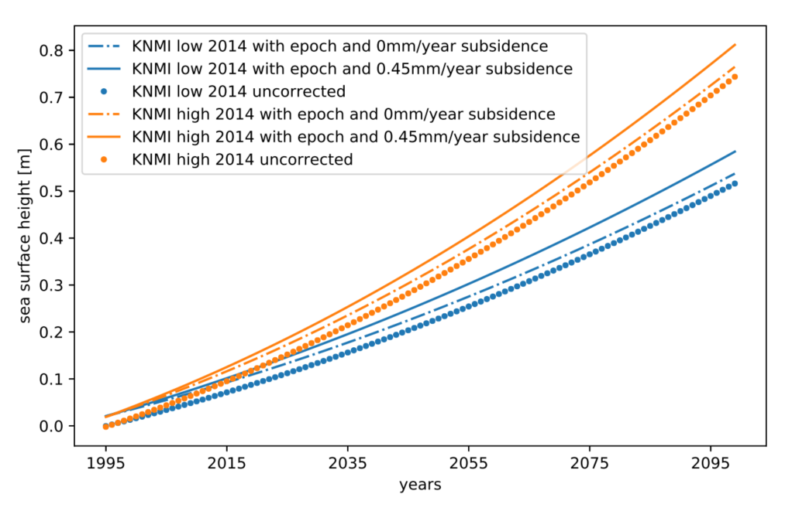
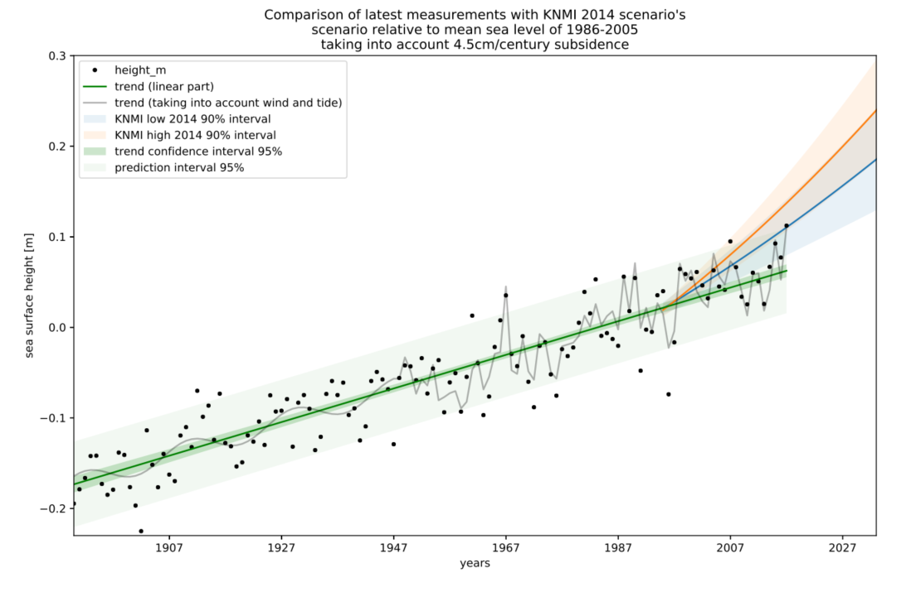
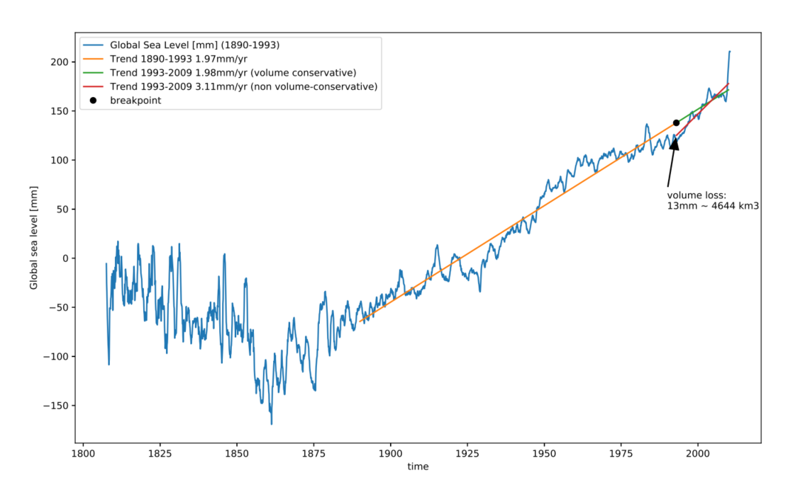
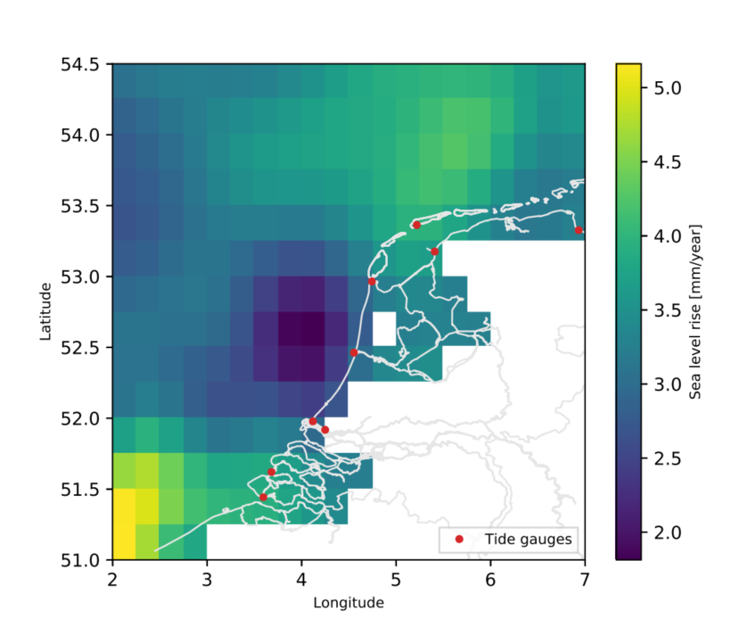

# Resultaten {#resultaten}

In \@ref(methoden) hebben we vastgesteld hoe de 'huidige zeespiegel' kan worden uitgerekend. In dit hoofdstuk wordt de huidige zeespiegel op basis van de periode 1890-2021 vastgesteld volgens de voorkeursmethode. Op basis van deze methode wordt de zeespiegel de komende 3 jaren vastgesteld en beschikbaar gemaakt via een update van bijbehorend interactieve rekendocument . Deze update vindt doorgaans plaats in juli of eerder zodra de gegevens van de heranalyses en jaargemiddelde metingen beschikbaar zijn.

De voorkeursmethode maakt gebruik van:

-   Het gemiddelde over 5 hoofdstations. Er wordt een gemiddelde genomen om de onregelmatigheden van indivuele stations niet al te zwaar te laten meewegen. Van de zes hoofdstations wordt Delfzijl dit keer niet meegenomen vanwege onzekerheid over de verticale referentie aldaar (zie hoofdstuk \@ref(methoden))
-   \acr{GTSM} wordt gebruikt voor correctie van windopzet op de zeespiegel. Deze methode zorgt voor een fysisch onderbouwde, onafhankelijke schatting van de windopzet. Nadeel is dat de beschikbare tijdreeks vrij kort is (vanaf 1979).
-   Uit de verzameling modellen met en zonder versnelling is het *gebroken lineaire* model (met breekpunt in 1993) als hoofdvariant geselecteerd (zie paragraaf \@ref(versnelling-methods)). Dit model presteert significant beter (heeft een significant lagere \acr{AIC}) dan de lineaire variant.

De andere varianten (stations, windcorrectie, versnellingstermen) worden in de Appendix getoond.

```{r prepareData}
require(tidyverse)
require(scales)
stations <- read_csv("../../data/deltares/results/variants/stations.csv")
series <- read_csv("../../data/deltares/results/variants/series.csv")
fits <- read_csv("../../data/deltares/results/variants/fits.csv")
predictions <- read_csv("c:\\Users\\stolte\\Downloads\\dutch-sea-level-monitor-predictions-2022-12-8.csv")

fitstyle =   theme_light() %+replace%
    theme(
      axis.text.x = element_text(angle = 45, vjust = 1, hjust = 1),
      legend.position = "bottom"
      ) 

### predictions moeten ook van github gelezen worden, maar staan daar nu nog niet. 

stationlevels <- c("Vlissingen",
              "Hoek van Holland",
              "IJmuiden",
              "Den Helder",
              "Harlingen",
              "Delfzijl",
              "Netherlands",
              "Netherlands (without Delfzijl)"
              )
model_variants <- c("linear", "quadratic", "broken_linear", "broken_quadratic")

fits <- fits %>%
  mutate(name = factor(name, levels = stationlevels),
         model_variant = factor(model_variant, levels = model_variants))

fits_wind <- fits %>% 
      filter(quantity == "height") %>%
      distinct(psmsl_id, `Wind $u^2$`, `Wind $v^2$`, wind_variant, model_variant, quantity,
               aic, Constant, `Constant (in year 1960)`, `Constant (in year 1970)`, Trend, `+trend (1993)`, 
               Acceleration, `Acceleration from 1960`, `Nodal U` , `Nodal V` )

timeseries_wind <- series %>%
  select(year, station, u2, v2, wind_variant, height) %>%
  left_join(
    stations %>% select(psmsl_id...1, name_rws), 
    by = c(station = "psmsl_id...1")
  ) %>%
  full_join(fits_wind, by = c(
    station = "psmsl_id", 
    wind_variant = "wind_variant"
  )) %>%
  mutate(effect = `Wind $u^2$`*u2 + `Wind $v^2$`*v2) %>%
  group_by(station, wind_variant, name_rws, quantity) %>%
  mutate(anomaly = effect - mean(effect)) %>%
  ungroup() %>%
    mutate(
    `height - effect` = height - effect,
    `height - anomaly` = height - anomaly
  ) %>% 
  rename(
    correction_variant = wind_variant
    ) %>%
  mutate(fit_height = `height - effect`)

fits_surge <- fits %>%
      filter(quantity == "height - surge anomaly") %>%
      distinct(psmsl_id, model_variant, quantity,
               aic, Constant, `Constant (in year 1960)`, `Constant (in year 1970)` , Trend, `+trend (1993)`, 
               Acceleration, `Acceleration from 1960`, `Nodal U` , `Nodal V` ) %>%
  mutate(wind_variant = "GTSM") %>%
  select(-quantity)


timeseries_surge <- series %>%
  distinct(year, station, height, surge_mm, `height - surge`, `height - surge anomaly`) %>%
  mutate(wind_variant = "GTSM") %>%
  left_join(
    stations %>% select(psmsl_id...1, name_rws), 
    by = c(station = "psmsl_id...1") 
  ) %>%
  left_join(fits_surge, by = c(
    station = "psmsl_id",
    wind_variant = "wind_variant"
  )) %>%
  mutate(
    anomaly = height - `height - surge anomaly`
  ) %>%
  rename(
    `height - effect` = `height - surge`,
    `height - anomaly` = `height - surge anomaly`
  ) %>% 
  rename(
    correction_variant = wind_variant, 
    effect = surge_mm
    )  %>% 
  mutate(fit_height = `height - anomaly`)

timeseries <- bind_rows(timeseries_wind, timeseries_surge) %>%
  mutate(correction_variant = factor(correction_variant, levels = c("NCEP1","20CR","Combined", "GTSM" ))) %>%
  mutate(model_variant = factor(model_variant, levels = model_variants)) %>%
  mutate(name_rws = factor(name_rws, levels = stationlevels))

# predictions uit modelfit
# met getij voor GTSM
# met getij en wind voor windgedreven correcties

predictions_wind<- predictions %>%
  filter(quantity == "height") %>%
  rename(correction_variant = wind_variant)

predictions_surge<- predictions %>%
  filter(quantity != "height") %>%
  filter(wind_variant == "Combined") %>%
  mutate(wind_variant = "GTSM") %>%
  rename(correction_variant = wind_variant)

# prediction without wind, but with tide
predictions2 <- bind_rows(predictions_wind, predictions_surge) %>%
  mutate(model_variant = factor(model_variant, levels = model_variants)) %>%
  mutate(correction_variant = factor(correction_variant, levels = c("NCEP1","20CR","Combined", "GTSM" ))) %>%
  rename(name_rws = name) %>%
  mutate(name_rws = factor(name_rws, levels = stationlevels))

# only sea level prediction without wind, surge or tide
pred_series <- timeseries %>%
    mutate(
    prediction_recalc = case_when(
      model_variant == "linear" ~         Constant + Trend * (year - 1970),
      model_variant == "broken_linear" ~  Constant + Trend * (year - 1970) + 
        ifelse(year > 1993, `+trend (1993)` * (year - 1993), 0),
      model_variant == "quadratic" ~ `Constant (in year 1970)` + Trend * (year - 1970) +
        Acceleration * (year - 1970) * (year - 1960),
      model_variant == "broken_quadratic" ~ `Constant (in year 1960)` + Trend * (year - 1960) +
        ifelse(year >= 1960, `Acceleration from 1960` * (year - 1960) * (year - 1960), 0)
    )    
  )

predictions_all <-
  predictions2 %>%
  left_join(pred_series %>% select(
    -quantity
  ))

rm(predictions_surge, predictions_wind, predictions, predictions2, pred_series)

```

## De huidige zeespiegel {#huidige}

In \@ref(fig:huidige-zeespiegel) is de huidige zeespiegel uitgezet tegen de tijd. De gemeten zeespiegel is voor 2021 vastgesteld op 7.6 cm boven \acr{NAP}.

De huidige zeespiegel, dat is de zeespiegel die we verwacht hadden op basis van de opgetreden variatie in windopzet en getij, is 9.4 cm boven \acr{NAP}. De windopzet afwijking van gemiddeld was dit jaar -1.5 cm. Het berekende effect van nodaal getij was dit jaar +1.2 cm. Bij gemiddelde windopzet zou de zeespiegel 9.0 cm bedragen.

Voor het jaar 2021 bedraagt de relatieve zeespiegelstijging langs de Nederlandse kust $2.86 \pm 0.35\,mm/jaar$ oftewel $28.6 \pm 3.5\,cm/eeuw$. Deze trend is berekend over de periode 1993 tot en met 2021. Dit beantwoordt de vraag, hoe snel de zeespiegel op dit moment stijgt. De zeespiegel stijgt nu dus sneller dan in de periode van 1890 - 1993. In die periode was de zeespiegelstijging $1.78 \pm 0.09\,mm/jaar$ oftewel $17.8 \pm 0.9\,cm/eeuw$.

De gemeten zeespiegel aan de Nederlandse kust heeft in 2020 zijn hoogste stand ooit gemeten bereikt. Kort gezegd komt dit doordat het dat jaar flink heeft gestormd in combinatie met een opgaand nodaal getij en de gestegen zeespiegel.

De zeespiegel gecorrigeerd voor de variatie in windopzet was het hoogste in 2021. Dit was te verwachten door de stijgende zeespiegel en een opgaand nodaal getij.

In figuur \@ref(fig:huidige-zeespiegel) is de zeespiegelvariatie over de tijd te zien. De twee modellen (lineair en gebroken lineair) zijn gefit aan gemeten waarden waar gecorrigeerd is voor windopzet met het \acr{GTSM} model (driehoeken). De variatie door nodaal getij is geincludeerd in het gefitte model. De metingen zijn weergegeven met ronde stippen. Er is te zien dat de variatie sterk verminderd door te corrigeren voor windopzet. Met andere woorden, een deel van de variatie in de metingen kan hierdoor toegeschreven worden aan effecten van wind en stormen. De gemodelleerde waarden (lijnen) bevatten nog wel de variatie door het nodaal getij. Het getij wordt dus niet onafhankelijk van de metingen gefit, maar het schatten daarvan is onderdeel van het model. Aangezien het nodaal getij in onze aannames een constante amplitude en fase heeft, heeft deze geen invloed op de zeespiegelstijging in onze methodiek.  

(ref:huidige-zeespiegel-label) Tijdserie van de zeespiegel langs de Nederlandse kust op basis van het gemiddelde van de vijf hoofdstations, zie ook \@ref(fig:metingen-scenarios). Opzet en opzetanomalie (afwijking van de gemiddelde opzet) zijn berekend  met \acr{GTSM}, de predictie is op basis van een gebroken lineair model. 


```{r}

plot_station <- function(stationi = "Netherlands (without Delfzijl)", predictions_all = predictions_all, correctionVariant, modelVariant) {

  startyear = 1900
  zoomyear = 2010
  
  plotShapes = c(
    "height" = 1,
    "height - anomaly" = 24#,
    # "heigt - effect" = 22
  )
  
  pal <- hue_pal()(4)
  
  plotColors = c(
    "metingen" = "black",
    "zeespiegel (-opzet)" = pal[1],
    "zeespiegel (-anomalie)" = pal[2],
    "predictie (+getij)" = pal[3],
    "predictie (-getij -anomalie)" = pal[4]
  )
  
  predictions_all2 <- predictions_all %>%
    filter(name_rws == stationi) %>%
    filter(correction_variant == correctionVariant) %>%
    filter(model_variant == modelVariant)
  
  symboolgrootte = 1
  
  q <- ggplot() +
    geom_point(data = predictions_all2 %>% filter(year >= startyear), 
               aes(x = year, y = height, color = "metingen"), 
               size = symboolgrootte, alpha = 0.5) +
    geom_line(data = predictions_all2 %>% filter(year >= startyear), 
               aes(x = year, y = `height - effect`, color = "zeespiegel (-opzet)"), 
               size = symboolgrootte, alpha = 0.5) +
    geom_line(data = predictions_all2 %>% filter(year >= startyear), 
               aes(x = year, y = `height - anomaly`, color = "zeespiegel (-anomalie)"), 
               size = symboolgrootte, alpha = 0.5) +
    geom_line(data = predictions_all2 %>% filter(year >= startyear),
              aes(x = year, y = prediction, color = "predictie (+getij)"),
              size = symboolgrootte, alpha = 0.7) +
    geom_line(data = predictions_all2 %>% filter(year >= startyear),
              aes(x = year, y = prediction_recalc, color = "predictie (-getij -anomalie)"),
              size = symboolgrootte, alpha = 0.7) +
    coord_cartesian(ylim = c(NA, NA)) +
    xlab("jaar") +
    ylab("zeespiegel in mm tov NAP") +
    labs(subtitle = "Gecorrigeerde zeespiegel (GTSM) en trends") +
    fitstyle +
    theme(
      strip.text.y = element_text(angle = 0)) +
    theme(legend.title = element_blank()) +
    theme(legend.direction = "vertical",
          legend.box = "horizontal",
          legend.position = c(0.025,0.975),
          legend.justification = c(0, 1),
          legend.title = element_blank()) +
    scale_color_manual(values = plotColors) +
    scale_x_continuous(breaks = scales::pretty_breaks())
  
  print(q)
}

plot_station(predictions_all = predictions_all, correctionVariant = "GTSM", modelVariant = "linear")
```


## Wat is veranderd?

Op basis van de mondiale gegevens betreffende zeespiegelmetingen en budgetten hadden we een vernelling verwacht van de zeespiegel in de twintigste eeuw (ref). Die versnelling was echter tot de vorige Zeespiegelmonitor (t/m meetjaar 2017) niet in de metingen te detecteren met de methode van de Zeespiegelmonitor (ref). Daarom was over de periode 1890 - 2017 de langjarig trend constant en had de waarde 1,9 mm/jaar (ref). De totale zeespiegelstijging over de periode 1890 - 2017 was 23 cm.

Sinds 2017 zijn meer gegevens beschikbaar gekomen. De zeespiegelmetingen over de laatste vier jaar laten zien dat de stijging doorzet. Ook wordt nu het \acr{GTSM} gebruikt om te corrigeren voor variatie in de zeespiegel door windopzet. De nieuwe meetpunten liggen zodanig hoog dat er voor de berekening van de langjarige trend nu wordt overgegaan van een lineair model (rechte lijn) op een gebroken lineair model (een geknikte lijn, variant 3 uit \@ref(methoden)). We doen dit omdat na testen blijkt het gebroken lineaire model een significant beter model is dan het lineaire model, rekening houdend met het feit dat het gebroken lineaire model ook complexer is.

Door over te gaan op het gebroken lineaire model wordt de zeespiegelstijging nu het beste beschreven met twee verschillende trends in de tijd. Een iets verlaagde trend in de periode van vóór 1993, namelijk 1.8 mm/jaar, en een verhoogde trend na 1993, namelijk 2,8 mm/jaar. We constateren ook dat de zeespiegel in 2021 bijna 25 cm hoger staat dan in 1890.

Het feit dat de geschatte zeespiegel in 2021 bijna 2 cm hoger wordt geschat dan in 2017 betekent niet dat de zeespiegel in deze 4 jaar zoveel gestegen is. Het verschil wordt verklaard door: 

*   Een werkelijk hogere zeespiegel
*   De aanname dat de zeespiegel na 1993 versned stijgt
*   Een betere correctie voor windopzet. Hierdoor wordt een kleiner deel van stijging toegeschreven aan verandering in windopzet.

De verhoogde stijging begint na 1993. De keuze voor dit tijdstip voor een versnelde stijging is gemotiveerd vanuit een \acr{MCMC} analyse [@Baart2019 sectie 6.3]. Een meer fysische verklaring ligt in het feit dat de zeespiegel rond die tijd lager was dan normaal door uitbarsting van de Pinatubo en daaruitvolgende mondiale afkoeling [@Nerem2018]. De knik in 1993 wordt dus gedeeltelijk veroorzaakt door deze vertraagde zeespiegel. Deze achterstand is nu ingehaald, en zet ook door. 

## Windopzet

De zeespiegel aan de Nederlandse kust is door windopzet gemiddeld zo'n 4.5 cm hoger dan het geval zou zijn zonder windopzet (figuur \@ref(fig:sea-level-wind)). De bijdrage van de windopzet varieert over de jaren en door het seizoen heen (zie ook paragraaf \@ref(seizoenen)).

(ref:sea-level-wind-label) De gemiddelde gemeten zeespiegel voor de vijf hoofdstations (zwart), de zeespiegel waarbij gecorrigeerd is voor de variatie in opzet (predictie - opzetanomalie), en de zeespiegel waarbij de opzet is afgetrokken (predictie - opzet). Opzet is berekend met het GTSM model (zie paragraaf \@ref(methoden-wind)). in de onderste figuur is de variatie door opzet (GTSM) getoond waarbij de trend is verwijderd.

```{r sea-level-wind, fig.height=4, fig.width=7, fig.show='hold', out.width="100%", fig.cap="(ref:sea-level-wind-label)"}

# knitr::include_graphics("figures/sea-level-wind.png")

startyear = 1960

plotShapes = c(
  "height" = 21,
  "height - anomaly" = 24,
  "heigt - effect" = 22
)

pal <- hue_pal()(4)

plotColors1 = c(
    "metingen" = "black",
  "predictie - opzetanomalie" = pal[1],
  "predictie - opzet" = pal[2]
)

plotColors2 = c(
  "anomalie" = pal[3],
  "opzet" = pal[4]
)

p <- predictions_all %>%
  filter(name_rws == "Netherlands (without Delfzijl)") %>%
  filter(year > startyear) %>%
  filter(correction_variant == "GTSM") %>%
  filter(model_variant %in% c("broken_linear")) %>%
  left_join(timeseries %>% select(year, name_rws, model_variant, correction_variant, height, `height - effect`, `height - anomaly`, fit_height, effect, anomaly)) %>%
  ggplot() +
  geom_point(aes(x = year, y = height, color = "metingen"), size = 2, alpha = 0.5) +
  geom_line(aes(x = year, y = `height - anomaly`, color = "predictie - opzetanomalie"), size = 1, alpha = 1) +
  geom_line(aes(x = year, y = `height - effect`, color = "predictie - opzet"), size = 1, alpha = 1) +
  coord_cartesian(xlim = c(NA, NA), ylim = c(NA, NA)) +
  scale_x_continuous(breaks = scales::pretty_breaks(n = 3)) +
  scale_y_continuous(minor_breaks = scales::pretty_breaks(n = 20)) +
  xlab("jaar") +
  ylab("zeespiegel in mm tov NAP") +
    scale_color_manual(values = plotColors1) +
    scale_x_continuous(breaks = scales::pretty_breaks()) +
  fitstyle

q <- predictions_all %>%
  filter(name_rws == "Netherlands (without Delfzijl)") %>%
  filter(year > startyear) %>%
  filter(correction_variant == "GTSM") %>%
  filter(model_variant %in% c("broken_linear")) %>%
  left_join(timeseries %>% select(year, name_rws, model_variant, correction_variant, height, `height - effect`, `height - anomaly`, fit_height, effect, anomaly)) %>%
  ggplot() +
  geom_line(aes(x = year, y = `effect`, color = "opzet"), size = 1, alpha = 1) +
  geom_line(aes(x = year, y = `anomaly`, color = "opzetanomalie"), size = 1, alpha = 1) +
  coord_cartesian(xlim = c(NA, NA), ylim = c(NA, NA)) +
  scale_x_continuous(breaks = scales::pretty_breaks(n = 3)) +
  scale_y_continuous(minor_breaks = scales::pretty_breaks(n = 20)) +
  xlab("jaar") +
  ylab("opzet en opzetanomalie in mm") +
    scale_color_manual(values = plotColors2) +
    scale_x_continuous(breaks = scales::pretty_breaks()) +
  fitstyle

p
q

```

<!-- !!! tabel overzetten naar code en tab caption -->

<!-- ```{r, eval = F} -->

<!-- # Bijvoorbeeld -->

<!-- files <- list.files("../../data/deltares/results", full.names = T) -->

<!-- stationTable <- files[grepl('stations', files)] %>% -->

<!--   sort() %>% -->

<!--   tail(1) %>% -->

<!--   read_delim(delim = ',', comment = '#') -->

<!-- meanTable <- files[!grepl('stations', files)] %>% -->

<!--   sort() %>% -->

<!--   tail(1) %>% -->

<!--   read_delim(delim = ',', comment = '#') -->

<!-- ``` -->

<!-- [$$tab:terms$$](#tab:terms){reference-type="ref" reference="tab:terms"} -->

<!-- l\|S$$table-format=3.2$$\|r\|r & Term & Std. fout & P\>\|z\|\ -->

<!-- Constant & -62.4 & 4.78 & 0.00\ -->

<!-- Trend & 1.86 & 0.06 & 0.00\ -->

<!-- $Nodal_{u}$ & 3.47 & 2.86 & 0.23\ -->

<!-- $Nodal_{v}$ & -10.5 & 2.97 & 0.00\ -->

<!-- $Wind_{u^2}$ & 10.9 & 1.08 & 0.00\ -->

<!-- $Wind_{v^2}$ & 1.58 & 2.66 & 0.55\ -->

<!-- ## Seizoensvariatie {#seizoenen} -->


## Versnelt de zeespiegelstijging? {#versnelling-results}

Of er een versnelling is stellen we vast door de modellen met versnelling (met acceleratieterm en met knik en de combinatie daarvan) te vergelijken met het model zonder versnelling. Deze analyse is uitgevoerd voor het gemiddelde van alle hoofdstations minus Delfzijl. De reden hiervan is beschreven in paragraaf \ref(bronnen).

De versnellingsmodellen "gebroken lineair" en "gebroken kwadratisch" verklaren beide beter de zeespiegel dan het lineaire model. Echter, het "gebroken lineair" model is het enige model dat significant beter is dan het lineaire model.  

We lopen voor de volledigheid alle drie versnellingsmodellen af:

Het lineaire model laat een trend zien van $1.91 \pm 0.06\,mm/jaar$.

Het model met een acceleratie term (kwadratisch) laat een versnelde zeespiegel zien ($0.0029 \pm 0.002\,mm^{2}/jaar$). Dit model is niet significant beter dan het lineaire model.

Het model met een acceleratie vanaf 1960 (gebroken kwadratisch) laat een versnelde zeespiegel zien ($0.0087 \pm 0.004\,mm^2/jaar$) vanaf 1960. De trend over de periode voor 1960 is $1.73 \pm 0.12\,mm/jaar$. Dit model is iets minder goed dan het gebroken lineaire model en is ook niet significant beter dan het lineaire model.

De voorkeursvariant, Het model met een knik in 1993 (gebroken lineair) laat een hogere zeespiegelstijging zien ($2.86 \pm 0.43\,mm/jaar$) na 1993 dan ervoor ($1.78 \pm 0.09 mm/jaar$), een extra $1.08 \pm 0.34\,mm/jaar$.

## Verwachting voor komende jaren

We zien dat de constante zeespiegelstijging niet meer de beste beschrijving oplevert voor de metingen tot nu toe. Wat betekent dit voor de komende jaren? Allereerst, onze analyes kan alleen worden toegepast op historische gegevens en is niet direct geschikt voor uitspraken over de komende jaren. In de vorige Zeespiegelmonitor was het uitgangspunt dat de huidige zeespiegelstijging hooguit voor een periode van 15 jaar vooruit kan worden gebruikt. Uitgaande van het nu beste model is dit  $2.9 \pm 0.4 mm/jaar$.  

```{r}
startyear = 1978

predictions_all %>% 
  filter(name_rws == "Netherlands (without Delfzijl)", correction_variant == "GTSM") %>%
  group_by(name_rws, model_variant, correction_variant) %>%
  arrange(name_rws, model_variant, correction_variant, year) %>%
  mutate(diff_pred = c(NA, diff(prediction_recalc, 1))) %>%
  ggplot() +
  # geom_point(data = pred_series %>% filter(model_variant == "linear", year > startyear), aes(x = year, y = diff(fit_height) ), size = 0.5, alpha = 0.2) +
  # geom_point(data = pred_series %>% filter(model_variant == "linear", year > 2017), aes(x = year, y = diff(fit_height)), size = 1, alpha = 1, color = "blue") +
  geom_line(aes(x = year, y = diff_pred, color = model_variant), size = 1) +
  facet_grid(name_rws ~ correction_variant) +
  coord_cartesian(ylim = c(0, NA)) +
  xlab("jaar") +
  ylab("zeespiegelstijging in mm/jaar") +
  labs(title = "Zeespiegelstijging volgens de verschillende modellen.") +
  fitstyle +
  theme(strip.text.y = element_text(angle = 0))
```


## Per station {#per-station}

Figuur laat zien dat de zes hoofdstations zowel wat betreft gemiddelde stand als wat betreft trend van elkaar verschillen. In Delfzijl is de trend groter dan bij Harlingen en de trends bij Vlissingen en IJmuiden zijn groter dan de trend bij Den Helder. De zeespiegel stond altijd wat hoger in het noorden van Nederland (bij Harlingen en Delfzijl), maar de relatieve zeespiegel is in Hoek van Holland gestegen ten opzichte van de rest van het land. Op dit moment staat de gemiddelde zeespiegelstand het laagste in Vlissingen.

Wat verder opvalt is dat de stations in het Waddengebied (Delfzijl, Harlingen, en in mindere mate Den Helder) een groter verschil zien in stijging voor en na 1993 dan de andere stations, vergelijk hiervoor het gebroken lineaire model met het lineaire model. Er is een tragere stijging voor 1993, en een snellere stijging na 1993 bij deze stations. De extra versnelling bij Delfzijl komt deels door een achterstallige verticale aanpassing.

(ref:6stations-caption) Huidige zeespiegelstijging volgens het lineaire model (rode) en het gebroken lineaire model (blauw) waarbij gecorrigeerd is voor windopzet. De trend is voor de 6 getijdestations afzonderlijk weergeven. De zeespiegel is uitgedrukt ten opzichte van post-2005 \acr{NAP}.

```{r 6stations, fig.cap="(ref:6stations-caption)"}

# knitr::include_graphics("figures/stations_trends.png")

predictions_all %>%
  filter(!grepl("Netherland", name_rws), year >= 1960) %>%
  filter(correction_variant == "GTSM") %>%
  filter(model_variant %in% c("linear", "broken_linear")) %>%
  left_join(timeseries %>% select(year, name_rws, model_variant, correction_variant, height, `height - effect`, `height - anomaly`, fit_height, effect, anomaly)) %>%
  ggplot(aes(year, `height - anomaly`)) +
  geom_point(aes(), alpha = 0.2) +
  geom_line(aes(year, prediction, color = model_variant), alpha = 0.8, size = 1) +
  facet_wrap(~name_rws) +
  xlab("jaar") +
  ylab("zeespiegel in mm tov NAP") +
  theme_light()
```

Dit is ook terug te zien in de waarden van de geschatte parameters (\@ref(tab:zeespiegeltrends)). De Noordelijke stations laten bij het gebroken lineaire model een relatief groot verschil zien tussen de trend voor en na 1993.

(ref:zeespiegeltrends-label) Trends en standaardfouten voor de 6 hoofdstations apart, berekend voor het lineaire model, en het gebroken lineaire model.

```{r zeespiegeltrends}

fits %>% 
  filter(model_variant == "broken_linear") %>% 
  filter(quantity == 'height - surge anomaly') %>% 
  filter(wind_variant == 'Combined') %>%
  select(
    name,
    Constant,
    `-trend (1993)` = Trend,
    `+trend (1993)`,
    `se-Constant`,
    `se-Trend`,
    `se-+trend (1993)`
  ) %>%
  mutate(
    total_trend = `-trend (1993)` + `+trend (1993)`,
    se_total_trend = sqrt((`se-Trend`)^2 + (`se-+trend (1993)`)^2)
  ) %>% 
  select(
    name,
    `zeespiegel (1970)` = Constant,
     `trend voor 1993` = `-trend (1993)`,
    `se` = `se-Trend`,
     `trend na 1993` = total_trend,
    `se2` = `se_total_trend`
  ) %>%
knitr::kable(align = "lrrrrr", caption = "(ref:zeespiegeltrends-label)", digits = 1)

```

Er zijn verschillende oorzaken die deze verschillen tussen de stations kunnen verklaren. De beschouwing van deze oorzaken is te vinden in \@ref(verschillen).

## Controles en validatie {#controles-en-validatie}

### Bodemdaling of zeespiegelstijging? {#bodemdaling-result}

Op basis van de analyse in \@ref(bodemdaling) en \@ref(nulpaal) kwamen we tot de conclusie dat in alle stations de zeespiegelstijging deels bestaat uit de isostatische en tectonische bodemdalingscomponenten. Er zijn twee stations waaronder winningen voor bodemdaling hebben gezorgd. Dat zijn het station van Delfzijl en het station van Hoek van Holland. In Hoek van Holland gaan we er vanuit dat de winningen in de zeespiegelstijgingen zitten. In Delfzijl weten we vrij zeker dat de bodemdaling sinds 1973 niet in de gegevens zit. In de periode 1963 tot 1973 daalde de bodem met 7cm. Hier gaan we ervan uit dat deze hetzelfde behandeld is als de bodemdaling na 1973 op basis van [@Jong1973 punt 5].

Daarmee komen we tot de uitsplitsing tussen de verschillende absolute bodemdaling- en zeespiegelcomponenten per station, zoals weegegeven in tabel \@ref(tab:bodemdaling-per-station).

::: {#tab:bodemdaling-per-station}
|                  |                       |           |        |          |          |
|:-----------|-----------:|-----------:|-----------:|-----------:|-----------:|
| Station          | Tectoniek + Isostasie | Winningen |  Bodem | Relatief | Absoluut |
|                  |                $$cm$$ |    $$cm$$ | $$mm$$ |   $$mm$$ |   $$mm$$ |
| Vlissingen       |                  -2.4 |       0.0 |  -0.24 |      2.1 |      1.9 |
| Hoek van Holland |                  -3.7 |        -1 |  -0.47 |      2.3 |      1.8 |
| IJmuiden         |                   5.0 |       0.0 |   -0.5 |      2.1 |      1.6 |
| Den Helder       |                  -5.4 |         0 |  -0.54 |      1.4 |      0.9 |
| Harlingen        |                  -6.0 |         0 |  -0.60 |      1.3 |      0.7 |
| Delfzijl         |                  -4.8 |       -24 |  -0.48 |      1.9 |      1.4 |

: Uitsplitsing bodemdaling en zeespiegelstijging per station [bodemdaling uit @Hijma2018]. Tectoniek + isostasie, Winningen en Bodemdaling zijn berekend over de periode 1917-2017. Boddemdaling is voor Delfzijl exclusief winning voor IJmuiden inclusief (zie tekst). Relatieve zeespiegelstijging is gemeten over de periode 1890-2017.
:::

In Delfzijl is, sinds in 1963 Nederland aan het gas werd aangesloten, de bodem met 24cm gezakt. Hierdoor is een generatie lang de zeespiegel op het niveau van het hoogste zeespiegelscenario geweest (44cm/eeuw door de winning bovenop de gemeten cm/eeuw). Dit werd niet eerder opgemerkt doordat de peilbout bij het station was losgekoppeld van het \acr{NAP}. De bodemdaling door gaswinning bij Hoek van Holland is aanzienlijk lager, maar kan wel verklaren waarom de gemeten zeespiegelstijging daar altijd wat hoger is geweest. In totaal is de bijdrage van de bodemdaling ongeveer 0.45 mm [@Hijma2018].

## Vergelijking van scenario's versus de huidige zeespiegel {#scenarios}

Nog herschrijven. correcties voor scenarios uitleggen en laten zien. 


In de vorige zeespiegelmonitor [@Baart2019] is geconstateerd dat er geen goede aansluting was tussen metingen en projecties van de zeespiegel. In de tussentijd zijn door \acr{KNMI} nieuwe scenario's berekend [@KNMI2021] die de eerdere projecties [@Hurk2014] vervangen. Het zijn representaties van een plausibele toekomstige ontwikkeling, op basis van paden gedefinïeerd door \acr{IPCC} [@IPCC2013]. De paden zijn gebaseerd op een mogelijke toekomstige ontwikkeling van emissie gecombineerd met een verhaallijn [@Moss2010].

Hier laten we zien hoe de zeespiegelscenario's aansluiten bij de metingen die sinds de doorrekening van de door klimaatverandering gedreven zeespiegelprojecties zijn uitgevoerd. Hierbij moet met een aantal aspecten rekening gehouden worden. Visueel weergegeven in figuur \@ref(fig:scenario-correction).

Epoch

:   De zeespiegelscenario's zijn relatief ten opzichte van de gemiddelde zeespiegelstand over de periode 1986 tot 2005. De zeespiegel was toen al 2 cm boven \acr{NAP}, dus de scenario's moeten, indien gepresenteerd samen met getijstations beginnen bij 2cm in 1990.

Absoluut

:   De zeespiegelscenario's hebben betrekking op de absolute zeespiegel. Als we deze willen vergelijken met de getijdestations moeten we, of van de metingen de bodemdaling af halen, of bij de scenario's de bodemdaling optellen. In figuur \@ref(fig:metingen-scenarios) doen we het eerste.

Natuurlijke variatie

:   De zeespiegelscenario's gaan uit van veranderingen ten opzichte van de referentieperiode. Variaties binnen een klimaatperiode, denk aan verschillen van jaar tot jaar door luchtdruk en stormen, zijn niet opgenomen. De jaargemiddelde zeespiegel varieert met een bandbreedte van ongeveer 5cm om de huidige zeespiegel. In de scenario's wordt niet met een natuurlijke variatie rekening gehouden.

Marges

:   De bandbreedte van zeespiegelprojecties neemt toe naar de toekomst. Dit komt doordat verder in de tijd, verandering minder nauwkeurig te berekenen zijn.

Versnelling

:   De zeespiegelversnelling in sommige projecties is toe te schrijven is aan processen die nu niet grootschalig optreden (bijvoorbeeld ijsklifinstabiliteit).

<!-- ![Toegepaste correcties om [KNMI]{acronym-label="KNMI" -->

<!-- acronym-form="singular+short"} 2014 zeespiegelscenario's [@Hurk2014] -->

<!-- vergelijkbaar te maken met relatieve zeespiegelstijging van de -->

<!-- getijdestations.](scenarios-with-correction){#fig:scenario-correction -->

<!-- width="1\\linewidth"} -->

(ref:scenario-correction-caption) Toegepaste correcties om \acr{KNMI} 2021 zeespiegelscenario's [@KNMI2021] vergelijkbaar te maken met relatieve zeespiegelstijging van de getijdestations.

```{r, fig.cap="(ref:scenario-correction-caption)"}

htmltools::h2("nog toe te voegen")
# 


```

(ref:metingen-scenarios) Toegepaste correcties om \acr{KNMI} 2021 zeespiegelscenario's [@KNMI2021] vergelijkbaar te maken met relatieve zeespiegelstijging van de getijdestations.

```{r, fig.cap="(ref:metingen-scenarios)"}

knitr::include_graphics("figures/combined_measurements_projection.png")

```

<!-- Voor het gebruik van de informatie dat onze huidige zeespiegel zich nu aan de onder- of bovenkant van een scenario bevindt kan men denken aan toepassingen waarbij men enige vrijheid heeft om een optimistische keuze te maken. Bij optimistische keuzes kan men denken in de context van adaptieve ontwerpen, onderhoud met een flexibele begroting en ontwerpen met goede vervangingsstrategie. Hierbij moet wel steeds rekening gehouden worden met het voorzorgsprincipe. Het principe dat als er gevaar is en sprake is van een onzekerheid, dat men de veilige kant moet kiezen. Dat betekent echter niet altijd zo hoog mogelijk bouwen, het wordt ook geïnterpreteerd als beter monitoren en zoals in de Waddenzee nu gehanteerd wordt, [de hand aan de (gas en zout)kraan houden](https://www.sodm.nl/documenten/publicaties/2021/03/10/index){target="_blank"}. -->

In \@ref(fig:metingen-scenarios) zien we dat de metingen afhankelijk van de correctie aan de onderkant ligt van het laagste scenario (correctie via metinge) of ongeveer gelijk aan het laagste scenario (correctie via gemodelleerde zeespiegel). In beide scenarios is de huidige stijging hoger dan verwacht op grond van het gebroken lineire model. Hier is dus een discrepantie. Dit betekent niet dat de scenario's niet klopppen, het waren immers studies die mogelijke toekomstige condities berekenden (het zou kunnen dat, met de kennis van toen).

Gegeven dat de poolkappen massa verliezen en de aarde opwarmt, verwachten we nog steeds een versnelde zeespiegel. De conclusie is wel dat we aan de Nederlandse kust achter liggen op de geprojecteerde waarden.

We concluderen dat langs de Nederlandse kust het zeespiegelscenario behorende 'hoog' boven de daadwerkelijk opgetreden toename in zeeniveau zit. De projecties horende bij 'laag' komen in de buurt van de metingen maar overlappen niet meer met het betrouwbaarheidsinterval van de huidige trend. De variatie van de zeespiegel van jaar tot jaar ontbreekt in de zeespiegelprojecties.

<!-- ![Vergelijking tussen metingen en zeespiegelscenario's van [@Hurk2014], -->

<!-- inclusief bodemdaling. De bandbreedte van de KNMI scenario's is -->

<!-- gebaseerd op een polynome fit door de 90% percentielen van de ensemble -->

<!-- members. De betrouwbaarheids (donkergroen) en predictieintervallen -->

<!-- (lichtgroen) van de trend van de huidige zeespiegel zijn gebaseerd op de -->

<!-- 95% percentielen van de verdeling van de standaardfout en -->

<!-- standaardafwijking van het gebruikte model om de zeespiegelstijging te -->

<!-- bepalen.](scenarios-with-ci){#fig:metingen-scenarios -->

<!-- width="1\\linewidth"} -->

(ref:metingen-scenarios-caption) Vergelijking tussen metingen en zeespiegelscenario's van [@Hurk2014], inclusief bodemdaling. De bandbreedte van de KNMI scenario's is gebaseerd op een polynome fit door de 90% percentielen van de ensemble members. De betrouwbaarheids- (donkergroen) en predictieintervallen (lichtgroen) van de trend van de huidige zeespiegel zijn gebaseerd op de 95% percentielen van de verdeling van de standaardfout en standaardafwijking van het gebruikte model om de zeespiegelstijging te bepalen.

```{r, fig.show='hold', fig.cap="(ref:metingen-scenarios-caption)"}
htmltools::h5("!!! verouderd")

```

De constatering dat het lage \acr{KNMI} scenario het beste bij de huidige zeespiegelstijging aansluit beantwoordt [$$question:aansluiten$$](#question:aansluiten){reference-type="ref" reference="question:aansluiten"}. $$answer:aansluiten$$

## Nederland versus buurlanden (wordt nog aangepast) {#nl-vs-northsea}

Naast Nederland hebben ook de andere landen die aan de Noordzee liggen een historie van metingen van de zeespiegel. De stations laten een consistent beeld zien van een zeespiegelstijging in de orde van 15cm/eeuw [@Wahl2013]. In \@ref(fig:northsea-stations) zien we dat de stations grotendeels dezelfde variatie laten zien. De stations in Noorwegen komen omhoog, daarom is daar geen relatieve zeespiegelstijging maar is deze gelijk of daalt deze. Er zijn veel verschillen te zien tussen de stations voor de periode 1890, voor er goede hoogtereferentiestelsels waren.

```{r northsea-stations, fig.cap="Zeespiegelmetingen van diverse stations in Frankrijk, Belgïe, Denemarken, Noorwegen en het Verenigd Koninkrijk."}

knitr::include_graphics("figures/multiple-stations.png")

```

## Nederland versus globaal (wordt nog aangepast) {#sec:nl-vs-globaal}

Als we de Nederlandse zeespiegel vergelijken met de globale zeespiegel dan kunnen we kijken naar de globale zeespiegelstijging zoals deze aan de kust gemeten wordt, of naar de zeespiegelstijging zoals gemeten op de oceaan door satellieten. In dit geval kijken we vooral naar de zeespiegel zoals gemeten langs de kust.

Het vergelijken van de Nederlandse kust met andere stations gaat niet zo maar. Getijstations worden niet geplaatst om de globaal gemiddelde zeespiegel te meten, maar omdat er ergens een haven ligt, of omdat er een probleem met zeespiegelstijging is. Daardoor liggen de getijstations, net als in Nederland, vooral in havens. Veel havens liggen op het noordelijk halfrond.

Om met deze scheve ruimtelijke verdeling rekening te houden worden zogenaamde reconstructies gemaakt. Er is veel variatie in de methoden waarop deze reconstructies worden gemaakt. Recente voorbeelden van reconstructies zijn @Hay2015, en @Frederikse2018 en [@Jevrejeva2014].

De meeste reconstructies komen er op uit dat de zeespiegel in de 20e eeuw gemiddeld steeg in het bereik 1.4&nbspmm--2.0&nbspmm. Er zijn ook reconstructies die een knikpunt leggen in de jaren 1990, bijvoorbeeld @Dangendorf2017 komen uit op 1.1mm over de periode 1900-1990. De hoogste snelheden ziet men in de jaren 30 en 40 van de 20ste eeuw en in de laatste 20 jaar. Ook @Jevrejeva2014 vinden een recente versnelling. ?ref? vonden de recente versnelling niet terug toen ze naar individuele stations keken.

Een mogelijke verklaring voor de discrepantie tussen de resultaten van @Houston2011 en @Jevrejeva2014 zit in hoe omgegaan wordt met het aansluiten van periodes (volume-conservatieve trends versus niet volume conservatieve trends). Indien trends uitgerekend worden over een periode zonder deze aan te laten sluiten met de periode ervoor kan een gat ontstaan tussen twee curves. Zonder behoud van volume is de zeespiegelstijging over de periode 1993-2009 met 3.1mm gestegen. Met behoud van volume is de zeespiegelstijging over dezelfde periode gelijk aan ervoor, zie \@ref(fig:conservative). Volume conservatieve trends kunnen berekend worden door eerst de trend over de beginperiode uit te rekenen en door bij de volgende periode een vast nulpunt op te leggen of door een gebroken trendmethode toe te passen .

(ref:conservative) De zeespiegelstijging op basis van de reconstructie van @Jevrejeva2014, met en zonder behoud van volume. De groene curve is berekend op basis van de volumebehoudende methode, waarbij het zwarte punt als beginpunt van de curve na 1993 is opgenomen. Bij de rode curve is in 1993 4644km^3^ verloren gegaan. De rode curve komt overeen met de trend uit @Jevrejeva2014.

```{r conservative, fig.cap="()"}

```

Samengevat kunnen we stellen dat over de 20ste eeuw, de zeespiegelstijging langs de Nederlandse kust aan de onderkant ligt van de globale schattingen. De zeespiegelstijging ligt over de periode 1993-2017 ook lager dan globaal. Op basis van de knik aanpak komen we op een absolute zeespiegelstijging van $2.4 - 0.45 = 1.95$mm over de periode 1993-2017. De 0.45mm is de eerder genoemde bodemdalingcomponenten met uitzondering van de daling van Hoek van Holland door winning. De globale cijfers zijn in de orde van 3mm. Deze worden gevonden op basis van satellietmetingen [zie bijvoorbeeld @Watson2015] en in reconstructies van getijstations [@Jevrejeva2014].

## Vergelijking met satellietmetingen (wordt nog aangepast) {#satelliet-results}

Net als voor de getijreeksen kijken we ook naar de satellietmetingen. Dit doen we vooral ter verificatie. In theorie zou de absolute zeespiegelstijging, zoals gemeten met satellieten, samen met de bodemdaling overeen moeten komen met de zeespiegelstand en zeespiegeltrend zoals gemeten met de getijstations.

Om de nauwkeurigheid van de aansluiting te bepalen zou men bij voorkeur naar de vergelijking van gemeten hoogtes ten opzichte van hetzelfde verticale referentie vlak kijken. Satellietgegevens worden ontsloten als anomaliteiten, berekend ten opzichte van een gemiddeld niveau over een bepaalde periode. Op basis van de anomaliteiten, kunnen we alleen trends met elkaar vergelijken.

```{r satellite, fig.cap="Gemiddelde snelheid van de zeespiegelstijging voor de Nederlandse kust op basis van satellietmetingen. De snelheid is berekend door het lineaire model te fitten op de jaargemiddelde zeespiegels. De rode punten geven de zes Nederlands hoofd-getijdestations aan."}



```

Het resultaat hiervan is te zien in \@ref(fig:satellite). Deze kaart laat zien dat er regionale verschillen in stijgsnelheid zijn voor in de Noordzee. De rode punten geven de getijdestations weer waarvoor de gegevens beschikbaar zijn via PSMSL.

Voor deze rode punten hebben we voor beide de satellietdata en de metingen van de getijdestations het model gefit. De trend komt voor beide datasets enigszins overeen, en de standaardfouten ook. Doordat aan het begin van de reeks, vooral in 1996 de zeespiegel laag stond en aan het eind van de reeks hoog (door nodaal getij en wind) is de trend in deze vergelijking hoger dan wat we de 'huidige zeespiegelstijging' noemen.

Door het ontbreken van een absolute aansluiting aan het begin van de meting, de korte periode waarvoor de gegevens beschikbaar zijn, de beperkte kwaliteit bij de kust, de hogere meetfout en lagere meetfrequentie maken de satellietgegevens een minder geschikte bron om de huidige zeespiegelstijging uit af te leiden. De ruimtelijke dekking maakt de gegevens geschikt om ruimtelijke variatie in de Noordzee te onderzoeken. In tegenstelling tot vorige versies van de zeespiegelmonitor, redelijke samenhang tussen de beide bronnen wat betreft ruimtelijke variatie.

## Modelkeuzes en aannames {#modelkeuzes}

Omdat de zeespiegel van vorig jaar informatie bevat die gebruikt kan worden om een goede voorspelling te doen van de zeespiegel dit jaar wordt een autocorrelatie term toegevoegd.

De variantie van de residuen is afhankelijk van de verklarende variabelen (meer residu bij veel wind). Voor het herkennen van een trendbreuk is het belangrijk dat de trendparameter zo betrouwbaar mogelijk wordt geschat. De standaardfouten zijn daarom op robuuste wijze geschat via de zogenaamde [HAC]{acronym-label="HAC" acronym-form="singular+short"} estimator [@Zeileis2004] .

Zowel het toevoegen van de autocorrelatieterm als de correctie voor heteroskedasticiteit heeft geen effect op de schattingen van de huidige zeespiegel, alleen op de standaardfouten.
