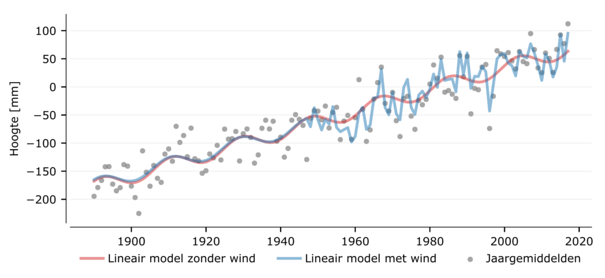
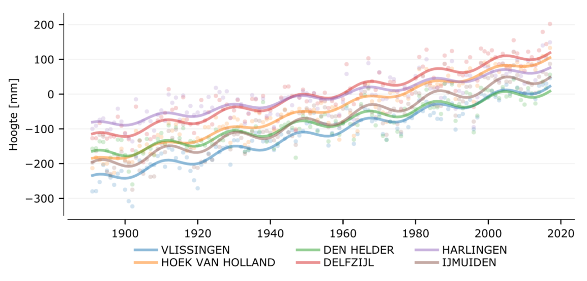

# Resultaten {#resultaten}

Voor het presenteren van de uiteindelijke resultaten zijn de volgende keuzes gemaakt betreffende methodiek. 

Delfzijl keuze

Delfzijl weglaten leidt tot informatieverlies.
Delfzijl meenemen leidt tot een fout (verwijzen naar HKV rapport)

Op dit moment kiezen we voor "Delfzijl weglaten". 

Optimale keuze is "gecorrigeerde waarden Delfzijl meenemen". De correctie wordt begin 2023 verwacht. 


Wind
GTSM is meest betrouwbaar, maar is het kortst. 

Windcorrelatiemethode kan niet goed omgaan met oostenwind. Kan dus niet goed omgaan met stormafzet. GTSM wel
GTSM is additief (opknipbaar).
20CR is het langst maar het minst nauwkeurig.
NCEP is korter, kwalitatief beter, maar minder goed dan 


Modelkeuze

LOESS is descriptief
Visueel maken wat elk model doet (schematisch). 


In \@ref(methoden) hebben we vastgesteld hoe de 'huidige zeespiegel' kan worden uitgerekend. In dit hoofdstuk wordt de huidige zeespiegel voor de periode 1890-2017 vastgesteld. Op basis van deze methode wordt de zeespiegel de komende 3 jaren vastgesteld en beschikbaar gemaakt via een update van bijbehorend interactieve rekendocument . Deze update vindt doorgaans plaats in juli of eerder zodra de gegevens van de heranalyses en jaargemiddelde metingen beschikbaar zijn.

## De huidige zeespiegel {#huidige}

!!! *Dit wordt ge-updatet met de nieuwe informatie. Overweeg om automatisch informatie op te halen uit notebooks voor jaarlijkse update.*

In \@ref(fig:huidige-zeespiegel) is de huidige zeespiegel uitgezet tegen de tijd. De huidige zeespiegel is voor 2017 vastgesteld op 6cm boven \acr{NAP}. Voor het jaar 2017 bedraagt de relatieve zeespiegelstijging langs de Nederlandse kust $1.86 \pm 0.12mm/jaar$ oftewel $18.6 \pm 1.2\,cm/eeuw$ . Deze trend is berekend over de periode 1890 tot en met 2017. Dit beantwoordt de vraag, hoe snel de zeespiegel op dit moment stijgt.

De zeespiegel heeft in 2017 zijn hoogste stand ooit gemeten bereikt. Kort gezegd komt dit doordat het voor het eerst sinds lange tijd weer flink heeft gestormd in combinatie met een opgaand nodaal getij en de gestegen zeespiegel.

(ref:huidige-zeespiegel-label) Huidige zeespiegelstijging langs de Nederlandse kust op basis van het gemiddelde van de zes hoofdstations, zie ook \@ref(fig:metingen-scenarios) voor alleen de lineaire component. De rode lijn laat de curve zien met gemiddelde wind. De blauwe lijn laat de curve zien gecorrigeerd voor de wind data uit de heranalyses.

```{r huidige-zeespiegel, fig.cap= "(ref:huidige-zeespiegel-label)"}

```

De schatting is dat het nodaal getij een amplitude heeft van $11 \pm 5.8\,mm$, iets hoger dan, maar niet significant afwijkend van het equilibrium getij. In jaren met veel kustgerichte wind, vanuit het westen, staat de zeespiegel $10 \pm 2\,mm$ hoger per m^2^/s^2^ extra jaargemiddelde wind. Als tijdens een storm het water 3 dagen lang 1.22m hoger staat dan stijgt de gemiddelde zeespiegel voor dat jaar met 1cm. De parameters van de vergelijking staan uitgewerkt in paragraaf \@ref(detail-vergelijking).

!!! tabel overzetten naar code en tab caption

```{r, eval = F}

# Bijvoorbeeld

files <- list.files("../../data/deltares/results", full.names = T)
stationTable <- files[grepl('stations', files)] %>%
  sort() %>%
  tail(1) %>%
  read_delim(delim = ',', comment = '#')

meanTable <- files[!grepl('stations', files)] %>%
  sort() %>%
  tail(1) %>%
  read_delim(delim = ',', comment = '#')


```

[$$tab:terms$$](#tab:terms){reference-type="ref" reference="tab:terms"}

l\|S$$table-format=3.2$$\|r\|r & Term & Std. fout & P\>\|z\|\
Constant & -62.4 & 4.78 & 0.00\
Trend & 1.86 & 0.06 & 0.00\
$Nodal_{u}$ & 3.47 & 2.86 & 0.23\
$Nodal_{v}$ & -10.5 & 2.97 & 0.00\
$Wind_{u^2}$ & 10.9 & 1.08 & 0.00\
$Wind_{v^2}$ & 1.58 & 2.66 & 0.55\

## Versnelt de zeespiegelstijging? {#versnelling-results}

Of er een versnelling is stellen we vast door de modellen met versnelling (met acceleratieterm en met knik en de combinatie daarvan) te vergelijken met het model zonder versnelling. Deze analyse is uitgevoerd voor het gemiddelde van alle hoofdstations minus Delfzijl. De reden hiervan is beschreven in paragraaf \ref(------).

Geen van de versnellingsmodellen zijn een significante verbetering ten opzichte van het model zonder versnelling. Dat wil zeggen dat we onder de aanname dat er geen versnelling is een acceleratie of knik hadden verwacht zo groot als we die gezien hebben. De versnellingsmodellen zijn vanuit de \acr{AIC} vergelijking wel een beter model. Zoals beschreven in \@ref(versnelling-methods) kiezen we op basis van de combinatie van deze twee criteria voor het model zonder versnelling. 

!!! Bijwerken
Het model met een acceleratie term laat een vertraagde zeespiegel zien ($-0.0001 \pm 0.004\,mm^{2}$). Het model met een knik in 1993 laat een hogere zeespiegel zien 2.4mm na 1993 dan ervoor 1.8mm, een extra $0.63 \pm 0.75\,mm$.

Dit beantwoordt de vraag, of er sprake is van een versnelling van de zeespiegel langs de Nederlandse kust.

<!-- ## Wanneer gaan we de versnelling zien als deze heeft plaatsgevonden? {#power} -->

<!-- Om te kijken of we een versnelling gaan vinden als deze doorzet gebruiken we de \acr{MCMC} analyse om een a-posteriori kansverdeling van een knikpunt en de voor en na-trend te maken. Dit gaat er vanuit dat we niet weten wanneer een versnelling is opgetreden en dat deze instantaan optreedt. Dit sluit aan bij een deel van de literatuur over 'inflexion points' [@Woodworth2009]. -->

<!-- In \@ref(fig:mcmc_before_after) zien we dat het meest waarschijnlijke knikpunt te vinden is in 1994 en dat de trend na de knik 0.6mm hoger is dan er voor. Dit vinden we ook als we het gebroken trend model toepassen met de trendbreuk vastgesteld op 1993. Dit is vooral toe te schrijven aan de extreem lage zeespiegelstand in 1996. -->

<!-- <!-- {#fig:mcmc_before_after width="\\linewidth"} --> -->

<!-- De a-posteriori kansverdeling van het knikpunt en de trends voor en na zijn te vinden in \@ref(fig:mcmc_switch). Hierin kunnen we aflezen dat het meest waarschijnlijke knikpunt in 1994 lag. De kansverdelingen van de trend voor en na overlappen dusdanig dat we concluderen dat de trend voor en na niet anders zijn. Als de trend na nog 0.5mm toeneemt dan zou deze nu al significant zijn geweest. Datzelfde geldt als deze trendverandering nog 20 jaar doorzet en een verschil maakt van 2.5 cm. Hoe meer metingen we verzamelen, hoe smaller het interval wordt. Ook het beter verklaren van de residuen, door de windeffecten met \acr{GTSM} te schatten, zal de kans op versnellingsdetectie doen toenemen. -->

<!-- De frequentistische manier om de kans op versnelling uit de drukken is door middel van een power analyse [@Cohen1988]. Omdat er al veel variantie verklaard is heeft een klein effect al een grote kans om op dit moment gevonden te worden. Een extra 0.2mm zeespiegelstijging, wat overenkomt met 0.2% extra verklaarde variantie, zou er voor zorgen dat de kans nu 50% zou zijn dat een versnelling was gedetecteerd. Als de zeespiegel 0.5mm extra was gestegen (overeenkomstig met een $R^{2}$ van 0.913 ten opzichte van de huidige 0.909), dan was de kans meer dan 80% dat we nu een significante versnelling hadden gezien. Het huidige breekpunt model verklaart slechts 0.1% extra variantie omdat vooral variantie verschuift (door de lagere zeespiegel in begin jaren 1990). -->

<!-- {width="\\linewidth"} -->

## Per station {#per-station}

laat zien dat de zes hoofdstations zowel wat betreft gemiddelde stand als wat betreft trend van elkaar verschillen. In Delfzijl is de trend groter dan bij Harlingen en de trends bij Vlissingen en IJmuiden zijn groter dan de trend bij Den Helder. De zeespiegel stond altijd wat hoger in het noorden van Nederland (bij Harlingen en Delfzijl), maar de relatieve zeespiegel is in Hoek van Holland gestegen ten opzichte van de rest van het land. Op dit moment staat de gemiddelde zeespiegelstand het laagste in Den Helder.

(ref:6stations-caption) Huidige zeespiegelstijging volgens het lineaire model *zonder* wind. De trend is voor de 6 getijdestations afzonderlijk weergeven. Zie ook voor een interactieve variant van deze grafiek waarmee individuele stations geselecteerd kunnen worden. De zeespiegel is uitgedrukt ten opzichte van post-2005 \acr{NAP}

```{r 6stations, fig.cap="(ref:6stations-caption)"}

htmltools::h5("!!! verouderd")

```

```{r}
# Beter: script obv data op github

zeespiegelTrends <- tibble(
  station = c("Vlissingen"  ,     
              "Hoek van Holland" ,
              "IJmuiden"        , 
              "Den Helder"    ,   
              "Harlingen"    ,    
              "Delfzijl"         ),
  `Trend (mm/j)` = c(2.1,
                   2.3,
                   2.1,
                   1.4,
                   1.3,
                   1.9),
  `Std. fout` = c(0.07,
                  0.06,
                  0.08,
                  0.06,
                  0.07,
                  0.08),
  `Niveau in 1970 (mm)` = c( -97,
                           -45,
                           -74,
                           -101,
                           -38,
                           -18),
  `Std. fout2` = c( 5.7,
                   6.6,
                   5.9,
                   4.9,
                   6.3,
                   5.6
  )
)
```

```{r zeespiegeltrends}
knitr::kable(zeespiegelTrends, align = "lrrrr", caption = "Zeespiegeltrends per station.")
```

<!-- ::: {#tab:trends} -->

<!-- | Station          | Trend $$mm/j$$ | Std. fout | Niveau in 1970 $$mm$$ | Std. fout | -->

<!-- |:-----------------|--------------:|----------:|----------------------:|----------:| -->

<!-- | Vlissingen       |           2.1 |      0.07 |                   -97 |       5.7 | -->

<!-- | Hoek van Holland |           2.3 |      0.06 |                   -45 |       6.6 | -->

<!-- | IJmuiden         |           2.1 |      0.08 |                   -74 |       5.9 | -->

<!-- | Den Helder       |           1.4 |      0.06 |                  -101 |       4.9 | -->

<!-- | Harlingen        |           1.3 |      0.07 |                   -38 |       6.3 | -->

<!-- | Delfzijl         |           1.9 |      0.08 |                   -18 |       5.6 | -->

<!-- : Zeespiegeltrends per station. -->

<!-- ::: -->

(FB) check text en figuur

In \ref(fig:residuals) worden de residuen, het onverklaarde restdeel, weergegeven van de regionale verschillen. We vinden de grootste pieken aan de begin van de meetreeks. Na 1948 worden ze structureel lager omdat we dan de wind als verklarende factor meenemen. Hierin is ook een afwijkend jaargemiddelde in Den Helder te vinden in de jaren 1930, wellicht gerelateerd aan de aanleg van de Afsluitdijk. Een aantal keer wijkt Delfzijl structureel af, waarschijnlijk door de unieke ligging. De meeste afwijkingen zijn terug te vinden in alle stations tegelijk en vertonen een zekere periodiciteit van ongeveer 6 jaar. Deze is niet toe te schrijven aan de \acr{NAO} index, die in de figuur is meegenomen. Uit een analyse van met behulp van een principale componenten analyse blijkt dat 96% van de variantie van de jaargemiddelden door een enkele principale component kan worden samengevat, dus dat de stations grotendeels hetzelfde signaal meten.

<!-- ![Residuen, het niet verklaarde deel van de jaarlijkse metingen per -->

<!-- station. In de onderste figuure is de [NAO]{acronym-label="NAO" -->

<!-- acronym-form="singular+short"} weergegeven, data van -->

<!-- [NOAA]{acronym-label="NOAA" -->

<!-- acronym-form="singular+short"}.](residuals){#fig:residuals -->

<!-- width="\\linewidth"} -->

Er zijn verschillende oorzaken die deze verschillen tussen de stations kunnen verklaren. De beschouwing van deze oorzaken is te vinden in \@ref(verschillen).

## Controles en validatie {#controles-en-validatie}

## Bodemdaling of zeespiegelstijging? {#bodemdaling-result}

Op basis van de analyse in \@ref(bodemdaling) en \@ref(nulpaal) kwamen we tot de conclusie dat in alle stations de zeespiegelstijging bestaat uit de isostatische en tectonische bodemdalingscomponenten. Er zijn twee stations waaronder winningen voor bodemdaling hebben gezorgd. Dat zijn het station van Delfzijl en het station van Hoek van Holland. In Hoek van Holland gaan we er vanuit dat de winningen in de zeespiegelstijgingen zitten. In Delfzijl weten we vrij zeker dat de bodemdaling sinds 1973 niet in de gegevens zit. In de periode 1963 tot 1973 daalde de bodem met 7cm. Hier gaan we ervan uit dat deze hetzelfde behandeld is als de bodemdaling na 1973 op basis van [@Jong1973 punt 5].

Daarmee komen we tot de uitsplitsing tussen de verschillende absolute bodemdaling- en zeespiegelcomponenten per station, zoals weegegeven in tabel \@ref(tab:bodemdaling-per-station).

::: {#tab:bodemdaling-per-station}
|                  |                       |           |        |          |          |
|:-----------|-----------:|-----------:|-----------:|-----------:|-----------:|
| Station          | Tectoniek + Isostasie | Winningen |  Bodem | Relatief | Absoluut |
|                  |                $$cm$$ |    $$cm$$ | $$mm$$ |   $$mm$$ |   $$mm$$ |
| Vlissingen       |                  -2.4 |       0.0 |  -0.24 |      2.1 |      1.9 |
| Hoek van Holland |                  -3.7 |        -1 |  -0.47 |      2.3 |      1.8 |
| IJmuiden         |                   5.0 |       0.0 |   -0.5 |      2.1 |      1.6 |
| Den Helder       |                  -5.4 |         0 |  -0.54 |      1.4 |      0.9 |
| Harlingen        |                  -6.0 |         0 |  -0.60 |      1.3 |      0.7 |
| Delfzijl         |                  -4.8 |       -24 |  -0.48 |      1.9 |      1.4 |

: Uitsplitsing bodemdaling en zeespiegelstijging per station [bodemdaling uit @Hijma2018]. Tectoniek + isostasie, Winningen en Bodemdaling zijn berekend over de periode 1917-2017. Boddemdaling is voor Delfzijl exclusief winning voor IJmuiden inclusief (zie tekst). Relatieve zeespiegelstijging is gemeten over de periode 1890-2017.
:::

In Delfzijl is, sinds in 1963 Nederland aan het gas werd aangesloten, de bodem met 24cm gezakt. Hierdoor is een generatie lang de zeespiegel op het niveau van het hoogste zeespiegelscenario geweest (44cm/ door de winning bovenop de gemeten cm/). Dit werd niet eerder opgemerkt doordat de peilbout bij het station was losgekoppeld van het [NAP]{acronym-label="NAP" acronym-form="singular+short"}. De bodemdaling door gaswinning bij Hoek van Holland is aanzienlijk lager, maar kan wel verklaren waarom de gemeten zeespiegelstijging daar altijd wat hoger is geweest. In totaal is de bijdrage van de bodemdaling ongeveer 0.45 mm [@Hijma2018].

Dit beantwoordt de vraag hoe we absolute bodemdaling en absolute zeespiegelstijging kunnen uitsplitsen.

## (SM) Scenario's versus de huidige zeespiegel {#sec:scenarios}

Zoals we in \@ref(toepassingen) gezien hebben zijn er zeespiegelindicatoren gebaseerd op alleen metingen (trends, gemiddelden), de combinatie van modellen en metingen (heranalyses) en indicatoren op basis van toekomstscenario's die berekend worden met modellen. In deze sectie kijken we naar de aansluiting tussen (toekomst)scenario's en metingen.

Zeespiegelscenario's hebben niet dezelfde kwaliteiten als zeespiegelverwachtingen en getijvoorspellingen. Er zijn verschillende termen in gebruik om de toekomst te duiden . Daarom een korte semantische duiding. De volgende termen zijn in gebruik in de context van de zeespiegel (ter indicatie, aantal keer gebruikt op de site rijksoverheid).

Scenario

:   $4300$ een plausibele toekomstige ontwikkeling, zoals gebruikt door het \acr{KNMI} en het \acr{IPCC}: 'Het zou kunnen dat ...'

Projectie

:   $260$ In klimaat onderzoek kan het een scenario-gedreven simulatie van de toekomst zijn [zie @Bray2009]. 'Het zou kunnen dat ...' + computersimulatie.

Verwachting

:   $20100$ een meest waarschijnlijke toekomst (deterministisch of probabilistisch), bijvoorbeeld een weersverwachting, zoals gebruikt door \acr{KNMI} en door \acr{RWS}, wordt vaak gebruikt voor de nabije toekomst. 'We hebben geschat dat ...'

Voorspelling

:   $818$ een verwachting met grote zekerheid, bijvoorbeeld getijvoorspellingen, zoals gebruikt door \acr{RWS}. 'Het zal zo zijn dat ...'

Andere gebruikte termen, buiten het domein van de zeespiegel, zijn ramingen (4400) (bijvoorbeeld \acr{CPB}, [@Mooij2003]) en wat algemener prognoses (2670) en vooruitzichten (1120). Projecties worden ook gebruikt als term voor een naar de toekomst doorgetrokken trend, zoals gebruikt door \acr{CBS}.

In Nederland wordt doorgaans gebruik gemaakt van de zogenaamde \acr{KNMI} scenario's [@Hurk2014]. Het zijn representaties van een plausibele toekomstige ontwikkeling, op basis van paden gedefinïeerd door \acr{IPCC} [@IPCC2013]. De paden zijn gebaseerd op een mogelijke toekomstige ontwikkeling van emissie gecombineerd met een verhaallijn [@Moss2010].

Hier laten we zien hoe de zeespiegelscenario's aansluiten bij de metingen die sinds de doorrekening van de door klimaatverandering gedreven zeespiegelprojecties zijn uitgevoerd. Hierbij moet met een aantal aspecten rekening gehouden worden. Visueel weergegeven in figuur \@ref(fig:scenario-correction).

Epoch

:   De zeespiegelscenario's zijn relatief ten opzichte van de gemiddelde zeespiegelstand over de periode 1986 tot 2005. De zeespiegel was toen al 2 cm boven \acr{NAP}, dus de scenario's moeten, indien gepresenteerd samen met getijstations beginnen bij 2cm in 1990.

Absoluut

:   De zeespiegelscenario's hebben betrekking op de absolute zeespiegel. Als we deze willen vergelijken met de getijdestations moeten we, of van de metingen de bodemdaling af halen, of bij de scenario's de bodemdaling optellen. In figuur \@ref(fig:metingen-scenarios) doen we het laatste, omdat we hier kijken vanuit de toepassing aan de kust.

Natuurlijke variatie

:   De zeespiegelscenario's gaan uit van veranderingen ten opzichte van de referentieperiode. Variaties binnen een klimaatperiode, denk aan verschillen van jaar tot jaar door luchtdruk en stormen, zijn niet opgenomen. De jaargemiddelde zeespiegel varieert met een bandbreedte van ongeveer 5cm om de huidige zeespiegel in de scenario's wordt met een natuurlijke variatie van 1.4cm rekening gehouden.

Marges

:   De bandbreedte van zeespiegelprojecties neemt toe naar de toekomst. Dit komt doordat verder in de tijd, verandering minder nauwkeurig te berekenen zijn.

Versnelling

:   De zeespiegelversnelling in sommige projecties is toe te schrijven is aan processen die nu niet grootschalig optreden (bijvoorbeeld ijsklifinstabiliteit).

<!-- ![Toegepaste correcties om [KNMI]{acronym-label="KNMI" -->

<!-- acronym-form="singular+short"} 2014 zeespiegelscenario's [@Hurk2014] -->

<!-- vergelijkbaar te maken met relatieve zeespiegelstijging van de -->

<!-- getijdestations.](scenarios-with-correction){#fig:scenario-correction -->

<!-- width="1\\linewidth"} -->

(ref:scenario-correction-caption) Toegepaste correcties om \acr{KNMI} 2014 zeespiegelscenario's [@Hurk2014] vergelijkbaar te maken met relatieve zeespiegelstijging van de getijdestations.

```{r, fig.cap="(ref:scenario-correction-caption)"}

knitr::include_graphics("figures/scenarios-with-correction.png")
```

Voor het gebruik van de informatie dat onze huidige zeespiegel zich nu aan de onder- of bovenkant van een scenario bevindt kan men denken aan toepassingen waarbij men enige vrijheid heeft om een optimistische keuze te maken. Bij optimistische keuzes kan men denken in de context van adaptieve ontwerpen, onderhoud met een flexibele begroting en ontwerpen met goede vervangingsstrategie. Hierbij moet wel steeds rekening gehouden worden met het voorzorgsprincipe. Het principe dat als er gevaar is en sprake is van een onzekerheid, dat men de veilige kant moet kiezen. Dat betekent echter niet altijd zo hoog mogelijk bouwen, het wordt ook geïnterpreteerd als beter monitoren en zoals in de Waddenzee nu gehanteerd wordt, [de hand aan de (gas en zout)kraan houden](https://www.sodm.nl/documenten/publicaties/2021/03/10/index){target="_blank"}.

In \@ref(fig:metingen-scenarios) zien we dat als we rekening met bovenstaande aspecten dat de huidige zeespiegel nu aan de onderkant ligt van het laagste scenario. De zeespiegel aan de Nederlandse kust is dus minder gestegen dan waar in de twee \acr{KNMI} scenario's van uit werd gegaan. Dit betekent niet dat de scenario's niet klopppen, het waren immers studies die mogelijke toekomstige condities berekenden (het zou kunnen dat, met de kennis van toen).

Gegeven dat de poolkappen massa verliezen en de aarde opwarmt, verwachten we nog steeds een versnelde zeespiegel. De conclusie is wel dat we aan de Nederlandse kust achter liggen op de geprojecteerde waarden.

We concluderen dat langs de Nederlandse kust het zeespiegelscenario behorende 'hoog' boven de daadwerkelijk opgetreden toename in zeeniveau zit. De projecties horende bij 'laag' komen in de buurt van de metingen maar overlappen niet meer met het betrouwbaarheidsinterval van de huidige trend. De variatie van de zeespiegel van jaar tot jaar ontbreekt in de zeespiegelprojecties.

<!-- ![Vergelijking tussen metingen en zeespiegelscenario's van [@Hurk2014], -->

<!-- inclusief bodemdaling. De bandbreedte van de KNMI scenario's is -->

<!-- gebaseerd op een polynome fit door de 90% percentielen van de ensemble -->

<!-- members. De betrouwbaarheids (donkergroen) en predictieintervallen -->

<!-- (lichtgroen) van de trend van de huidige zeespiegel zijn gebaseerd op de -->

<!-- 95% percentielen van de verdeling van de standaardfout en -->

<!-- standaardafwijking van het gebruikte model om de zeespiegelstijging te -->

<!-- bepalen.](scenarios-with-ci){#fig:metingen-scenarios -->

<!-- width="1\\linewidth"} -->

(ref:metingen-scenarios-caption) Vergelijking tussen metingen en zeespiegelscenario's van [@Hurk2014], inclusief bodemdaling. De bandbreedte van de KNMI scenario's is gebaseerd op een polynome fit door de 90% percentielen van de ensemble members. De betrouwbaarheids- (donkergroen) en predictieintervallen (lichtgroen) van de trend van de huidige zeespiegel zijn gebaseerd op de 95% percentielen van de verdeling van de standaardfout en standaardafwijking van het gebruikte model om de zeespiegelstijging te bepalen.

```{r, fig.show='hold', fig.cap="(ref:metingen-scenarios-caption)"}
htmltools::h5("!!! verouderd")
knitr::include_graphics("figures/scenarios-with-ci.png")
```

De constatering dat het lage \acr{KNMI} scenario het beste bij de huidige zeespiegelstijging aansluit beantwoordt [$$question:aansluiten$$](#question:aansluiten){reference-type="ref" reference="question:aansluiten"}. $$answer:aansluiten$$

## (SM) Nederland versus buurlanden {#nl-vs-northsea}

Naast Nederland hebben ook de andere landen die aan de Noordzee liggen een historie van metingen van de zeespiegel. De stations laten een consistent beeld zien van een zeespiegelstijging in de orde van 15cm/ [@Wahl2013]. In \@ref(fig:northsea-stations) zien we dat de stations grotendeels dezelfde variatie laten zien. De stations in Noorwegen komen omhoog, daarom is daar geen relatieve zeespiegelstijging maar is deze gelijk of daalt deze. Er zijn veel verschillen te zien tussen de stations voor de periode 1890, voor er goede hoogtereferentiestelsels waren.

```{r northsea-stations, fig.cap="Zeespiegelmetingen van diverse stations in Frankrijk, Belgïe, Denemarken, Noorwegen en het Verenigd Koninkrijk."}

knitr::include_graphics("figures/multiple-stations.png")

```

## (SM) Nederland versus globaal {#sec:nl-vs-globaal}

Als we de Nederlandse zeespiegel vergelijken met de globale zeespiegel dan kunnen we kijken naar de globale zeespiegelstijging zoals deze aan de kust gemeten wordt, of naar de zeespiegelstijging zoals gemeten op de oceaan door satellieten. In dit geval kijken we vooral naar de zeespiegel zoals gemeten langs de kust.

Het vergelijken van de Nederlandse kust met andere stations gaat niet zo maar. Getijstations worden niet geplaatst om de globaal gemiddelde zeespiegel te meten, maar omdat er ergens een haven ligt, of omdat er een probleem met zeespiegelstijging is. Daardoor liggen de getijstations, net als in Nederland, vooral in havens. Veel havens liggen op het noordelijk halfrond.

Om met deze scheve ruimtelijke verdeling rekening te houden worden zogenaamde reconstructies gemaakt. Er is veel variatie in de methoden waarop deze reconstructies worden gemaakt. Recente voorbeelden van reconstructies zijn @Hay2015, en @Frederikse2018 en [@Jevrejeva2014].

De meeste reconstructies komen er op uit dat de zeespiegel in de 20e eeuw gemiddeld steeg in het bereik 1.4&nbspmm--2.0&nbspmm. Er zijn ook reconstructies die een knikpunt leggen in de jaren 1990, bijvoorbeeld @Dangendorf2017 komen uit op 1.1mm over de periode 1900-1990. De hoogste snelheden ziet men in de jaren 30 en 40 van de 20ste eeuw en in de laatste 20 jaar. Ook @Jevrejeva2014 vinden een recente versnelling. ?ref? vonden de recente versnelling niet terug toen ze naar individuele stations keken.

Een mogelijke verklaring voor de discrepantie tussen de resultaten van @Houston2011 en @Jevrejeva2014 zit in hoe omgegaan wordt met het aansluiten van periodes (volume-conservatieve trends versus niet volume conservatieve trends). Indien trends uitgerekend worden over een periode zonder deze aan te laten sluiten met de periode ervoor kan een gat ontstaan tussen twee curves. Zonder behoud van volume is de zeespiegelstijging over de periode 1993-2009 met 3.1mm gestegen. Met behoud van volume is de zeespiegelstijging over dezelfde periode gelijk aan ervoor, zie \@ref(fig:conservative). Volume conservatieve trends kunnen berekend worden door eerst de trend over de beginperiode uit te rekenen en door bij de volgende periode een vast nulpunt op te leggen of door een gebroken trendmethode toe te passen .

(ref:conservative) De zeespiegelstijging op basis van de reconstructie van @Jevrejeva2014, met en zonder behoud van volume. De groene curve is berekend op basis van de volumebehoudende methode, waarbij het zwarte punt als beginpunt van de curve na 1993 is opgenomen. Bij de rode curve is in 1993 4644km^3^ verloren gegaan. De rode curve komt overeen met de trend uit @Jevrejeva2014.

```{r conservative, fig.cap="()"}
knitr::include_graphics("figures/conservative-jevrejeva.png")
```

Samengevat kunnen we stellen dat over de 20ste eeuw, de zeespiegelstijging langs de Nederlandse kust aan de onderkant ligt van de globale schattingen. De zeespiegelstijging ligt over de periode 1993-2017 ook lager dan globaal. Op basis van de knik aanpak komen we op een absolute zeespiegelstijging van $2.4 - 0.45 = 1.95$mm over de periode 1993-2017. De 0.45mm is de eerder genoemde bodemdalingcomponenten met uitzondering van de daling van Hoek van Holland door winning. De globale cijfers zijn in de orde van 3mm. Deze worden gevonden op basis van satellietmetingen [zie bijvoorbeeld @Watson2015] en in reconstructies van getijstations [@Jevrejeva2014].

## Vergelijking met satellietmetingen {#satelliet-results}

Net als voor de getijreeksen kijken we ook naar de satellietmetingen. Dit doen we vooral ter verificatie. In theorie zou de absolute zeespiegelstijging, zoals gemeten met satellieten, samen met de bodemdaling overeen moeten komen met de zeespiegelstand en zeespiegeltrend zoals gemeten met de getijstations.

Om de nauwkeurigheid van de aansluiting te bepalen zou men bij voorkeur naar de vergelijking van gemeten hoogtes ten opzichte van hetzelfde verticale referentie vlak kijken. Satellietgegevens worden ontsloten als anomaliteiten, berekend ten opzichte van een gemiddeld niveau over een bepaalde periode. Op basis van de anomaliteiten, kunnen we alleen trends met elkaar vergelijken.

```{r satellite, fig.cap="Gemiddelde snelheid van de zeespiegelstijging voor de Nederlandse kust op basis van satellietmetingen. De snelheid is berekend door het lineaire model te fitten op de jaargemiddelde zeespiegels. De rode punten geven de zes Nederlands hoofd-getijdestations aan."}

knitr::include_graphics("figures/slr_satellite.png")

```

Het resultaat hiervan is te zien in \@ref(fig:satellite). Deze kaart laat zien dat er regionale verschillen in stijgsnelheid zijn voor in de Noordzee. De rode punten geven de getijdestations weer waarvoor de gegevens beschikbaar zijn via PSMSL.

Voor deze rode punten hebben we voor beide de satellietdata en de metingen van de getijdestations het model gefit. De trend komt voor beide datasets enigszins overeen, en de standaardfouten ook. Doordat aan het begin van de reeks, vooral in 1996 de zeespiegel laag stond en aan het eind van de reeks hoog (door nodaal getij en wind) is de trend in deze vergelijking hoger dan wat we de 'huidige zeespiegelstijging' noemen (zie voor details !!! waar?).

Door het ontbreken van een absolute aansluiting aan het begin van de meting, de korte periode waarvoor de gegevens beschikbaar zijn, de beperkte kwaliteit bij de kust, de hogere meetfout en lagere meetfrequentie maken de satellietgegevens een minder geschikte bron om de huidige zeespiegelstijging uit af te leiden. De ruimtelijke dekking maakt de gegevens geschikt om ruimtelijke variatie in de Noordzee te onderzoeken. In tegenstelling tot vorige versies van de zeespiegelmonitor, redelijke samenhang tussen de beide bronnen wat betreft ruimtelijke variatie.

## Modelkeuzes en aannames {#modelkeuzes}

Omdat de zeespiegel van vorig jaar informatie bevat die gebruikt kan worden om een goede voorspelling te doen van de zeespiegel dit jaar wordt een autocorrelatie term toegevoegd.

De variantie van de residuen is afhankelijk van de verklarende variabelen (meer residu bij veel wind). Voor het herkennen van een trendbreuk is het belangrijk dat de trendparameter zo betrouwbaar mogelijk wordt geschat. De standaardfouten zijn daarom op robuuste wijze geschat via de zogenaamde [HAC]{acronym-label="HAC" acronym-form="singular+short"} estimator [@Zeileis2004] .

Zowel het toevoegen van de autocorrelatieterm als de correctie voor heteroskedasticiteit heeft geen effect op de schattingen van de huidige zeespiegel, alleen op de standaardfouten.

