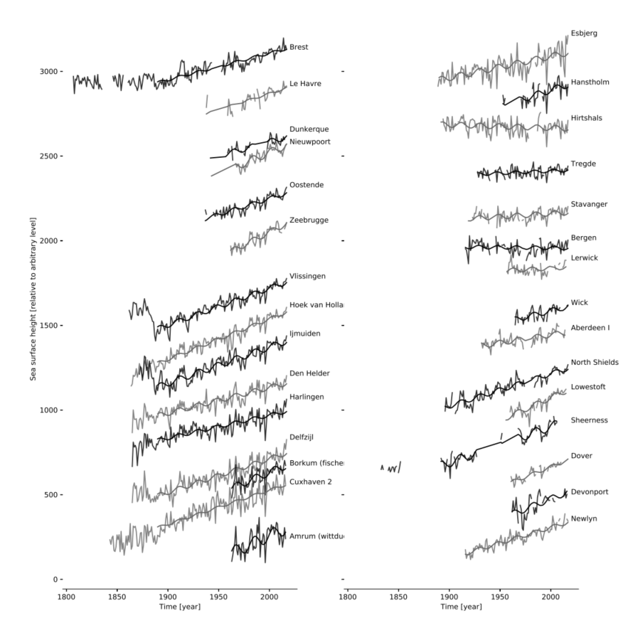
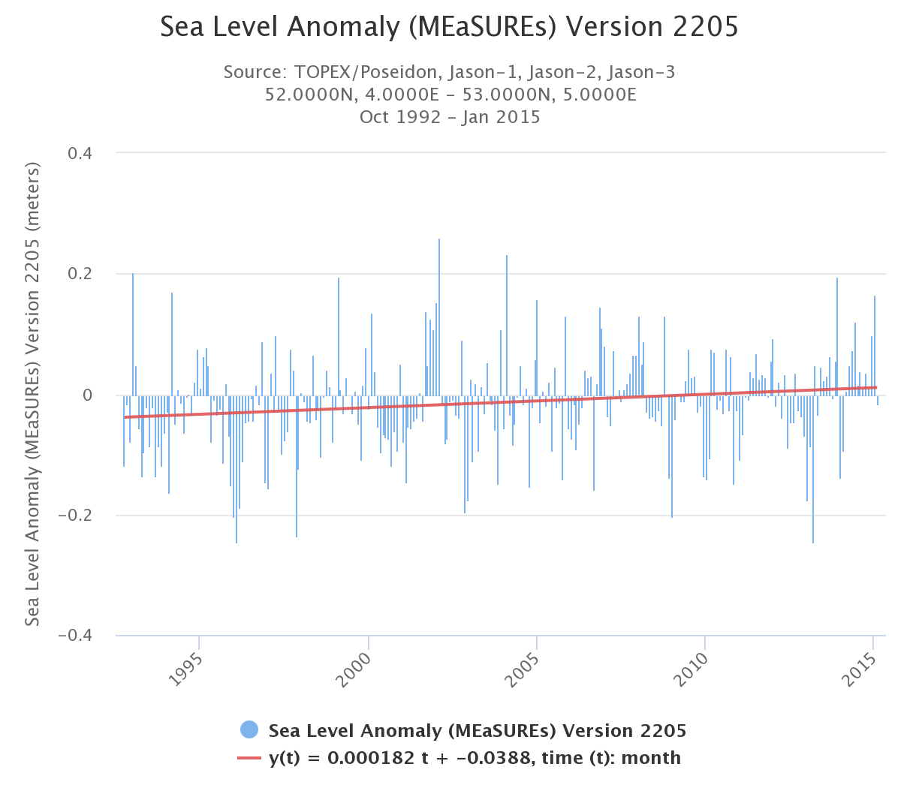

# Resultaten {#resultaten}

```{r prepareData}
require(tidyverse)
require(scales)
stations <- read_csv("../../data/deltares/results/variants/stations.csv")
series <- read_csv("../../data/deltares/results/variants/series.csv")
fits <- read_csv("../../data/deltares/results/variants/fits.csv")
predictions_url <- "../../data/deltares/results/dutch-sea-level-monitor-predictions-2023-2-28.csv"
predictions <- read_csv(predictions_url)

fitstyle =   theme_light() %+replace%
    theme(
      axis.text.x = element_text(angle = 45, vjust = 1, hjust = 1),
      legend.position = "bottom"
      ) 

### predictions moeten ook van github gelezen worden, maar staan daar nu nog niet. 

stationlevels <- c("Vlissingen",
              "Hoek van Holland",
              "IJmuiden",
              "Den Helder",
              "Harlingen",
              "Delfzijl",
              "Netherlands",
              "Netherlands (without Delfzijl)"
              )
model_variants <- c("linear", "quadratic", "broken_linear", "broken_quadratic")

fits <- fits %>%
  mutate(name = factor(name, levels = stationlevels),
         model_variant = factor(model_variant, levels = model_variants))

fits_wind <- fits %>% 
      filter(has_wind) %>%
      distinct(psmsl_id, `Wind $u^2$`, `Wind $v^2$`, wind_variant, model_variant, quantity, aic, Constant, `Constant (in year 1960)`, `Constant (in year 1970)`, Trend, `+trend (1993)`, Acceleration, `Acceleration from 1960`, `Nodal U` , `Nodal V` )

timeseries_wind <- series %>%
  select(year, station, u2, v2, wind_variant, height) %>%
  left_join(
    stations %>% select(psmsl_id...1, name_rws), 
    by = c(station = "psmsl_id...1")
  ) %>%
  full_join(fits_wind, by = c(
    station = "psmsl_id", 
    wind_variant = "wind_variant"
  )) %>%
  mutate(effect = `Wind $u^2$`*u2 + `Wind $v^2$`*v2) %>%
  group_by(station, wind_variant, model_variant, name_rws, quantity) %>%
  mutate(anomaly = effect - mean(effect)) %>%
  ungroup() %>%
    mutate(
    `height - effect` = height - effect,
    `height - anomaly` = height - anomaly
  ) %>% 
  rename(
    correction_variant = wind_variant
    ) %>%
  mutate(fit_height = `height - effect`)

fits_surge <- fits %>%
      filter(!has_wind) %>%
      distinct(psmsl_id, model_variant, quantity,
               aic, Constant, `Constant (in year 1960)`, `Constant (in year 1970)` , Trend, `+trend (1993)`, 
               Acceleration, `Acceleration from 1960`, `Nodal U` , `Nodal V` ) %>%
  mutate(wind_variant = "GTSM") %>%
  select(-quantity)


timeseries_surge <- series %>%
  distinct(year, station, height, surge_mm, `height - surge`, `height - surge anomaly`) %>%
  mutate(wind_variant = "GTSM") %>%
  left_join(
    stations %>% select(psmsl_id...1, name_rws), 
    by = c(station = "psmsl_id...1") 
  ) %>%
  left_join(fits_surge, by = c(
    station = "psmsl_id",
    wind_variant = "wind_variant"
  )) %>%
  mutate(
    anomaly = height - `height - surge anomaly`
  ) %>%
  rename(
    `height - effect` = `height - surge`,
    `height - anomaly` = `height - surge anomaly`
  ) %>% 
  rename(
    correction_variant = wind_variant, 
    effect = surge_mm
    )  %>% 
  mutate(fit_height = `height - anomaly`)

timeseries <- bind_rows(timeseries_wind, timeseries_surge) %>%
  mutate(correction_variant = factor(correction_variant, levels = c("NCEP1","20CR","Combined", "GTSM" ))) %>%
  mutate(model_variant = factor(model_variant, levels = model_variants)) %>%
  mutate(name_rws = factor(name_rws, levels = stationlevels))

# predictions uit modelfit
# met getij voor GTSM
# met getij en wind voor windgedreven correcties

predictions_wind<- predictions %>%
  filter(has_wind) %>%
  rename(correction_variant = wind_variant)

predictions_surge<- predictions %>%
  filter(!has_wind) %>%
  filter(wind_variant == "Combined") %>% # one of three versions needed
  mutate(wind_variant = "GTSM") %>%      # rename variant to gtsm to be used with other variants
  rename(correction_variant = wind_variant)

# prediction without wind, but with tide
predictions2 <- bind_rows(predictions_wind, predictions_surge) %>%
  mutate(model_variant = factor(model_variant, levels = model_variants)) %>%
  mutate(correction_variant = factor(correction_variant, levels = c("NCEP1","20CR","Combined", "GTSM" ))) %>%
  rename(name_rws = name) %>%
  mutate(name_rws = factor(name_rws, levels = stationlevels))

# only sea level prediction without wind, surge or tide
pred_series <- timeseries %>%
    mutate(
    prediction_recalc = case_when(
      model_variant == "linear" ~         Constant + Trend * (year - 1970),
      model_variant == "broken_linear" ~  Constant + Trend * (year - 1970) + 
        ifelse(year > 1993, `+trend (1993)` * (year - 1993), 0),
      model_variant == "quadratic" ~ `Constant (in year 1970)` + Trend * (year - 1970) +
        Acceleration * (year - 1970) * (year - 1960),
      model_variant == "broken_quadratic" ~ `Constant (in year 1960)` + Trend * (year - 1960) +
        ifelse(year >= 1960, `Acceleration from 1960` * (year - 1960) * (year - 1960), 0)
    )
  ) %>% 
  group_by(model_variant, correction_variant, name_rws) %>%
  mutate(
    prediction_recalc = case_when(
      correction_variant == "GTSM" ~ prediction_recalc,
      correction_variant != "GTSM" ~ prediction_recalc + mean(effect)
    )
  )

predictions_all <-
  predictions2 %>%
  left_join(pred_series %>% select(
    -quantity
  )) %>%
  mutate(
    `nodal tide` = `Nodal U` * cos(2*pi*(year-1970)/18.613) + `Nodal V`*sin(2*pi*(year-1970)/18.613)
  )

write_csv(predictions_all, "../../data/deltares/results/predictions_all.csv")

rm(predictions_surge, predictions_wind, predictions, predictions2, pred_series)

```

In hoofdstuk \@ref(methoden) hebben we vastgesteld hoe de 'huidige zeespiegel' wordt uitgerekend. In dit hoofdstuk wordt de huidige zeespiegel op basis van de periode 1890-2021 vastgesteld volgens de voorkeursmethode. De voorkeursmethode maakt gebruik van:

-   Het gemiddelde over 5 hoofdstations. Er wordt een gemiddelde genomen om de onregelmatigheden van indivuele stations niet al te zwaar te laten meewegen. Van de zes hoofdstations wordt Delfzijl dit keer niet meegenomen vanwege onzekerheid over de verticale referentie aldaar (zie hoofdstuk \@ref(methoden))
-   \acr{GTSM} wordt gebruikt voor correctie van windopzet op de zeespiegel. Deze methode zorgt voor een fysisch onderbouwde, onafhankelijke schatting van de windopzet. Nadeel is dat de beschikbare tijdreeks vrij kort is (vanaf 1979).
-   Uit de verzameling modellen met en zonder versnelling is op grond van het \acr{AIC} criterium het *gebroken lineaire* model (met breekpunt in 1993) als hoofdvariant geselecteerd (zie paragraaf \@ref(versnelling-methods)). Dit model verklaart als enige significant beter de variatie (heeft een significant lagere \acr{AIC}) dan de lineaire variant, rekening houdend met het verschil in vrijheidsgraden. Voor details omtrent deze analyse verwijzen we naar de bijbehorende [rekendocument](https://github.com/openearth/sealevel/blob/report/notebooks/dutch-sea-level-monitor.ipynb).

De andere varianten (stations, windcorrectie, versnellingstermen) worden in bijlage \@ref(varianten) getoond.

## De huidige zeespiegel {#huidige}

```{r, include=F}

# plot voor in hoofdstuk methoden

predictions_all %>%
    filter(name_rws == "Netherlands (without Delfzijl)") %>%
    filter(correction_variant %in% c("NCEP1", "GTSM")) %>%
    filter(model_variant == "linear") %>%
  rename(`windopzet correctie` = correction_variant) %>%
ggplot() +
    geom_point(aes(x = year, y = height), size = 1, alpha = 0.4) +
    geom_line(data = . %>% filter(`windopzet correctie` == "NCEP1"), aes(year, prediction_recalc + effect, color = `windopzet correctie`), size = 1, alpha = 0.6) +
    geom_line(data = . %>% filter(`windopzet correctie` == "GTSM"), aes(year, prediction_recalc + anomaly, color = `windopzet correctie`), size = 1, alpha = 0.6) +
  ylab("zeespiegel in mm") + xlab("jaar") +
  scale_x_continuous(breaks = scales::pretty_breaks(6)) +
  theme_light()

  ggsave(filename = "figures/slr_mean_surge.png", height = 4, width = 8)

```

```{r plotfunctie}
plot_station <- function(stationi = "Netherlands (without Delfzijl)", predictions_all = predictions_all, correctionVariant, modelVariant, printNumbers = FALSE) {

  startyear = 1900
  zoomyear = 2010
  
  plotShapes = c(
    "height" = 1,
    "height - anomaly" = 24#,
    # "heigt - effect" = 22
  )
  
  pal <- hue_pal()(4)
  
  plotColors = c(
    "zeespiegel" = "darkgrey",
    "zeespiegel (- nodaal getij)" = pal[1],
    # "zeespiegel (-opzet)" = pal[2],
    "zeespiegel (-opzetanomalie -nodaal getij)" = pal[2],
    "predictie (-opzetanomalie +getij)" = pal[3],
    "predictie (-opzetanomalie -nodaal getij)" = pal[4]
  )
  plotFills = c(
    "predictie-interval" = pal[1],
    "betrouwbaarheids-interval" = pal[2]
  )

  predictions_all2 <- predictions_all %>%
    filter(name_rws == stationi) %>%
    filter(correction_variant == correctionVariant) %>%
    filter(model_variant == modelVariant)
  
  symboolgrootte = 1.5
  
  q <- ggplot() +
    geom_point(data = predictions_all2 %>% filter(year >= startyear), 
               aes(x = year, y = height/10, color = "metingen"), 
               size = symboolgrootte, alpha = 0.4) +
    geom_line(data = predictions_all2 %>% filter(year >= startyear),
               aes(x = year, y = (height - `nodal tide`)/10, color = "zeespiegel (- nodaal getij)"),
               size = symboolgrootte, alpha = 0.6) +
    geom_line(data = predictions_all2 %>% filter(year >= startyear), 
               aes(x = year, y = (`height - anomaly` - `nodal tide`)/10, color = "zeespiegel (-opzetanomalie -nodaal getij)"), 
               size = symboolgrootte, alpha = 0.5) +
    geom_line(data = predictions_all2 %>% filter(year >= startyear),
              aes(x = year, y = prediction/10, color = "predictie (-opzetanomalie +getij)"),
              size = symboolgrootte, alpha = 0.7) +
    geom_line(data = predictions_all2 %>% filter(year >= startyear),
              aes(x = year, y = prediction_recalc/10, color = "predictie (-opzetanomalie -nodaal getij)"),
              size = symboolgrootte, alpha = 0.7) +
    geom_vline(xintercept = 1993, linetype = 5) +
    annotate("text", label = "1993", x = 1993, y = 13) +
    coord_cartesian(ylim = c(NA, NA)) +
    xlab("jaar") +
    ylab("zeespiegel in cm tov NAP") +
    labs(subtitle = "Gecorrigeerde zeespiegel (GTSM) en trends") +
    fitstyle +
    theme(
      strip.text.y = element_text(angle = 0)) +
    theme(legend.title = element_blank()) +
    theme(legend.direction = "vertical",
          legend.box = "horizontal",
          legend.position = c(0.025,0.975),
          legend.justification = c(0, 1),
          legend.title = element_blank()) +
    scale_color_manual(values = plotColors) +
    scale_fill_manual(values = plotFills) +
    scale_x_continuous(breaks = scales::pretty_breaks())
  
  if(printNumbers) {
    nudge_xx = 1
    textsize = 3.5
    q = q +
      geom_text(data = predictions_all2 %>% filter(year ==2021), 
                aes(x = year, y = height/10, label = signif(height/10, 2), color = "metingen"), 
                size = textsize, alpha = 0.5, nudge_x = nudge_xx, fontface = "bold") +
       geom_text(data = predictions_all2 %>% filter(year ==2021), 
                aes(x = year, y = (height - `nodal tide`)/10, label = signif((height - `nodal tide`)/10, 2), color = "zeespiegel (- nodaal getij)"), 
                size = textsize, alpha = 0.5, nudge_x = nudge_xx, fontface = "bold") +
      geom_text(data = predictions_all2 %>% filter(year >= 2021),
                aes(x = year, y = (`height - anomaly` - `nodal tide`)/10, label = signif((`height - anomaly` - `nodal tide`)/10, 2), color = "zeespiegel (-opzetanomalie -nodaal getij)"),
                size = textsize, alpha = 0.5, nudge_x = nudge_xx+1, fontface = "bold") +
      geom_text(data = predictions_all2 %>% filter(year >= 2021),
                aes(x = year, y = prediction/10, label = signif(prediction/10, 2), color = "predictie (-opzetanomalie +getij)"),
                size = textsize, alpha = 0.7, nudge_x = nudge_xx, nudge_y = 0.1, fontface = "bold") +
      geom_text(data = predictions_all2 %>% filter(year >= 2021),
                aes(x = year, y = prediction_recalc/10, label = signif(prediction_recalc/10, 2), color = "predictie (-opzetanomalie -nodaal getij)"),
                size = textsize, alpha = 0.7, nudge_x = nudge_xx, fontface = "bold")
  }

  return(q)
  
}

```

In figuur \@ref(fig:huidige-zeespiegel) is de zeespiegel uitgezet tegen de tijd. De gemeten zeespiegel is voor 2021 vastgesteld op 7.6 cm boven \acr{NAP}.

De huidige zeespiegel, dat is de zeespiegel die we verwacht hadden op basis van de opgetreden variatie in windopzet en getij, is 9.4 cm boven \acr{NAP} (predictie -opzetanomalie +getij in figuur \@ref(fig:huidige-zeespiegel)). De windopzet afwijking van gemiddeld was dit jaar -3.1 cm. Het berekende effect van nodaal getij was dit jaar +1.2 cm. Bij gemiddelde windopzet zou de zeespiegel 7.8 cm bedragen.

Voor het jaar 2021 bedraagt de relatieve zeespiegelstijging langs de Nederlandse kust 2.9 ± 0.4 mm/jaar oftewel 29 ± 4,cm/eeuw. Deze trend is berekend over de periode 1993 tot en met 2021. Dit beantwoordt de vraag, hoe snel de zeespiegel op dit moment stijgt. De zeespiegel stijgt nu dus sneller dan in de periode van 1890 - 1993. In die periode was de zeespiegelstijging 1.8 ± 0.1 mm/jaar oftewel 18 ± 1,cm/eeuw (figuur \@ref(fig:huidige-zeespiegel) en tabel \@ref(tab:kengetallen-tabel)).

(ref:huidige-zeespiegel-label) Tijdserie van de zeespiegel langs de Nederlandse kust op basis van het gemiddelde van de vijf hoofdstations, zie ook paragraaf \@ref(bronnen). Opzet en opzetanomalie (afwijking van de gemiddelde opzet) zijn berekend met \acr{GTSM}, de predictie is op basis van een gebroken lineair model.

```{r huidige-zeespiegel, fig.cap = "(ref:huidige-zeespiegel-label)"}


p <- plot_station(predictions_all = predictions_all, correctionVariant = "GTSM", modelVariant = "broken_linear")

q <- plot_station(predictions_all = predictions_all, correctionVariant = "GTSM", modelVariant = "broken_linear", printNumbers = T) +
  coord_cartesian(xlim = c(2016, 2024), ylim = c(5,10)) +
  theme(rect = element_rect(color = "darkgrey", size = 1, fill = "transparent")) +
  labs(subtitle = "") + ylab("") + xlab("") +
  theme(legend.position = "none")

print(p + annotation_custom(ggplotGrob(q), xmin = 1970, xmax = 2025, 
                       ymin = -28.5, ymax = -5)
)
```

```{r kengetallen-tabel}
predictions_all %>%
    filter(name_rws == "Netherlands (without Delfzijl)") %>%
    filter(correction_variant %in% c("GTSM")) %>%
    filter(model_variant == "broken_linear") %>%
  filter(year == 2021) %>% 
  mutate(
    `betrouwbaarheid schatting in cm` = abs(conf_int_lower - conf_int_upper)/2,
  ) %>%
  select(correction_variant, 
         `gemeten zeespiegel in cm NAP`  = height, 
        `totale windopzet in cm NAP`   = effect, 
         `bijdrage nodaal getij in cm NAP` = `nodal tide`, 
         `zeespiegel - windopzetanomalie in cm NAP` = `height - anomaly`, 
         `geschatte zeespiegel (-windopzet) in cm NAP` = prediction,
        `betrouwbaarheid schatting in cm`,
         `geschatte zeespiegel (-nodaal getij - windopzet) in cm NAP` = prediction_recalc) %>%
  # mutate(`prediction+effect` = prediction + effect) %>%
  mutate(across(is.numeric, function(x) round(x/10, 1))) %>% 
  mutate(across(is.numeric,as.character)) %>%
   pivot_longer(-correction_variant) %>% 
   pivot_wider(names_from=correction_variant, values_from=value) %>%
  rename(variabele = name, `waarde in cm` = GTSM) %>%
  kableExtra::kable(caption = "Kengetallen voor de huidige zeespiegelstand (2021).") %>% 
  kableExtra::kable_styling(latex_options="scale_down")
  
```

De gemeten zeespiegel aan de Nederlandse kust heeft in 2020 zijn hoogste stand ooit gemeten bereikt. Kort gezegd komt dit doordat het dat jaar flink heeft gestormd in combinatie met een opgaand nodaal getij en de gestegen zeespiegel.

De zeespiegel gecorrigeerd voor de variatie in windopzet was het hoogste in 2021. Dit was te verwachten door de stijgende zeespiegel en een opgaand nodaal getij.

## Vergelijking met eerdere analyse

De versnelling langs de Nederlandse kust is consistent met resultaten die zijn afgeleid van mondiale zeespiegelmetingen en budgetten. Het model met versnelling was echter tot de vorige Zeespiegelmonitor (t/m meetjaar 2017) niet significant beter dan het lineaire model met de methode van de Zeespiegelmonitor [@Baart2019]. Daarom was over de periode 1890 - 2017 de langjarig trend constant en had de waarde 1.9 mm/jaar. De totale zeespiegelstijging over de periode 1890 - 2017 was toen bepaald op 23 cm.

```{r, include=FALSE}
  startyear = 1900
  zoomyear = 2010
  
  plotShapes = c(
    "height" = 1,
    "height - anomaly" = 24#,
    # "heigt - effect" = 22
  )
  
  pal = hue_pal()(3)
  
  symboolgrootte = 2
  
  correctionColors = c(
    "jaarlijkse windopzetcorrectie" = "black",
    "gemiddelde windopzetcorrectie" = "darkgrey"
  )
  
  predictions_all %>% ungroup() %>%
    filter(name_rws == "Netherlands (without Delfzijl)") %>%
    filter(correction_variant == "GTSM") %>%
    filter(model_variant %in% c("linear", "broken_linear")) %>% 
    select(year, model_variant, `height - anomaly`, prediction_recalc, `nodal tide`) %>% 
    # pivot_wider(year, names_from = model_variant, values_from = prediction_recalc) %>%
    mutate(`na 1993` = ifelse(year >= 1993, "-","dashed")) %>%
    mutate(`voor 2018` = ifelse(year < 2018, "-","dashed")) %>%
    filter(year >= startyear) %>% 
    arrange(year) %>% 
    mutate(`correctie beschikbaar` = ifelse(year >= 1979, "jaarlijkse windopzetcorrectie", "gemiddelde windopzetcorrectie")) %>%
    ggplot() +
    geom_vline(xintercept = 1993, linetype = 4, alpha = 0.5, color = pal[3]) +
    geom_point(aes(year, (`height - anomaly` - `nodal tide`)/10, color = `correctie beschikbaar`), alpha = 0.6, size = symboolgrootte) +
    # geom_line(data = . %>% filter(model_variant == "linear"), 
    #   aes(x = year, y = prediction_recalc/10, color = model_variant, linetype = `voor 2018`), 
    #           alpha = 0.75, size = symboolgrootte) +
    geom_line(data = . %>% filter(model_variant == "broken_linear"), 
              aes(x = year, y = prediction_recalc/10, linetype = `na 1993`), 
              alpha = 0.75, size = symboolgrootte - 0.5, color = pal[2]) +
  annotate(geom = "text", x = 1960, y = -15 , label = "1.8 mm/jaar", color = pal[2]) +
  annotate(geom = "text", x = 2003, y = 10, label = "2.9 mm/jaar", color = pal[2]) +
    annotate("text", label = "knikpunt", x = 1993, y = -20, color = pal[3], alpha = 0.7) +
    coord_cartesian(ylim = c(NA, NA)) +
    xlab("jaar") +
    ylab("zeespiegel in cm t.o.v. NAP") +
    labs(subtitle = "Zeespiegel (gecorrigeerd voor windopzet en nodaal getij) met gebroken lineair model") +
    fitstyle +
    theme(
      strip.text.y = element_text(angle = 0)) +
    theme(legend.title = element_blank()) +
    scale_linetype_discrete(guide = "none") +
    scale_color_manual(values = correctionColors) +
    theme(legend.direction = "vertical",
          legend.box = "horizontal",
          legend.position = c(0.025,0.975),
          legend.justification = c(0, 1),
          legend.title = element_blank()
          ) +
    scale_x_continuous(breaks = scales::pretty_breaks())

ggsave(filename = "figures/samenvatting_v2.png", width = 7, height = 5)
```

```{r overgangLinearBrokenLinear, fig.cap="Tijdserie van gemiddelde zeespiegel (gemiddeld over hoofdstations minus Delfzijl) gecorrigeerd voor de variatie in windopzet (GTSM) en voor de variatie in nodaal getij. Trendlijnen voor het lineaire en het gebroken lineaire model zijn toegevoegd. De gegevens tot en met 2022 worden beter beschreven met het gebroken lineaire model dan met het lineaire model."}

# moet grafiek worden die ook in de samenvatting past. 

  startyear = 1900
  zoomyear = 2010
  
  pal <- hue_pal()(4)

  
  plotColors <- c(
    "lineair model" = pal[1],
    "gebroken lineair model" = pal[2]  
  )
  
  plotShapes = c(
    "height" = 1,
    "height - anomaly" = 24#,
    # "heigt - effect" = 22
  )
  
  
  symboolgrootte = 1.5
  
  plotAlpha = c(
    "predictie-interval" = 0.1,
    "betrouwbaarheids-interval" = 0.2
  )

  
  predictions_all %>% ungroup() %>%
    filter(name_rws == "Netherlands (without Delfzijl)") %>%
    filter(correction_variant == "GTSM") %>%
    filter(model_variant %in% c("linear", "broken_linear")) %>% 
    select(year, model_variant, `height - anomaly`, prediction_recalc, `nodal tide`, conf_int_mean_tide_lower, conf_int_mean_tide_upper, pred_int_mean_tide_lower, pred_int_mean_tide_upper) %>% 
    # pivot_wider(year, names_from = model_variant, values_from = prediction_recalc) %>%
    mutate(`na 1993` = ifelse(year >= 1993, "-","dashed")) %>%
    mutate(`voor 2018` = ifelse(year < 2018, "-","dashed")) %>%
    filter(year >= startyear) %>% 
    arrange(year) %>% 
    ggplot() +
    # geom_jitter(aes(year, `nodal tide`/10, color = model_variant), alpha = 0.75) +
    geom_point(aes(year, (`height - anomaly` - `nodal tide`)/10, color = "grey"), alpha = 0.4, size = symboolgrootte) +
    geom_line(data = . %>% filter(model_variant == "linear"), 
              aes(x = year, y = prediction_recalc/10, color =  "lineair model", linetype = `voor 2018`), 
              alpha = 0.5, size = symboolgrootte) +
    geom_line(data = . %>% filter(model_variant == "broken_linear"), 
              aes(x = year, y = prediction_recalc/10, color = "gebroken lineair model", linetype = `na 1993`), 
              alpha = 0.75, size = symboolgrootte) +
    geom_ribbon(data = . %>% filter(model_variant == "broken_linear"), 
                aes(x = year, ymin = pred_int_mean_tide_lower/10, ymax = pred_int_mean_tide_upper/10, alpha = "predictie-interval"), fill = pal[2]) +
    geom_ribbon(data = . %>% filter(model_variant == "broken_linear"), 
                aes(x = year, ymin = conf_int_mean_tide_lower/10, ymax = conf_int_mean_tide_upper/10, 
                alpha = "betrouwbaarheids-interval"), fill = pal[2]) +
    coord_cartesian(ylim = c(NA, NA)) +
    xlab("jaar") +
    ylab("zeespiegel in mm tov NAP") +
    labs(subtitle = "Verandering van trendmodel in de tijd.") +
    fitstyle +
    theme(
      strip.text.y = element_text(angle = 0)) +
    theme(legend.title = element_blank()) +
    scale_linetype_discrete(guide = "none") +
    theme(
      legend.direction = "vertical",
      legend.box = "horizontal",
      legend.position = c(0.025,0.975),
      legend.justification = c(0, 1),
      legend.title = element_blank()
    ) +
    scale_x_continuous(breaks = scales::pretty_breaks()) +
    scale_alpha_manual(values = plotAlpha) +
    scale_color_manual(values = plotColors)

```

Sinds 2017 zijn meer gegevens beschikbaar gekomen. De zeespiegelmetingen over de laatste vier jaar laten zien dat de stijging doorzet. Tegelijkertijd is deze keer het \acr{GTSM} model gebruikt om te corrigeren voor variatie in de zeespiegel door windopzet. De nieuwe gecorrigeerde zeespiegelmetingen liggen zodanig hoog dat er voor de berekening van de langjarige trend nu wordt overgegaan van een lineair model (rechte lijn) op een gebroken lineair model (een geknikte lijn, variant 3 uit hoofdstuk \@ref(methoden)). We doen dit omdat na testen (\acr{AIC} criterium) blijkt dat het gebroken lineaire model een significant beter model is dan het lineaire model, rekening houdend met het feit dat het gebroken lineaire model ook complexer is.

Door over te gaan op het gebroken lineaire model wordt de zeespiegelstijging nu het beste beschreven met twee verschillende trends in de tijd. Een iets verlaagde trend in de periode van vóór 1993, namelijk 1.8 mm/jaar, en een verhoogde trend na 1993, namelijk 2,9 mm/jaar. We constateren ook dat de zeespiegel in 2021 bijna 25 cm hoger staat dan in 1890.

Het feit dat de geschatte zeespiegel in 2021 bijna 2 cm hoger wordt geschat dan in 2017 wordt verklaard door:

-   Een werkelijk hogere zeespiegel
-   De aanname dat de zeespiegel na 1993 versneld is gaan stijgen
-   Een betere correctie voor windopzet. Hierdoor wordt een iets kleiner deel van de gemeten stijging toegeschreven aan variatie in windopzet.

De verhoogde stijging begint in 1993. De keuze voor dit jaar voor een versnelde stijging is gemotiveerd vanuit een \acr{MCMC} analyse [@Baart2019 sectie 6.3]. Wereldwijd wordt er ook een versnelde zeespiegelstijging gevonden in de periode na 1993 in vergelijking met daarvoor [@IPCC2013]. De keuze voor dit jaartal ligt gedeeltelijk in het feit dat vanaf dat jaar een goede mondiale dekking werd bereikt door metingen met satellieten, ook zijn er sterke aanwijzingen dat vanaf die tijd de ijsmassa op Groenland versneld afnam. Tegelijkertijd is bekend dat de zeespiegel rond die tijd lager was dan normaal door uitbarsting van de Pinatubo en daaruitvolgende mondiale afkoeling [@Nerem2018]. De knik in 1993 kan gedeeltelijk verklaard worden door deze vertraagde zeespiegelstijging. We constateren nu echter dat deze vertraging in zeespiegelstijging is ingehaald, en dat de versnelde stijging nu ook aan de Nederlandse kust waarneembaar is geworden.

## Nodaal getij

Het nodaal getij draagt bij aan het zeespiegelsignaal met plus of min 1.2 cm (figuur \@ref(fig:nodaalgetijNederlandGemiddeld)). Het nodaal getij wordt meegenomen in de regressie, en de invloed daarvan op de zeespiegel wordt dus geschat uit de gegevens in combinatie met het gebruikte model en na aftrek van windopzet. Voor de 5 stations gemiddeld is de bijdrage van het nodaal getij niet afhankelijk van de gebruikte windopzetcorrectie (GTSM of NCEP1) en model (lineair of gebroken lineair). Voor de overige varianten wordt verwezen naar Appendix \@ref(varianten).

```{r nodaalgetijNederlandGemiddeld, fig.width = 6, fig.height = 2.5, out.width = "70%", fig.cap="Het geschatte aandeel van het nodale getij op de zeespiegel voor de 5 hoofdstations gemiddeld. "}
predictions_all %>% ungroup() %>%
    filter(name_rws == "Netherlands (without Delfzijl)") %>%
    filter(correction_variant %in% c("NCEP1", "GTSM")) %>%
    filter(model_variant %in% c("linear", "broken_linear")) %>%
  ggplot(aes(year, `nodal tide`/10)) +
  geom_line(aes(color = interaction(correction_variant, model_variant)), size = 1) +
  coord_cartesian(xlim = c(2000, 2022)) +
  xlab("jaar") + ylab("geschat nodaal getij in cm") +
  theme_light() +
  guides(color=guide_legend(title="windopzet- en modelvariant"))
  
```

## Windopzet

De zeespiegel aan de Nederlandse kust is door windopzet gemiddeld over de meetperiode zo'n 4.5 cm hoger dan het geval zou zijn zonder windopzet (figuur \@ref(fig:sea-level-wind)). De bijdrage van de windopzet varieert over de jaren.

(ref:sea-level-wind-label) De gemiddelde gemeten zeespiegel voor de vijf hoofdstations (zwart), de geschatte (predictie) zeespiegel (gebroken lineaire model) waarbij gecorrigeerd is voor de variatie in opzet (predictie - opzetanomalie), en de geschatte zeespiegel waarbij de windopzet is afgetrokken (predictie - opzet). Windopzet is berekend met het GTSM model (zie paragraaf \@ref(methoden-wind)).

```{r sea-level-wind, fig.height=2.5, fig.width=6, out.width = "70%", fig.show='hold', out.width="100%", fig.cap="(ref:sea-level-wind-label)"}

# knitr::include_graphics("figures/sea-level-wind.png")

startyear = 1960

plotShapes = c(
  "height" = 21,
  "height - anomaly" = 24,
  "heigt - effect" = 22
)

pal <- hue_pal()(4)

plotColors1 = c(
    "metingen" = "black",
  "predictie - opzetanomalie" = pal[1],
  "predictie - opzet" = pal[2]
)

plotColors2 = c(
  "anomalie" = pal[3],
  "opzet" = pal[4]
)

p <- predictions_all %>%
  filter(name_rws == "Netherlands (without Delfzijl)") %>%
  filter(year > startyear) %>%
  filter(correction_variant == "GTSM") %>%
  filter(model_variant %in% c("broken_linear")) %>%
  left_join(timeseries %>% select(year, name_rws, model_variant, correction_variant, height, `height - effect`, `height - anomaly`, fit_height, effect, anomaly)) %>%
  ggplot() +
  geom_point(aes(x = year, y = height, color = "metingen"), size = 2, alpha = 0.5) +
  geom_line(aes(x = year, y = `height - anomaly`, color = "predictie - opzetanomalie"), size = 1, alpha = 1) +
  geom_line(aes(x = year, y = `height - effect`, color = "predictie - opzet"), size = 1, alpha = 1) +
  coord_cartesian(xlim = c(NA, NA), ylim = c(NA, NA)) +
  scale_x_continuous(breaks = scales::pretty_breaks(n = 3)) +
  scale_y_continuous(minor_breaks = scales::pretty_breaks(n = 20)) +
  xlab("jaar") +
  ylab("zeespiegel in mm tov NAP") +
    scale_color_manual(values = plotColors1, name = "") +
    scale_x_continuous(breaks = scales::pretty_breaks()) +
  fitstyle
p 


# q <- predictions_all %>%
#   filter(name_rws == "Netherlands (without Delfzijl)") %>%
#   filter(year > startyear) %>%
#   filter(correction_variant == "GTSM") %>%
#   filter(model_variant %in% c("broken_linear")) %>%
#   left_join(timeseries %>% select(year, name_rws, model_variant, correction_variant, height, `height - effect`, `height - anomaly`, fit_height, effect, anomaly)) %>%
#   ggplot() +
#   geom_line(aes(x = year, y = `effect`, color = "opzet"), size = 1, alpha = 1) +
#   geom_line(aes(x = year, y = `anomaly`, color = "opzetanomalie"), size = 1, alpha = 1) +
#   coord_cartesian(xlim = c(NA, NA), ylim = c(NA, NA)) +
#   scale_x_continuous(breaks = scales::pretty_breaks(n = 3)) +
#   scale_y_continuous(minor_breaks = scales::pretty_breaks(n = 20)) +
#   xlab("jaar") +
#   ylab("opzet en opzetanomalie in mm") +
#     scale_color_manual(values = plotColors2, name = "") +
#     scale_x_continuous(breaks = scales::pretty_breaks()) +
#   fitstyle
# 
# q

```

## Stijgt de zeespiegel versneld? {#versnelling-results}

Of er een versnelling is stellen we vast door de modellen met versnelling (met acceleratieterm en met knik en de combinatie daarvan) te vergelijken met het model zonder versnelling. Deze analyse is uitgevoerd voor het gemiddelde van alle hoofdstations minus Delfzijl. De reden hiervan is beschreven in paragraaf \@ref(bronnen).

De versnellingsmodellen "gebroken lineair" en "gebroken kwadratisch" verklaren beide beter de zeespiegel dan het lineaire model. Echter, het "gebroken lineair" model is het enige model dat significant beter is dan het lineaire model.

We lopen voor de volledigheid alle drie versnellingsmodellen af (figuur \@ref(fig:stijgingModellen)):

Het lineaire model laat een trend zien van 1.9 ± 0.1 mm/jaar.

Het model met een acceleratie term (kwadratisch) laat een versnelde zeespiegel zien (0.003 ± 0.002 mm/jaar^2^). Dit model is niet significant beter dan het lineaire model.

Het model met een acceleratie vanaf 1960 (gebroken kwadratisch) laat een versnelde zeespiegel zien (0.009 ± 0.004 mm/jaar^2^) vanaf 1960. De trend over de periode voor 1960 is 1.7 ± 0.1 mm/jaar. Dit model is iets minder goed dan het gebroken lineaire model en is ook niet significant beter dan het lineaire model.

De voorkeursvariant, Het model met een knik in 1993 (gebroken lineair) laat een hogere zeespiegelstijging zien (2.9 ± 0.4 mm/jaar) na 1993 dan ervoor (1.8 ± 0.1 mm/jaar), een extra 1.1 ± 0.3 mm/jaar.

## Verwachting voor komende jaren

We zien dat een constante zeespiegelstijging niet meer de beste beschrijving oplevert voor de metingen tot nu toe. Wat betekent dit voor de komende jaren? Allereerst, onze analyse kan alleen worden toegepast op historische gegevens en is niet direct geschikt voor uitspraken over de komende jaren. In de vorige Zeespiegelmonitor, het advies van \acr{ENW} volgend, was het uitgangspunt dat de huidige zeespiegelstijging hooguit voor een periode van 15 jaar vooruit kan worden gebruikt. Uitgaande van het nu beste model is de huidige zeespiegelstijging 2.9 ± 0.4 mm/jaar. De huidige zeespiegelstijging is afhankelijk van het gebruikte model zoals te zien is in figuur \@ref(fig:stijgingModellen). Hier is duidelijk het verschil te zien in zeespiegelstijging voor het gebroken lineaire model voor en na 1993. Het gebroken kwadratische model, dat de variatie wel goed verklaart maar niet significant beter was dan het lineaire model, laat ongeveer dezelfde zeespiegelstijging zien als het gebroken lineaire model. De zeespiegelstijging in het gebroken lineaire model is over de periode sinds 2000 gelijk, terwijl die van het gebroken kwadratische model in die periode toenam.

```{r stijgingModellen, fig.cap="Het verloop van de snelheid van zeespiegelstijging in de tijd voor de vier verschillende geteste modellen." }

startyear = 1978

predictions_all %>% 
  filter(name_rws == "Netherlands (without Delfzijl)", correction_variant == "GTSM") %>%
  group_by(name_rws, model_variant, correction_variant) %>%
  arrange(name_rws, model_variant, correction_variant, year) %>%
  mutate(diff_pred = c(NA, diff(prediction_recalc, 1))) %>%
  ggplot() +
  # geom_point(data = pred_series %>% filter(model_variant == "linear", year > startyear), aes(x = year, y = diff(fit_height) ), size = 0.5, alpha = 0.2) +
  # geom_point(data = pred_series %>% filter(model_variant == "linear", year > 2017), aes(x = year, y = diff(fit_height)), size = 1, alpha = 1, color = "blue") +
  geom_line(aes(x = year, y = diff_pred, color = model_variant), size = 1) +
  geom_text(data = predictions_all %>% 
              filter(name_rws == "Netherlands (without Delfzijl)", correction_variant == "GTSM") %>%
              group_by(name_rws, model_variant, correction_variant) %>%
              arrange(name_rws, model_variant, correction_variant, year) %>%
              mutate(diff_pred = c(NA, diff(prediction_recalc, 1))) %>% 
              filter(year ==2021), 
            aes(x = year, y = diff_pred, label = signif(diff_pred, 2), color = model_variant), 
            size = 4, alpha = 0.8, nudge_x = 3, fontface = "bold") +
  geom_vline(xintercept = 2021, linetype = 2) +
  # facet_grid(name_rws ~ correction_variant) +
  coord_cartesian(ylim = c(0, NA)) +
  xlab("jaar") +
  ylab("zeespiegelstijging in mm/jaar") +
  # labs(title = "Zeespiegelstijging volgens de verschillende modellen.") +
  fitstyle +
  theme(strip.text.y = element_text(angle = 0))
```

## Per station {#per-station}

Figuur \@ref(fig:6stations) laat zien dat de zes hoofdstations zowel wat betreft gemiddelde stand als wat betreft trend van elkaar verschillen. In Delfzijl is de trend groter dan bij Harlingen en de trends bij Vlissingen en IJmuiden zijn groter dan de trend bij Den Helder. De zeespiegel stond altijd wat hoger in het noorden van Nederland (bij Harlingen en Delfzijl), maar de relatieve zeespiegel is in Hoek van Holland gestegen ten opzichte van de rest van het land. Op dit moment staat de gemiddelde zeespiegelstand het laagste in Vlissingen.

Wat verder opvalt is dat de stations in het Waddengebied (Delfzijl, Harlingen, en in mindere mate Den Helder) een groter verschil zien in stijging voor en na 1993 dan de andere stations, dit is af te leiden uit een vergelijking hiervoor tussen het gebroken lineaire model met en het lineaire model (figuur \@ref(fig:zeespiegeltrendsplot)). Er is een tragere stijging voor 1993, en een snellere stijging na 1993 bij deze stations. De extra versnelling bij Delfzijl kan deels verklaard worden doordat hier de verticale correcties iets achterlopen (paragraaf \@ref(bronnen)).

(ref:6stations-caption) Zeespiegel en predictie volgens het gebroken lineaire model waarbij gecorrigeerd is voor windopzet (GTSM) en nodaal getij. De trend is voor de 6 getijdestations afzonderlijk weergeven. De zeespiegel is uitgedrukt ten opzichte van post-2005 \acr{NAP}. In de periode voor 1979 is gecorrigeerd voor een gemiddelde windopzet.

```{r 6stations, fig.cap="(ref:6stations-caption)", fig.width=8, fig.height=6}

# knitr::include_graphics("figures/stations_trends.png")

startyear = 1900

symboolgrootte = 1

predictions_all3 <- predictions_all %>%
    filter(!grepl("Netherland", name_rws), year >= 1900) %>%
  filter(correction_variant == "GTSM") %>%
  filter(model_variant == "broken_linear")

  plotColors = c(
    # "zeespiegel" = "darkgrey",
    # "zeespiegel (- nodaal getij)" = pal[1],
    # "zeespiegel (-opzet)" = pal[2],
    "zeespiegel (-opzetanomalie -nodaal getij)" = pal[2],
    # "predictie (-opzetanomalie +getij)" = pal[3],
    "predictie (-opzetanomalie -nodaal getij)" = pal[4]
  )

  q <- ggplot() +
    geom_point(data = predictions_all3 %>% filter(year >= startyear), 
               aes(x = year, y = (`height - anomaly` - `nodal tide`)/10, color = "zeespiegel (-opzetanomalie -nodaal getij)"), 
               size = symboolgrootte, alpha = 0.5) +
    geom_line(data = predictions_all3 %>% filter(year >= startyear),
              aes(x = year, y = prediction_recalc/10, color = "predictie (-opzetanomalie -nodaal getij)"),
              size = 1.3, alpha = 0.7) +
    geom_vline(xintercept = 1993, linetype = 4) +
    annotate("text", label = "1993", x = 1993, y = 13, alpha = 0.7) +
    coord_cartesian(ylim = c(NA, NA)) +
    xlab("jaar") +
    ylab("zeespiegel in cm tov NAP") +
    labs(subtitle = "Gecorrigeerde zeespiegel (GTSM) en trends") +
    fitstyle +
    theme(
      strip.text.y = element_text(angle = 0)) +
    theme(legend.title = element_blank()) +
    theme(
      # legend.direction = "horizontal",
      # legend.box = "vertical",
      # legend.position = c(0.025,0.975),
      legend.justification = c(0, 1),
      legend.title = element_blank()) +
    scale_color_manual(values = plotColors) +
    scale_x_continuous(breaks = scales::pretty_breaks()) +
  facet_wrap(~name_rws)

q

```

Dit is ook terug te zien in de waarden van de geschatte parameters (tabel \@ref(tab:zeespiegeltrends)). De Noordelijke stations laten bij het gebroken lineaire model een relatief groot verschil zien tussen de trend voor en na 1993.

(ref:zeespiegeltrends-label) Constante (als zeespiegel in 1970), trends en standaardfouten voor de 6 hoofdstations apart, berekend voor het gebroken lineaire model.

```{r zeespiegeltrends}

fits %>% 
  filter(model_variant == "broken_linear") %>% 
  filter(quantity == 'height - surge anomaly') %>% 
  filter(wind_variant == 'Combined') %>%
  select(
    name,
    Constant,
    `-trend (1993)` = Trend,
    `+trend (1993)`,
    `se-Constant`,
    `se-Trend`,
    `se-+trend (1993)`
  ) %>%
  mutate(
    total_trend = `-trend (1993)` + `+trend (1993)`,
    se_total_trend = sqrt((`se-Trend`)^2 + (`se-+trend (1993)`)^2)
  ) %>% 
  select(
    name,
    `zeespiegel (1970)` = Constant,
     `trend voor 1993` = `-trend (1993)`,
    `se` = `se-Trend`,
     `trend na 1993` = total_trend,
    `se2` = `se_total_trend`
  ) %>%
knitr::kable(align = "lrrrrr", caption = "(ref:zeespiegeltrends-label)", digits = 1)

```

```{r zeespiegeltrendsplot, fig.cap="Zeespiegeltrends voor en na 1993 (gebroken lineaire model) per station, in vergelijking met de trend bij gebruik van het lineaire model (zwarte horizontale strepen). "}

fits %>%
  filter(model_variant == "broken_linear") %>%
  filter(wind_variant == 'Combined') %>%
  filter(quantity == "height - surge anomaly") %>%
  select(model_variant, wind_variant, name, Trend, `+trend (1993)`) %>%
  rename(`trend vóór 1993` = Trend,
         `+ trend na 1993` = `+trend (1993)`) %>%
  pivot_longer(c(`trend vóór 1993`, `+ trend na 1993`), names_to = 'gebroken lineair', values_to = 'waarde') %>%
  ggplot(aes(x = name)) +
  geom_col(aes(y = waarde, fill = `gebroken lineair`)) +
  geom_point(data = fits %>%
               filter(model_variant == "linear") %>%
               filter(wind_variant == 'Combined') %>%
               filter(quantity == "height - surge anomaly"),
             aes(x = name, y = Trend),
             shape = "_", size = 8
  ) +
coord_cartesian(ylim = c(0,4)) +
  labs(subtitle = "gebroken lineair model, trend voor en na 1993 en lineaire trend (zwart)") +
  ylab("zeespiegelverandering in mm/jaar") + xlab("station") +
  fitstyle

```

Er zijn verschillende oorzaken die deze verschillen tussen de stations kunnen verklaren. De beschouwing van deze oorzaken is te vinden in paragraaf \@ref(verschillen).

## Bodemdaling of zeespiegelstijging? {#bodemdaling-result}

Op basis van de analyse in paragraaf \@ref(bodemdaling) en paragraaf \@ref(nulpaal) kwamen we tot de conclusie dat in alle stations de zeespiegelstijging deels bestaat uit de isostatische en tektonische bodemdalingscomponenten (geologische bodemdaling). Er zijn twee stations waar ook bodemdaling door gaswinning heeft plaatsgevonden, namelijk Delfzijl en Hoek van Holland. Voor Hoek van Holland gaan we er vanuit dat de daling door winning in het zeespiegelsignaal zit. Voor Delfzijl weten we vrij zeker dat de bodemdaling sinds 1973 niet in de zeespiegeldata zit [@Jong1973 punt 5]. Met andere woorden, de relatieve zeespiegelstijging bij Delfzijl gaat eigenlijk sneller dan de zeespiegeldata laat zien, omdat de daling door winning niet meegenomen wordt. Tussen de start van de gaswinning in Groningen in 1963 en 1973 daalde de bodem bij Delfzijl ongeveer 7 cm. Wij gaan er hier vanuit dat deze daling op dezelfde manier is behandeld als de daling na 1973, conform [@Jong1973 punt 5], en dus niet in het zeespiegelsignaal zit. Daarmee komen we tot de uitsplitsing tussen de verschillende absolute bodemdaling- en zeespiegelcomponenten per station, zoals weegegeven in tabel \@ref(tab:bodemdaling-per-station).

(ref:bodemdaling-per-station-label) Uitsplitsing bodemdaling en zeespiegelstijging per station [bodemdaling uit @Hijma2018]. Tectoniek + isostasie, Winningen en Bodemdaling zijn berekend over de periode 1917-2017. Bodemdaling is voor Delfzijl exclusief winning voor Hoek van Holland inclusief (zie tekst). Gemiddelde relatieve zeespiegelstijging is gemeten over de periode 1993-2021 (gebroken lineair model).

|                  |                       |           |             |                 |                 |
|:-----------|-----------:|-----------:|-----------:|-----------:|-----------:|
| Station          | Tectoniek + Isostasie | Winningen |       Bodem | Huidig relatief | Huidig absoluut |
|                  |                $$cm$$ |    $$cm$$ | $$mm/jaar$$ |     $$mm/jaar$$ |     $$mm/jaar$$ |
| Vlissingen       |                  -2.4 |       0.0 |       -0.24 |             2.8 |             2.6 |
| Hoek van Holland |                  -3.7 |        -1 |       -0.47 |             3.1 |             2.6 |
| IJmuiden         |                  -5.0 |       0.0 |       -0.50 |             2.3 |             1.8 |
| Den Helder       |                  -5.4 |         0 |       -0.54 |             2.7 |             2.2 |
| Harlingen        |                  -6.0 |         0 |       -0.60 |             3.3 |             2.7 |
| Delfzijl         |                  -4.8 |       -24 |       -0.48 |             3.9 |             3.4 |

: (#tab:bodemdaling-per-station) (ref:bodemdaling-per-station-label)

De tabel laat zien dat in Delfzijl de bodem tot 2017 met 24 cm is gezakt sinds in 1963 de gaswinning is gestart. Delfzijl ondergaat hiermee al 60 jaar het niveau van het hoogste zeespiegelscenario (44cm/eeuw door de winning bovenop de gemeten cm/eeuw). Dit werd niet eerder opgemerkt doordat de peilbout bij het station was losgekoppeld van het \acr{NAP}. De bodemdaling door gaswinning bij Hoek van Holland is aanzienlijk lager, maar kan mogelijk wel verklaren waarom de gemeten zeespiegelstijging daar altijd wat hoger dan gemiddeld is geweest. Gemiddeld over de zes hoofdgetijdenstations is de bijdrage van geologische bodemdaling 0.45 mm/jaar [@Hijma2018; @Hijma2022].

## Vergelijking van scenario's versus de huidige zeespiegel {#scenarios}

In de vorige zeespiegelmonitor [@Baart2019] is geconstateerd dat er geen goede aansluiting was tussen metingen en projecties van de zeespiegel. In de tussentijd zijn door \acr{KNMI} nieuwe scenario's berekend [@KNMI2021] die de eerdere projecties [@Hurk2014] vervangen. Het zijn representaties van een plausibele toekomstige ontwikkeling, op basis van paden gedefinïeerd door \acr{IPCC} [@IPCC2013]. De paden zijn gebaseerd op een mogelijke toekomstige ontwikkeling van emissies gecombineerd met een verhaallijn [@Moss2010].

Hier laten we zien hoe de zeespiegelscenario's aansluiten bij de metingen die sinds de doorrekening van de door klimaatverandering gedreven zeespiegelprojecties zijn uitgevoerd. Hierbij moet met een aantal aspecten rekening gehouden worden.

Referentie-tijdvak

:   De zeespiegelscenario's zijn relatief ten opzichte van de gemiddelde zeespiegelstand over de periode 1995 tot 2014. De zeespiegel was toen al 3 cm boven \acr{NAP}, het referentiepunt voor de getijstations. Om de scenario's te vergelijken met de metingen is een correctie uitgevoerd zodat de projecties uitgedrukt worden t.o.v. \acr{NAP} (\>2005). Hiertoe is de gemiddelde gemeten zeespiegel over 1995-2014 opgeteld bij de zeespiegelverandering (t.o.v. die periode) in de projectie.

Natuurlijke variatie

:   De zeespiegelscenario's representeren langjarige veranderingen ten opzichte van de referentieperiode. Variaties binnen een klimaatperiode, zoals verschillen van jaar tot jaar door luchtdruk en stormen en getij, zijn niet expliciet weergegeven. De jaargemiddelde zeespiegel varieert met een bandbreedte van ongeveer 5cm rondom de langjarige zeespiegeltrend.

Marges

:   De bandbreedte van zeespiegelprojecties neemt toe naar de toekomst. Deze marges omvatten een combinatie van natuurlijke fluctuaties die op klimatologische tijdschalen plaatsvinden (bijvoorbeeld door langzame fluctuaties in oceaanstromingen of lokale warmteopslag) en door modelonzekerheid in de mate van lokale zeespiegelstijging voor een gegeven emissiescenario. Met name deze modelonzekerheid neemt toe met de tijd.

Versnelling

:   De zeespiegelversnelling in sommige projecties is toe te schrijven is aan processen die in een warmere toekomst een grotere rol kunnen spelen dan nu (zoals grootschalig massaverlies van de grote ijskappen).

Modelkeuze

:   In 2021 heeft KNMI in het klimaatsignaal '21 zeespiegelprojecties voor de Nederlandse kust opgenomen. Deze projecties zijn het resultaat van voorlopige selectie en bewerking van beschikbare klimaatprojecties. Bij de publicatie van de officiele klimaatscenario's in 2023 kunnen de daarin opgenomen zeespiegelscenario's afwijken van de resultaten die in 2021 zijn gepubliceerd.

(ref:metingen-scenarios-label) Zeespiegelprojecties (mediaan midden scenario SSP245) met 5 en 95 percentiel uit \acr{KNMI} klimaatsignaal 2021 [@KNMI2021] gecorrigeerd voor referentieperiode en omgerekend naar NAP vergeleken met metingen gemiddeld over de 5 hoofdstations en gecorrigeerd voor windopzet (\acr{GTSM}) en getij.

```{r metingen-scenarios, fig.cap="(ref:metingen-scenarios-label)"}


predictions_all2 <- predictions_all %>% ungroup() %>%
    filter(name_rws == "Netherlands (without Delfzijl)") %>%
    filter(correction_variant == "GTSM") %>%
    filter(model_variant %in% c("broken_linear")) %>% 
    select(year, model_variant, height, `height - anomaly`, prediction_recalc, `nodal tide`, pred_int_mean_tide_lower, pred_int_mean_tide_upper, conf_int_mean_tide_lower, conf_int_mean_tide_upper) %>% 
  mutate(`height-anomaly-tide` = `height - anomaly` - `nodal tide`) %>%
    filter(year >= startyear)

# Correction terms to correct projected sea level to NAP in order to compare to the measured sea level.

# for knmi14 projections (ref period 86-05) and for projections with processes (not used here)

height_1986_2005 <- predictions_all2 %>%
  filter(year >= 1986 & year <= 2005) %>%
  ungroup() %>%
  summarize(mean = mean(`height-anomaly-tide`)/10) %>% unlist %>% unname

# for knmi21 projections (ref period 95-14)

height_1995_2014 <- predictions_all2 %>%
  filter(year >= 1995 & year <= 2014) %>%
  ungroup() %>%
  summarize(mean = mean(`height-anomaly-tide`)/10) %>% unlist %>% unname

# read projection data

## read from klimaatsignaal csv
## correct to NAP by height correction term above

knmi_klimaatsignaal <- read_csv("../../data/knmi/knmi21/DataKlimaatsignaal21_SeaLevel_2100_ref_period_1995_2014.csv") %>%
  select(time, ssp245_5pc, ssp245_50pc, ssp245_95pc) %>%
  mutate(
    ssp245_5pc = ssp245_5pc + height_1995_2014, 
    ssp245_50pc = ssp245_50pc + height_1995_2014, 
    ssp245_95pc = ssp245_95pc + height_1995_2014
)

  startyear = 1900
  zoomyear = 2010
  
  plotShapes = c(
    "height" = 1,
    "height - anomaly" = 24#,
    # "heigt - effect" = 22
  )
  
  pal <- hue_pal()(4)
  
  plotColors = c(
    # "zeespiegel" = "darkgrey",
    "KNMI klimaatsignaal 21 midden" = pal[1],
    # "zeespiegel (-opzet)" = pal[2],
    "zeespiegel (-opzetanomalie -nodaal getij)" = pal[4],
    "gebroken lineaire fit" = pal[2]
  )
  plotFills = c(
    "5 - 95 percentiel" = pal[1]
    # "predictie-interval" = pal[2],
    # "betrouwbaarheidsinterval" = pal[3]
  )
  
  plotAlpha = c(
    "predictie-interval" = 0.1,
    "betrouwbaarheids-interval" = 0.2
  )
  

  
  symboolgrootte = 1.5
  
  ggplot(predictions_all2) +
    geom_point(aes(year, (`height-anomaly-tide`)/10, color = "zeespiegel (-opzetanomalie -nodaal getij)"), 
               alpha = 0.4, size = symboolgrootte) +
    geom_line(aes(year, (`height-anomaly-tide`)/10, color = "zeespiegel (-opzetanomalie -nodaal getij)"), 
               alpha = 0.4, size = 0.5) +
    geom_line(data = . %>% filter(model_variant == "broken_linear"), 
              aes(x = year, y = prediction_recalc/10, color = "gebroken lineaire fit"), 
              alpha = 0.75, size = symboolgrootte-0.5) +
    # geom_line(data = knmi_df %>% filter(percentiles == 50),
    #           aes(time, perc_ts_nap, color = correction)) +
    # geom_ribbon(data = knmi_df %>% filter(percentiles != 50) %>%
    #               pivot_wider(id_cols = c(scenario, time, correction, proc), names_from = percentiles, values_from = perc_ts_nap),
    #             aes(time, ymin = `5`, ymax = `95`, fill = correction),
    #             alpha = 0.2) +
    geom_line(
      data = knmi_klimaatsignaal, 
      aes(time, ssp245_50pc, color = "KNMI klimaatsignaal 21 midden")
    ) +
    geom_ribbon(
      data = . %>% filter(model_variant == "broken_linear"),
      aes(
        x = year,
        ymin = pred_int_mean_tide_lower/10,
        ymax = pred_int_mean_tide_upper/10,
        alpha = "predictie-interval"
      ),
      fill = pal[2]) +
    geom_ribbon(
      data = . %>% filter(model_variant == "broken_linear"), 
      aes(
        x = year, 
        ymin = conf_int_mean_tide_lower/10, 
        ymax = conf_int_mean_tide_upper/10, 
        alpha = "betrouwbaarheids-interval"
      ), 
      fill = pal[2]) +
    geom_ribbon(
      data = knmi_klimaatsignaal,
      aes(time, 
          ymin = ssp245_5pc, 
          ymax = ssp245_95pc,
          fill = "5 - 95 percentiel"
      ),
      alpha = 0.2) +
    coord_cartesian(xlim = c(1985, 2030), ylim = c(-5, 27)) +
    scale_color_manual(values = plotColors) +
    scale_fill_manual(values = plotFills) +
    scale_alpha_manual(values = plotAlpha) +
    xlab("jaar") +
    ylab("zeespiegel in cm tov NAP") +
    labs(subtitle = "Aansluiting gemeten zeespiegel en projecties") +
    fitstyle +
    theme(
      strip.text.y = element_text(angle = 0)) +
    theme(legend.title = element_blank()) +
    scale_linetype_discrete(guide = "none") +
    theme(legend.direction = "vertical",
          legend.box = "horizontal",
          legend.position = c(0.025,0.975),
          legend.justification = c(0, 1),
          legend.title = element_blank()) +
    scale_x_continuous(breaks = scales::pretty_breaks()) +
    scale_y_continuous(breaks = scales::pretty_breaks(6))


```

<!-- (ref:metingen-scenarios-oud-label) Zeespiegelprojectie (mediaan midden scenario) met 5 en 95 percentiel uit \acr{KNMI} klimaatsignaal 2021 [@KNMI2021] gecorrigeerd voor referentieperiode en omgerekend naar NAP (methode 1 boven, methode 2 onder) vergeleken met metingen gemiddeld over alle hoofdstations. (deze figuur wordt nog verbeterd) -->

```{r metingen-scenarios-oud, eval=FALSE, fig.cap="(ref:metingen-scenarios-label)", fig.show='hold'}

knitr::include_graphics("figures/knmi21correctie1.png")
knitr::include_graphics("figures/combined_measurements_projection.png")

# scenarioData <- read_csv("")


```

In figuur \@ref(fig:metingen-scenarios) zien we dat de metingen aan de onderkant liggen van de projectie (midden scenario). Hoewel er overlap is van het predictieinterval van de gebroken lineaire fit en de onzekerheid in the projectie (uitgedrukt als 5 en 95 percentiel), valt op dat de huidige stijging van de mediane projectie hoger is dan verwacht op grond van het gebroken lineaire model. Hier is dus een discrepantie. De getoonde scenario's impliceren een relatief steile toename van de snelheid waarmee de zeespiegel in de nabije toekomst stijgt. In het klimaatsignaal '21 [@KNMI2021] is dit verschil verklaard door variatie in natuurlijke processen (weer, oceaanstromingen, regionale opwarming en zoutgehalte van de oceaan).

Voor het gebruik van de informatie dat onze huidige zeespiegel zich nu aan de onder- of bovenkant van een scenario bevindt kan men denken aan toepassingen waarbij men enige vrijheid heeft om een optimistische keuze te maken. Bij optimistische keuzes kan men denken in de context van adaptieve ontwerpen, onderhoud met een flexibele begroting en ontwerpen met goede vervangingsstrategie. Hierbij moet wel steeds rekening gehouden worden met het voorzorgsprincipe. Het principe dat als er gevaar is en sprake is van een onzekerheid, dat men de veilige kant moet kiezen. Dat betekent echter niet altijd zo hoog mogelijk bouwen, het wordt ook geïnterpreteerd als beter monitoren en zoals in de Waddenzee nu gehanteerd wordt, [de hand aan de (gas en zout)kraan houden](https://www.sodm.nl/documenten/publicaties/2021/03/10/index){target="_blank"}.

## Nederland versus buurlanden {#nl-vs-northsea}

Naast Nederland hebben ook de andere landen die aan de Noordzee liggen een historie van metingen van de zeespiegel. De stations laten een consistent beeld zien van een zeespiegelstijging in de orde van 15cm/eeuw in de laatste 2 eeuwen (Wahl et al. 2013). In figuur \@ref(fig:northsea-stations) zien we dat de stations na 1890 grotendeels vergelijkbare dezelfde variatie trends laten zien. De stations in Noorwegen (Hirshals tot Bergen) komen omhoog, en de relatieve zeespiegelstijging is daar zeer beperkt of zelfs negatief. In de periode voor 1890 ontbraken goede hoogtereferentiestelsels, wat de vergelijkbaarheid van de stations beperkt.

Naast Nederland hebben ook de andere landen die aan de Noordzee liggen een historie van metingen van de zeespiegel. De stations laten een consistent beeld zien van een zeespiegelstijging in de orde van 15cm/eeuw [@Wahl2013]. In figuur \@ref(fig:northsea-stations) zien we dat de stations grotendeels dezelfde variatie laten zien. De stations in Noorwegen (Hirshals tot Bergen) komen omhoog, daarom is daar geen relatieve zeespiegelstijging maar is deze gelijk of daalt deze. Er zijn veel verschillen te zien tussen de stations voor de periode 1890, voor er goede hoogtereferentiestelsels waren.

```{r northsea-stations, fig.cap="Zeespiegelmetingen van diverse stations in Frankrijk, Belgïe, Denemarken, Noorwegen en het Verenigd Koninkrijk."}



```

In detail zien we dat vooral Delfzijl en Harlingen de laatste jaren een zeespiegelstijging vertonen die duidelijk boven de getrokken lijn ligt (een lineaire fit met gefit nodaal getij). Dit is de reden dat (gemiddeld over de Nederlandse stations) een gebroken lineair model beter past dan een lineaire stijging. Deze versnelling is te zien bij sommige buitenlandse stations zoals Oostende, Borkum and Esbjerg, maar is lang niet zo duidelijk bij veel andere ons omringende stations.

## Vergelijking met satellietmetingen {#satelliet-results}

Satellietmetingen zijn gebruikt ter verificatie van de resultaten. In theorie komt de absolute zeespiegelstijging, zoals gemeten met satellieten, in combinatie met bodemdaling overeen met de zeespiegelstand en zeespiegeltrend zoals gemeten met de getijstations.

Voor een nauwkeurige vergelijking is het nodig om de gemeten hoogtes ten opzichte van hetzelfde verticale referentie vlak te bepalen. Satellietgegevens worden berekend ten opzichte van een gemiddeld niveau over een bepaalde periode (anomaliën), zonder informatie over het absolute referentieniveau. Op basis hiervan kunnen we alleen trends met elkaar vergelijken.

(ref:satellite-label) Gemiddelde snelheid van de zeespiegelstijging voor de Nederlandse kust op basis van satellietmetingen. De snelheid is berekend door een lineair model over de periode 1993 - heden. De berekening is gedaan met deze [NASA webtool](https://sealevel.nasa.gov/data-analysis-tool/#b=&l=SEA_SURFACE_HEIGHT_ALT_GRIDS_L4_2SATS_5DAY_6THDEG_V_JPL2205(1),OSMCoastlines(1)&vm=2D&ve=-1.3199897995452368,49.31257781688733,19.0123952801465,59.53432332143181&pl=false&pb=false&tr=false&d=2022-02-01&tlr=months). De berekende zeespiegelstijging over de periode 1993 - 2015 is 0.000182 \* 12 maanden \* 100 cm = 0.22 cm/jaar

```{r satellite, fig.cap="(ref:satellite-label)"}



```

Het resultaat hiervan is te zien in \@ref(fig:satellite). Deze figuur laat stijgsnelheid zien in een punt voor de kust van Nederland in de Noordzee. Voor het getoonde voorbeeld is de stijgsnelheid uit de satellietwaarnemingen (0.22 cm/jaar) dus lager dan de gemiddelde stijging zoals berekend uit de stations (0.29 cm/jaar). Dit is ook verwacht, omdat bij de (relatieve) zeespiegelstijging berekend uit de stationmetingen (t.o.v. NAP) de bodemdaling opgeteld is. Deze is eerder geschat als ongeveer 0.45 mm/jaar of 0.045 cm/jaar (tabel \@ref(tab:bodemdaling-per-station)). We kunnen concluderen dat beide waarnemingen vrijwel overeenkomen.

Door het ontbreken van een absolute aansluiting aan het begin van de meting, de korte periode waarvoor de gegevens beschikbaar zijn, de beperkte kwaliteit bij de kust, de hogere meetfout en lagere meetfrequentie maken de satellietgegevens een minder geschikte bron om de huidige zeespiegelstijging uit af te leiden. De ruimtelijke dekking maakt de gegevens geschikt om ruimtelijke variatie in de Noordzee te onderzoeken.

## Modelkeuzes en aannames {#modelkeuzes}

Omdat de zeespiegel van vorig jaar informatie bevat die gebruikt kan worden om een goede voorspelling te doen van de zeespiegel dit jaar wordt een autocorrelatie term toegevoegd.

De variantie van de residuen is afhankelijk van de verklarende variabelen (meer residu bij veel wind). Voor het herkennen van een trendbreuk is het belangrijk dat de trendparameter zo betrouwbaar mogelijk wordt geschat. De standaardfouten zijn daarom op robuuste wijze geschat via de zogenaamde \acr{HAC} estimator [@Zeileis2004] .

Zowel het toevoegen van de autocorrelatieterm als de correctie voor heteroskedasticiteit heeft geen effect op de schattingen van de huidige zeespiegel, alleen op de standaardfouten.
