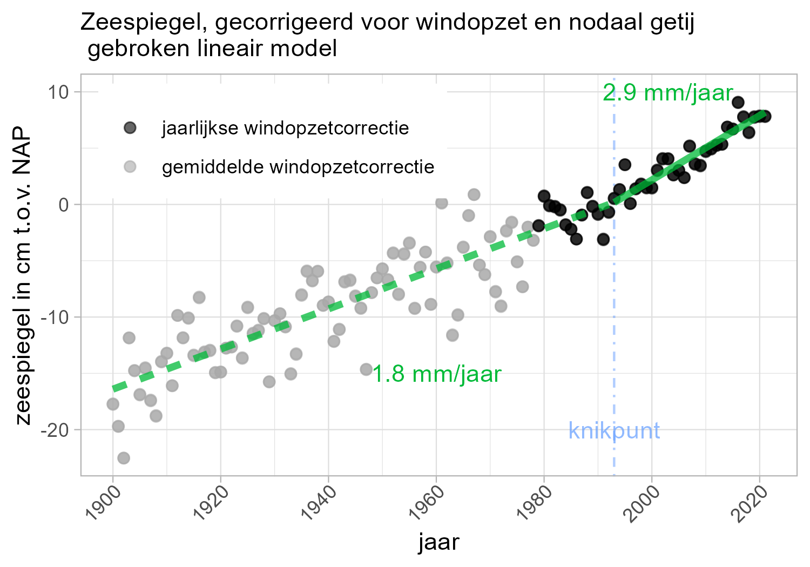

# Samenvatting Zeespiegelmonitor {.unnumbered #samenvatting}

Sinds 2014 onderhoudt Deltares in opdracht van Ministerie van I&W de Zeespiegelmonitor. Doel is de stand en ontwikkeling van de zeespiegel vast te stellen, ter ondersteuning van het waterveiligheidsbeleid. Het gaat in het bijzonder om de gemiddelde hoeveelheid jaarlijks te suppleren zand en het toetsingen en ontwerpen van keringen.

De Zeespiegelmonitor stelt jaarlijks de stand van de zeespiegel vast bij de zes Nederlandse hoofdkuststations (Delfzijl, Harlingen, Den Helder, IJmuiden, Hoek van Holland, Vlissingen). De methodiek voor de Zeespiegelmonitor is in 2014 vastgesteld en geeft een schatting van de langjarige trend. Ze houdt rekening met de verschillende factoren die fluctuaties in waterstanden beïnvloeden. Wind en getij zijn daarvan de belangrijkste. Het resultaat wordt indicatief geacht voor de gemiddelde zeespiegelstijging in de komende ca 15 jaar. Omdat ook bodemdaling bijdraagt wordt gesproken over relatieve zeespiegelstijging t.o.v. \acr{NAP}. Iedere vier jaar wordt gerapporteerd over de waarnemingen, de conclusies en de onderzoeksresultaten. Dit is de derde rapportage.

Tot vorig jaar volgde uit analyse cf. de methodiek de conclusie dat een constante trend, sinds begin 20e eeuw, de beste beschrijving geeft van de trend. Vanaf dit jaar is dit niet meer zo. De zeespiegel langs de Nederlandse kust kan nu het best beschreven worden door een trend tot eind van de 20e eeuw van 1,8 mm/jaar, met een toename van de gemiddelde jaarlijkse stijging over de laatste 30 jaar van 2,9 mm/jaar (zie figuur). Deze toename past bij de verwachting, op basis van de kennis over de wereldwijde stand van de zeespiegel, van een langzaam opbouwende versnelling van de zeespiegel.

Voor de komende ca 15 jaar is een trend van 2,9 mm/jaar de beste schatting. De methodiek is niet geschikt voor een schatting van de trend over de periode daarna.

```{r , out.width="70%", fig.cap="De verandering van de zeespiegeltrend in de tijd."}

```

Uit bovenstaande figuur zijn drie belangrijke boodschappen te halen:

-   In Nederland is versnelling van de zeespiegelstijging waarneembaar. De stijging is in de komende decennia naar verwachting hoger dan de trend in de vorige eeuw.
-   De gegevens vanaf 1979 vertonen een kleinere onzekerheid dan daarvoor door een nauwkeuriger correctie voor windopzet. Dat verhoogt de nauwkeurigheid van de beschrijving van de lokale zeespiegelstijging in recente tijdvakken.
-   De jaar op jaar variatie van de zeespiegel (ca 10 cm) is veel groter dan de onzekerheid in de langjarige trend .

In de stand en trend van de zeespiegel zijn de gegevens van vijf van de zes Nederlandse stations gebruikt. Er is namelijk reden om aan te nemen dat de gegevens van het station Delfzijl nu niet betrouwbaar genoeg zijn, door de snelle bodemdaling in dit gebied waar ook gaswinning een rol speelt. De overige stations vertonen vergelijkbare trends in stijging sinds 1993, tussen 2,3 en 3,3 mm per jaar.


